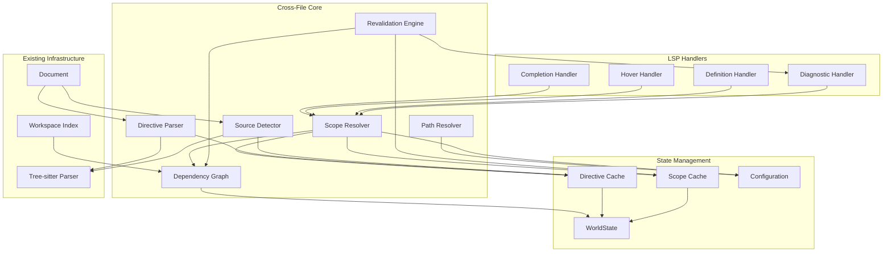

# Design Document: Cross-File Awareness for Rlsp

## Overview

This design document describes the architecture and implementation approach for adding cross-file awareness to Rlsp. The feature enables the LSP to understand relationships between R source files through `source()` calls and special comment directives, providing accurate symbol resolution, diagnostics, and navigation across file boundaries.

The implementation follows Rlsp's existing patterns: tree-sitter for parsing, `RwLock` for thread-safe state, and integration with the existing `WorldState` and `Document` structures. Per project coding guidelines: use `log::trace!` instead of `log::debug!`, use explicit `return Err(anyhow!(...))` instead of `bail!`, and omit `return` in match expressions.

## Architecture




### Data Flow

1. **In-memory document change**: When a document is opened or modified (`didOpen`/`didChange`), the Directive Parser and Source Detector extract cross-file metadata from the in-memory document contents.
2. **Disk/workspace change**: When a file changes on disk (`workspace/didChangeWatchedFiles`), the server invalidates disk-backed caches/index entries for that URI/path and updates workspace indexing (see **Workspace Watching + Indexing (Required)**).
3. **Cache update**: Parsed metadata is stored in the metadata cache; the Dependency Graph is updated.
4. **Invalidation**: Dependent scope caches are invalidated based on the Dependency Graph.
5. **Revalidation**: The Revalidation Engine schedules diagnostics updates for affected open files.
6. **Resolution**: LSP handlers query the Scope Resolver, which lazily computes scope chains using cached data.
7. **Response**: Handlers use resolved scope to provide completions, hover info, definitions, and diagnostics.

## Components and Interfaces

### Unified Cross-File Metadata Model (Single Source of Truth)

#### Line Numbering Conventions (Required)

- LSP positions are 0-based for `line` and `character`.
- Directive syntax `line=` is 1-based for user ergonomics (Requirement 1.4).
- Internally, all stored line numbers in `CrossFileMetadata`, dependency edges, and scope artifacts MUST be 0-based.
- The implementation MUST convert user-facing 1-based line numbers to internal 0-based representation.

The implementation uses **one** structured representation for cross-file metadata (`CrossFileMetadata`) which is:
- derived from document contents (directives + detected `source()` calls)
- serializable (for debugging/tests)
- used to update the dependency graph and drive scope resolution

```rust
use serde::{Deserialize, Serialize};
use std::collections::HashSet;

/// Complete cross-file metadata for a document
#[derive(Debug, Clone, Default, Serialize, Deserialize)]
pub struct CrossFileMetadata {
    /// Backward directives (this file is sourced by others)
    pub sourced_by: Vec<BackwardDirective>,
    /// Forward directives and detected source() calls
    pub sources: Vec<ForwardSource>,
    /// Working directory override
    pub working_directory: Option<String>,
    /// Lines with @lsp-ignore
    pub ignored_lines: HashSet<u32>,
    /// Lines following @lsp-ignore-next
    pub ignored_next_lines: HashSet<u32>,
}

#[derive(Debug, Clone, Serialize, Deserialize, PartialEq, Eq)]
pub struct BackwardDirective {
    pub path: String,
    pub call_site: CallSiteSpec,
    pub directive_line: u32,
}

#[derive(Debug, Clone, Serialize, Deserialize, PartialEq, Eq)]
pub struct ForwardSource {
    pub path: String,
    pub line: u32,
    pub is_directive: bool, // true if @lsp-source, false if detected source()
    pub local: bool,
    pub chdir: bool,
}

#[derive(Debug, Clone, Serialize, Deserialize, PartialEq, Eq)]
pub enum CallSiteSpec {
    Default,
    Line(u32),
    Match(String),
}

pub trait CrossFileExtractor {
    /// Extract CrossFileMetadata from file content (directives + detected source() calls)
    fn extract(&self, content: &str, tree: Option<&tree_sitter::Tree>) -> CrossFileMetadata;

    /// Check if a line should have diagnostics suppressed
    fn is_line_ignored(&self, metadata: &CrossFileMetadata, line: u32) -> bool;
}
```


### Call-Site Resolution (Backward Directives)

Backward directives require identifying where the parent sourced the child. Resolution priority:
1. explicit `line=` (validate in-bounds + validate line contains relevant call)
2. explicit `match=` (find string, map to line)
3. reverse dependency edges (parent → child)
4. text inference in parent file (static string-literal `source()`/`sys.source()` only)
5. config default (`assumeCallSite`)

This mirrors Sight's robustness and is necessary to avoid defaulting too often.

### Source Detection (part of CrossFileExtractor)

Detects `source()` and `sys.source()` calls in R code using tree-sitter.

```rust
/// A detected source() call in the code
#[derive(Debug, Clone, PartialEq, Eq)]
pub struct SourceCall {
    pub path: String,
    pub line: u32,
    pub column: u32,
    pub is_sys_source: bool,
    pub local: bool,      // source(..., local = TRUE)
    pub chdir: bool,      // source(..., chdir = TRUE)
}

pub trait SourceDetector {
    /// Extract all resolvable source() calls from a parsed tree
    fn detect(&self, tree: &Tree, content: &str) -> Vec<SourceCall>;
}
```

### Path Resolver

Resolves relative paths to absolute paths considering working directory context.

```rust
/// Context for path resolution
#[derive(Debug, Clone)]
pub struct PathContext {
    pub file_path: PathBuf,
    pub working_directory: Option<PathBuf>,
    pub inherited_working_directory: Option<PathBuf>,
}

pub trait PathResolver {
    /// Resolve a path string to an absolute path
    fn resolve(&self, path: &str, context: &PathContext) -> Option<PathBuf>;
    
    /// Get the effective working directory for a context
    fn effective_working_directory(&self, context: &PathContext) -> PathBuf;
}
```


### Dependency Graph

Tracks source relationships between files and drives cache invalidation + diagnostics fanout.

Key properties:
- Supports multiple edges between the same (from,to) at different call sites.
- Stores enough metadata to support backward call-site resolution via reverse deps.
- Uses canonicalized URIs/paths to avoid duplicate nodes for the same file.

```rust
use std::collections::{HashMap, HashSet};
use tower_lsp::lsp_types::Url;

#[derive(Debug, Clone, Copy, PartialEq, Eq, Hash)]
pub enum EdgeKind {
    Forward,  // parent sources child
    Backward, // child declares parent via directive
}

/// One call edge (a parent may source the same child multiple times).
///
/// The edge payload MUST include any fields that affect scope semantics so:
/// - reverse-dep call-site inference can validate the relationship
/// - scope resolution can apply correct inheritance rules
/// - cache fingerprints are stable and complete
#[derive(Debug, Clone, PartialEq, Eq, Hash)]
pub struct DependencyEdge {
    pub from: Url,
    pub to: Url,
    pub kind: EdgeKind,

    /// 0-based line number in `from` where the call occurs (if known).
    pub call_site_line: Option<u32>,

    /// `source(..., local=TRUE)` semantics.
    pub local: bool,

    /// `source(..., chdir=TRUE)` semantics.
    pub chdir: bool,

    /// True for sys.source() edges, false for source() edges.
    pub is_sys_source: bool,

    /// True if declared via @lsp-source directive, false if detected from AST.
    pub is_directive: bool,
}

pub struct DependencyGraph {
    forward: HashMap<Url, Vec<DependencyEdge>>,
    backward: HashMap<Url, Vec<DependencyEdge>>,
}

impl DependencyGraph {
    pub fn new() -> Self;

    /// Update edges for a file based on extracted metadata.
    pub fn update_file(&mut self, uri: &Url, meta: &CrossFileMetadata);

    pub fn remove_file(&mut self, uri: &Url);

    pub fn get_dependencies(&self, uri: &Url) -> Vec<&DependencyEdge>;

    pub fn get_dependents(&self, uri: &Url) -> Vec<&DependencyEdge>;

    pub fn get_transitive_dependents(&self, uri: &Url, max_depth: usize) -> Vec<Url>;
}
```


### Scope Resolver (Position-Aware)

Scope resolution is position-aware because `source()` introduces symbols only *after* its call site.

The resolver exposes a single core query: **scope at a position**.

```rust
use std::collections::HashMap;
use std::path::PathBuf;
use tower_lsp::lsp_types::Url;

#[derive(Debug, Clone)]
pub struct ScopedSymbol {
    pub name: String,
    pub kind: SymbolKind,
    pub source_uri: Url,
    pub defined_line: u32,
    pub signature: Option<String>,
}

#[derive(Debug, Clone)]
pub enum ScopeError {
    MissingFile { path: String, referenced_from: Url, line: u32 },
    CircularDependency { cycle: Vec<Url> },
    MaxDepthExceeded { depth: usize },
    AmbiguousParents { parents: Vec<Url> },
}

/// A reusable per-file artifact: exported interface + a timeline of scope-introducing events.
///
/// IMPORTANT: call-site filtering correctness requires more than a final exported interface.
/// Parents may introduce symbols via their own forward source() calls; children should only
/// see the subset that is in-scope at the parent's call site.
#[derive(Debug, Clone)]
pub struct ScopeArtifacts {
    /// Public surface used by dependents when importing this file wholesale.
    pub exported_interface: HashMap<String, ScopedSymbol>,

    /// A deterministic, line-ordered event stream used to compute scope-at-line.
    pub timeline: Vec<ScopeEvent>,

    /// Stable hash of exported_interface AND any semantics-bearing aspects of the timeline.
    pub interface_hash: u64,

    pub errors: Vec<ScopeError>,
}

/// A scope-introducing event within a file.
#[derive(Debug, Clone)]
pub enum ScopeEvent {
    /// A symbol definition introduced at a specific line.
    Def { line: u32, symbol: ScopedSymbol },

    /// A forward source edge introduced at a call site line.
    /// The sourced file's interface becomes available strictly after `call_site_line`.
    Source { call_site_line: u32, edge: DependencyEdge },

    /// A working directory change that affects subsequent path resolution.
    WorkingDirectory { line: u32, absolute_path: PathBuf },
}

/// A computed scope at a particular line.
#[derive(Debug, Clone)]
pub struct ScopeAtLine {
    pub symbols: HashMap<String, ScopedSymbol>,
    pub chain: Vec<Url>,
    pub errors: Vec<ScopeError>,
}

pub trait ScopeResolver {
    /// Compute per-file artifacts used by dependents (hashable interface).
    fn compute_artifacts(&self, uri: &Url, state: &WorldState, config: &CrossFileConfig) -> ScopeArtifacts;

    /// Resolve scope visible at a given line in `uri`.
    fn scope_at_line(&self, uri: &Url, line: u32, state: &WorldState, config: &CrossFileConfig) -> ScopeAtLine;
}
```

Implementation notes:
- `timeline` MUST be sufficient to compute `scope_at_line(uri, N)` without accidentally including symbols introduced after N via forward sourcing.
- `scope_at_line` merges local defs + inherited interfaces gated by call-site ordering, using the parent's own position-aware scope at the call site.
- Both use call-site resolution ladder for backward directives (explicit → reverse deps → inference → default).


### Configuration

Configuration options support all settings from Requirement 11.

```rust
/// Cross-file awareness configuration
#[derive(Debug, Clone)]
pub struct CrossFileConfig {
    /// Maximum depth for backward directive traversal (Requirement 11.1)
    pub max_backward_depth: usize,
    /// Maximum depth for forward source() traversal (Requirement 11.2)
    pub max_forward_depth: usize,
    /// Maximum total chain depth (Requirement 11.3)
    pub max_chain_depth: usize,
    /// Default call site assumption when not specified (Requirement 11.4)
    pub assume_call_site: CallSiteDefault,
    /// Whether to index workspace files (Requirement 11.5)
    pub index_workspace: bool,

    /// Max number of open documents to schedule for diagnostics revalidation per trigger (Requirement 11.6)
    pub max_revalidations_per_trigger: usize,

    /// Debounce delay for cross-file diagnostics fanout (Requirement 11.7)
    pub revalidation_debounce_ms: u64,

    /// Whether undefined variable diagnostics are enabled (Requirement 11.9, 11.10)
    pub undefined_variables_enabled: bool,
    
    /// Severity for missing file diagnostics (Requirement 11.8)
    pub missing_file_severity: DiagnosticSeverity,
    /// Severity for circular dependency diagnostics (Requirement 11.8)
    pub circular_dependency_severity: DiagnosticSeverity,
    /// Severity for out-of-scope symbol diagnostics (Requirement 11.8)
    pub out_of_scope_severity: DiagnosticSeverity,
    /// Severity for ambiguous parent diagnostics (Requirement 11.8)
    pub ambiguous_parent_severity: DiagnosticSeverity,
}

#[derive(Debug, Clone, Copy, PartialEq, Eq)]
pub enum CallSiteDefault {
    End,
    Start,
}

impl Default for CrossFileConfig {
    fn default() -> Self {
        Self {
            max_backward_depth: 10,      // Requirement 11.1
            max_forward_depth: 10,       // Requirement 11.2
            max_chain_depth: 20,         // Requirement 11.3
            assume_call_site: CallSiteDefault::End, // Requirement 11.4
            index_workspace: true,       // Requirement 11.5
            max_revalidations_per_trigger: 10, // Requirement 11.6
            revalidation_debounce_ms: 200,     // Requirement 11.7
            undefined_variables_enabled: true, // Requirement 11.9
            missing_file_severity: DiagnosticSeverity::WARNING,
            circular_dependency_severity: DiagnosticSeverity::ERROR,
            out_of_scope_severity: DiagnosticSeverity::WARNING,
            ambiguous_parent_severity: DiagnosticSeverity::WARNING,
        }
    }
}

/// Configuration change handling (Requirement 11.11)
/// When configuration changes, the LSP must re-resolve scope chains for all open documents.
pub fn on_configuration_changed(state: &mut WorldState, new_config: CrossFileConfig) {
    let old_config = std::mem::replace(&mut state.cross_file_config, new_config);
    
    // If scope-affecting settings changed, invalidate all scope caches
    if old_config.assume_call_site != state.cross_file_config.assume_call_site
        || old_config.max_chain_depth != state.cross_file_config.max_chain_depth
        || old_config.max_backward_depth != state.cross_file_config.max_backward_depth
        || old_config.max_forward_depth != state.cross_file_config.max_forward_depth
    {
        // Invalidate all scope caches
        state.cross_file_cache.invalidate_all();
        
        // Schedule diagnostics revalidation for all open documents
        let open_docs: Vec<Url> = state.documents.keys().cloned().collect();
        for uri in open_docs {
            state.cross_file_revalidation.schedule(uri);
        }
    }
}
```


### Cache Structures (Versioned)

Caches must be versioned/fingerprinted so concurrent edits cannot reuse stale cross-file state.

```rust
use std::collections::HashMap;
use tower_lsp::lsp_types::Url;

#[derive(Debug, Clone, PartialEq, Eq, Hash)]
pub struct ScopeFingerprint {
    /// Hash of the file's own contents (or doc version mapped to a hash).
    pub self_hash: u64,

    /// Hash of the dependency edge set used (including call-site lines and semantics-bearing edge fields).
    pub edges_hash: u64,

    /// Hash of upstream exported interfaces / upstream scope artifacts used.
    pub upstream_interfaces_hash: u64,

    /// Workspace index version to prevent stale reuse across index updates.
    pub workspace_index_version: u64,
}

pub struct MetadataCache {
    cache: HashMap<Url, CrossFileMetadata>,
}

pub struct ArtifactsCache {
    cache: HashMap<Url, (ScopeFingerprint, ScopeArtifacts)>,
}

impl ArtifactsCache {
    pub fn get_if_fresh(&self, uri: &Url, fp: &ScopeFingerprint) -> Option<ScopeArtifacts>;
    pub fn insert(&mut self, uri: Url, fp: ScopeFingerprint, artifacts: ScopeArtifacts);
    pub fn invalidate(&mut self, uri: &Url);
}
```

Implementation notes:
- The simplest correct approach is to compute `self_hash` from document text.
- For performance, add Sight-like interface hashing: dependents only invalidate when `interface_hash` or edge set changes.


### Extended WorldState

Rlsp already protects `WorldState` behind an async lock at the server boundary (`Arc<tokio::sync::RwLock<WorldState>>`). This is a *good* fit for cross-file awareness: it enables concurrent read access from request handlers while serializing mutation.

Key rule: **Never spawn background work that holds a borrowed `&mut WorldState`**. Background tasks must reacquire a fresh lock and must guard against publishing stale results.

#### Document Versioning (Required)

To support concurrent editing and to prevent publishing stale diagnostics:
- Each open `Document` MUST store the LSP `TextDocumentItem.version` (monotonic per document while open).
- Any debounced/background diagnostics task MUST capture a trigger version (or content hash) and MUST re-check it before publishing.
- If the document is no longer open, tasks MUST no-op.

```rust
/// Extended WorldState with cross-file support
pub struct WorldState {
    // Existing fields
    pub documents: HashMap<Url, Document>,
    pub workspace_folders: Vec<Url>,
    pub library: Library,
    pub workspace_index: HashMap<Url, Document>,
    pub workspace_imports: Vec<String>,
    pub help_cache: HelpCache,

    // Cross-file state (mutated under the server's async write lock)
    pub cross_file_config: CrossFileConfig,
    pub cross_file_meta: MetadataCache,
    pub cross_file_graph: DependencyGraph,
    pub cross_file_cache: ArtifactsCache,

    // Workspace/disk cache for closed files (used by scope resolution)
    pub cross_file_file_cache: CrossFileFileCache,

    // Revalidation bookkeeping (debounce/cancellation keyed by URI)
    pub cross_file_revalidation: CrossFileRevalidationState,

    // Workspace index integration (required)
    pub cross_file_workspace_index: CrossFileWorkspaceIndex,
}
```

Notes:
- `cross_file_file_cache` is the disk-backed cache used when resolving files that are not currently open.
- `cross_file_workspace_index` is maintained via file watching and is used to keep closed-file information fresh and to reduce disk IO.


### Real-Time Cross-File Update System (Requirement 0)

The real-time update system ensures diagnostics, completions, hover, and definitions stay correct across all affected open files when any file in the chain is edited.

#### Trigger Model (Diagnostics Fanout)

When a document changes (in-memory `didOpen`/`didChange` *or* on-disk `didChangeWatchedFiles`):
1. **Metadata Update**: Extract `CrossFileMetadata` (directives + detected `source()` calls + working directory).
2. **Graph Update**: Update `DependencyGraph` edges for the changed file.
3. **Change Detection**: Compute whether the semantics-bearing exported interface hash or edge set changed.
4. **Selective Invalidation**: If interface/edges changed, invalidate scope caches for all transitive dependents.
5. **Diagnostics Fanout**: Schedule diagnostics recomputation for affected **open** documents.
6. **Cancellation**: Cancel any outdated pending revalidations for the same files.
7. **Freshness Guard (required)**: Before publishing diagnostics from a background task, verify the document version/hash still matches the triggering version/hash; otherwise do not publish.

#### Debouncing and Cancellation

```rust
use std::collections::HashMap;
use tokio::sync::mpsc;
use tokio_util::sync::CancellationToken;

/// Tracks pending revalidation work per file
pub struct CrossFileRevalidationState {
    /// Pending revalidation tasks keyed by URI
    pending: HashMap<Url, CancellationToken>,
    /// Debounce delay in milliseconds
    debounce_ms: u64,

    /// Max number of open documents to schedule per trigger.
    max_revalidations_per_trigger: usize,
}

impl CrossFileRevalidationState {
    pub fn new(debounce_ms: u64, max_revalidations_per_trigger: usize) -> Self {
        Self {
            pending: HashMap::new(),
            debounce_ms,
            max_revalidations_per_trigger,
        }
    }

    /// Schedule revalidation for a file, cancelling any pending work
    pub fn schedule(&mut self, uri: Url) -> CancellationToken {
        // Cancel existing pending work for this URI
        if let Some(old_token) = self.pending.remove(&uri) {
            old_token.cancel();
        }
        
        let token = CancellationToken::new();
        self.pending.insert(uri, token.clone());
        token
    }

    /// Mark revalidation as complete
    pub fn complete(&mut self, uri: &Url) {
        self.pending.remove(uri);
    }
}
```


#### Revalidation Flow

```rust
/// Revalidate a file and its dependents after a change.
///
/// IMPORTANT: this runs under the server's write lock (mutating WorldState).
pub fn revalidate_after_change_locked(
    state: &mut WorldState,
    changed_uri: &Url,
) -> Vec<Url> {
    // 1. Update metadata for changed file
    let old_meta = state.cross_file_meta.get(changed_uri).cloned();
    let new_meta = extract_cross_file_metadata(state, changed_uri);
    state.cross_file_meta.insert(changed_uri.clone(), new_meta.clone());

    // 2. Update dependency graph
    state.cross_file_graph.update_file(changed_uri, &new_meta);

// 3. Compute if interface or edges changed (semantics-bearing)
    let old_hash = old_meta.as_ref().map(|m| compute_interface_hash(m));
    let new_hash = compute_interface_hash(&new_meta);
    let interface_changed = old_hash != Some(new_hash);

    let edges_changed = compute_edges_hash_from_meta(changed_uri, old_meta.as_ref())
        != compute_edges_hash_from_meta(changed_uri, Some(&new_meta));
    // 4. Get affected files (transitive dependents)
    let mut affected = vec![changed_uri.clone()];
    if interface_changed || edges_changed {
        let dependents = state.cross_file_graph.get_transitive_dependents(
            changed_uri,
            state.cross_file_config.max_chain_depth,
        );

        for dep in &dependents {
            state.cross_file_cache.invalidate(dep);
        }
        affected.extend(dependents);
    }

    // 5. Filter to only open documents (diagnostics are only pushed for open docs)
    affected.retain(|uri| state.documents.contains_key(uri));

    affected
}

/// Publish diagnostics for affected files with debouncing.
///
/// IMPORTANT: background tasks must not capture `&mut WorldState`.
/// Instead, they re-acquire state via `Arc<RwLock<WorldState>>` and must guard
/// against publishing stale results.
pub fn schedule_diagnostics_debounced(
    state_arc: Arc<tokio::sync::RwLock<WorldState>>,
    client: Client,
    trigger_uri: Url,
    mut affected: Vec<Url>,
    max_to_schedule: usize,
) {
    // Prioritization + cap (Requirement 0):
    // Always schedule `trigger_uri` first if present, then schedule remaining URIs.
    affected.sort_by_key(|u| if *u == trigger_uri { 0usize } else { 1usize });

    for uri in affected.into_iter().take(max_to_schedule) {
        // Determine the trigger version/hash now (freshness guard)
        // If we can't read the current version/hash, skip scheduling.
        let state_arc2 = state_arc.clone();
        let client2 = client.clone();
        let uri2 = uri.clone();

        tokio::spawn(async move {
            // 1) Read trigger fingerprint/version
            let (debounce_ms, token, trigger_version) = {
                let mut st = state_arc2.write().await;
                let token = st.cross_file_revalidation.schedule(uri2.clone());
                let debounce_ms = st.cross_file_revalidation.debounce_ms;
                let trigger_version = st
                    .documents
                    .get(&uri2)
                    .and_then(|d| d.version); // Document Versioning (Required)
                (debounce_ms, token, trigger_version)
            };

            // 2) Debounce / cancellation
            tokio::select! {
                _ = token.cancelled() => { return; }
                _ = tokio::time::sleep(Duration::from_millis(debounce_ms)) => {}
            }

            // 3) Freshness guard: re-check current version before publishing
            let diagnostics_opt = {
                let st = state_arc2.read().await;
                let current_version = st.documents.get(&uri2).and_then(|d| d.version);
                if current_version != trigger_version {
                    return; // stale
                }
                Some(handlers::diagnostics(&st, &uri2))
            };

            if let Some(diagnostics) = diagnostics_opt {
                client2.publish_diagnostics(uri2.clone(), diagnostics, None).await;
            }

            // 4) Mark completion (best-effort)
            let mut st = state_arc2.write().await;
            st.cross_file_revalidation.complete(&uri2);
        });
    }
}
```


### Multiple Source Calls and Ambiguous Parents

#### Multiple Source Calls at Different Call Sites (Requirement 5.9)

When a file is sourced multiple times at different call sites in the same parent:

```rust
/// Resolve the effective call site when a file is sourced multiple times
pub fn resolve_multiple_source_calls(
    sources: &[ForwardSource],
    target_path: &str,
) -> Option<u32> {
    // Find all source calls to the same target
    let calls: Vec<_> = sources.iter()
        .filter(|s| s.path == target_path)
        .collect();
    
    match calls.len() {
        0 => None,
        1 => Some(calls[0].line),
        _ => {
            // Multiple calls: use the earliest call site
            // Symbols become available at the first source() call
            calls.iter().map(|s| s.line).min()
        }
    }
}
```

#### Ambiguous Parents (Requirement 5.10)

When a file has multiple possible parents (multiple backward directives or multiple callers), selection MUST be deterministic and the precedence MUST be documented.

Precedence (highest to lowest):
1. Backward directive with explicit `line=`
2. Backward directive with explicit `match=`
3. Reverse-dependency edge (forward resolution) with known call site
4. Backward directive / reverse edge without call site (uses inference/default)
5. Deterministic tiebreak: lexicographic by URI

A warning diagnostic SHOULD be emitted when multiple viable parents exist.

```rust
/// Result of parent resolution
pub enum ParentResolution {
    /// Single unambiguous parent
    Single(Url, Option<u32>), // (parent_uri, call_site_line)
    /// Multiple possible parents - deterministic but ambiguous
    Ambiguous {
        selected: (Url, Option<u32>),
        alternatives: Vec<Url>,
    },
    /// No parent found
    None,
}
```


```rust
/// Resolve parent for a file with backward directives
pub fn resolve_parent(
    metadata: &CrossFileMetadata,
    graph: &DependencyGraph,
    uri: &Url,
    config: &CrossFileConfig,
) -> ParentResolution {
    // Collect all possible parents
    let mut parents: Vec<(Url, Option<u32>)> = Vec::new();
    
    // From backward directives
    for directive in &metadata.sourced_by {
        if let Some(parent_uri) = resolve_path(&directive.path, uri) {
            let call_site = match &directive.call_site {
                CallSiteSpec::Line(n) => Some(*n),
                CallSiteSpec::Match(pattern) => {
                    // Try to find matching line in parent
                    find_matching_line(&parent_uri, pattern)
                }
                CallSiteSpec::Default => None,
            };
            parents.push((parent_uri, call_site));
        }
    }
    
    // From reverse dependency edges (forward resolution found us)
    for edge in graph.get_dependents(uri) {
        if edge.kind == EdgeKind::Forward {
            let entry = (edge.from.clone(), edge.call_site_line);
            if !parents.iter().any(|(u, _)| u == &edge.from) {
                parents.push(entry);
            }
        }
    }
    
    match parents.len() {
        0 => ParentResolution::None,
        1 => ParentResolution::Single(parents[0].0.clone(), parents[0].1),
        _ => {
            // Deterministic selection: sort by URI string, take first
            parents.sort_by(|a, b| a.0.as_str().cmp(b.0.as_str()));
            let selected = parents.remove(0);
            let alternatives: Vec<Url> = parents.into_iter().map(|(u, _)| u).collect();
            ParentResolution::Ambiguous {
                selected: (selected.0, selected.1),
                alternatives,
            }
        }
    }
}
```


When ambiguity is detected, emit a diagnostic suggesting `line=` or `match=` to disambiguate:

```rust
/// Generate diagnostic for ambiguous parent
pub fn ambiguous_parent_diagnostic(
    directive_line: u32,
    selected: &Url,
    alternatives: &[Url],
) -> Diagnostic {
    let alt_list = alternatives.iter()
        .map(|u| u.path())
        .collect::<Vec<_>>()
        .join(", ");
    
    Diagnostic {
        range: line_range(directive_line),
        severity: Some(DiagnosticSeverity::WARNING),
        message: format!(
            "Ambiguous parent: using '{}' but also found: {}. \
             Consider adding line= or match= to disambiguate.",
            selected.path(),
            alt_list
        ),
        ..Default::default()
    }
}
```

## Data Models

### Cross-file metadata

See **Unified Cross-File Metadata Model (Single Source of Truth)** above (`CrossFileMetadata`). That representation is the only directive/source data model.

### Position-aware scope artifacts

Cross-file scope is position-aware. The stable "unit of sharing" across files is a file's **exported interface** plus an **interface hash** used for invalidation.

```rust
/// The hashable surface a file exposes to dependents.
#[derive(Debug, Clone)]
pub struct ExportedInterface {
    pub symbols: HashMap<String, ScopedSymbol>,
    pub interface_hash: u64,
}

/// A computed scope at a line in a file.
#[derive(Debug, Clone)]
pub struct ScopeAtLine {
    pub symbols: HashMap<String, ScopedSymbol>,
    pub chain: Vec<Url>,
    pub errors: Vec<ScopeError>,
}
```


## Correctness Properties

*A property is a characteristic or behavior that should hold true across all valid executions of a system—essentially, a formal statement about what the system should do. Properties serve as the bridge between human-readable specifications and machine-verifiable correctness guarantees.*

### Property 1: Backward Directive Synonym Equivalence

*For any* valid path string, parsing `# @lsp-sourced-by <path>`, `# @lsp-run-by <path>`, and `# @lsp-included-by <path>` SHALL produce equivalent `BackwardDirective` structures with the same path.

**Validates: Requirements 1.1, 1.2, 1.3**

### Property 2: Working Directory Synonym Equivalence

*For any* valid path string, parsing `# @lsp-working-directory <path>`, `# @lsp-wd <path>`, `# @lsp-cd <path>`, and `# @lsp-current-directory <path>` SHALL produce equivalent working directory configurations.

**Validates: Requirements 3.1, 3.2, 3.3, 3.4**

### Property 3: Quote Style Equivalence for Source Detection

*For any* valid path string `p`, detecting `source("p")` and `source('p')` SHALL produce equivalent `SourceCall` structures with the same path.

**Validates: Requirements 4.1, 4.2**

### Property 4: Local Symbol Precedence

*For any* scope chain where a symbol `s` is defined in both a sourced file and the current file, the resolved scope SHALL contain the current file's definition of `s`, and completions, hover, and go-to-definition SHALL use the local definition.

**Validates: Requirements 5.4, 7.3, 8.3, 9.2, 9.3**

### Property 5: Diagnostic Suppression

*For any* file containing `# @lsp-ignore` on line `n`, no diagnostics SHALL be emitted for line `n`. *For any* file containing `# @lsp-ignore-next` on line `n`, no diagnostics SHALL be emitted for line `n+1`.

**Validates: Requirements 2.2, 2.3, 10.4, 10.5**

### Property 6: Missing File Diagnostics

*For any* directive or source() call referencing a non-existent file path, the Diagnostic_Engine SHALL emit exactly one warning diagnostic at the location of that reference.

Clarification: "exactly one" means a single diagnostic per (file, line, referenced path) tuple. If the same missing path is referenced multiple times at different lines, each reference may produce its own diagnostic.

**Validates: Requirements 1.8, 2.5, 10.2**

### Property 7: Circular Dependency Detection

*For any* set of files where file A sources file B and file B sources file A (directly or transitively), the Scope_Resolver SHALL detect the cycle, break it, and emit an error diagnostic listing the cycle.

**Validates: Requirements 5.7, 10.6**

### Property 8: Directive Round-Trip Serialization

*For any* valid `CrossFileMetadata` structure, serializing to JSON and then deserializing SHALL produce an equivalent structure. This implies parsing is deterministic.

**Validates: Requirements 14.1, 14.2, 14.3, 14.4**

### Property 9: Call Site Line Parameter Extraction

*For any* backward directive with `line=N` parameter where N is a valid 1-based line number, the parsed `CallSiteSpec` SHALL be `Line(N-1)` (converted to 0-based) with the exact value.

**Validates: Requirements 1.4**

### Property 10: Call Site Match Parameter Extraction

*For any* backward directive with `match="pattern"` parameter, the parsed `CallSiteSpec` SHALL be `Match(pattern)` with the exact pattern string.

**Validates: Requirements 1.5**

### Property 11: Relative Path Resolution

*For any* file at path `/a/b/c.R` and relative directive path `../d/e.R`, the Path_Resolver SHALL resolve to `/a/d/e.R`.

**Validates: Requirements 1.6, 1.7, 3.7**

### Property 12: Forward Directive Order Preservation

*For any* file containing multiple `@lsp-source` directives, the parsed `ForwardSource` list SHALL maintain the same order as they appear in the document.

**Validates: Requirements 2.4**

### Property 13: Working Directory Inheritance

*For any* source chain A → B → C where only A has a working directory directive, files B and C SHALL inherit A's working directory for path resolution.

**Validates: Requirements 3.5**

### Property 14: Default Working Directory

*For any* file at path `/a/b/c.R` with no working directory directive and no inherited working directory, the effective working directory SHALL be `/a/b/`.

**Validates: Requirements 3.6**

### Property 15: Named Argument Source Detection

*For any* source() call using `source(file = "path.R")` syntax, the Source_Detector SHALL extract "path.R" as the path.

**Validates: Requirements 4.3**

### Property 16: sys.source Detection

*For any* sys.source() call with a string literal path, the Source_Detector SHALL extract the path and mark `is_sys_source` as true.

**Validates: Requirements 4.4**

### Property 17: Dynamic Path Graceful Handling

*For any* source() call where the path argument is a variable, expression, or paste0() call, the Source_Detector SHALL not extract a path and SHALL not emit an error.

**Validates: Requirements 4.5, 4.6**

### Property 18: Source Call Parameter Extraction

*For any* source() call with `local = TRUE`, the extracted `SourceCall` SHALL have `local = true`. *For any* source() call with `chdir = TRUE`, the extracted `SourceCall` SHALL have `chdir = true`.

**Validates: Requirements 4.7, 4.8**

### Property 19: Backward-First Resolution Order

*For any* file with both backward directives and forward source() calls, the Scope_Resolver SHALL process backward directives before forward sources, resulting in parent symbols being available before sourced file symbols.

**Validates: Requirements 5.1, 5.2**

### Property 20: Call Site Symbol Filtering

*For any* backward directive with `line=N`, only symbols defined on lines 0 through N-1 (0-based) in the parent file SHALL be included in the scope.

**Validates: Requirements 5.5**

### Property 21: Default Call Site Behavior

*For any* backward directive without a call site specification, when `assumeCallSite` is "end", all symbols from the parent SHALL be included; when "start", no symbols from the parent SHALL be included.

**Validates: Requirements 5.6**

### Property 22: Maximum Depth Enforcement

*For any* source chain exceeding `maxChainDepth`, the Scope_Resolver SHALL stop traversal at the configured depth and emit a diagnostic.

**Validates: Requirements 5.8**

### Property 23: Dependency Graph Update on Change

*For any* file change that modifies directives or source() calls, the Dependency_Graph edges for that file SHALL reflect the new state.

**Validates: Requirements 0.1, 0.2, 6.1, 6.2**

### Property 24: Scope Cache Invalidation on Interface Change

*For any* file whose exported interface or dependency edges change, all files that depend on it (directly or transitively) SHALL have their scope caches invalidated.

**Validates: Requirements 0.3, 12.4, 12.5**

### Property 25: Dependency Graph Edge Removal

*For any* file that is deleted, the Dependency_Graph SHALL contain no edges where that file is either source or target.

**Validates: Requirements 6.3, 13.3**

### Property 26: Transitive Dependency Query

*For any* file A that sources B, and B sources C, querying dependencies of A SHALL include both B and C. Querying dependents of C SHALL include both B and A.

**Validates: Requirements 6.4, 6.5**

### Property 27: Cross-File Completion Inclusion

*For any* file with a resolved scope chain containing symbol `s` from a sourced file, completions at a position after the source() call SHALL include `s`.

**Validates: Requirements 7.1, 7.4**

### Property 28: Completion Source Attribution

*For any* completion item for a symbol from a sourced file, the completion detail SHALL contain the source file path.

**Validates: Requirements 7.2**

### Property 29: Cross-File Hover Information

*For any* symbol from a sourced file, hovering over a usage SHALL display the source file path and function signature (if applicable).

**Validates: Requirements 8.1, 8.2**

### Property 30: Cross-File Go-to-Definition

*For any* symbol defined in a sourced file, go-to-definition SHALL navigate to the definition location in that file.

**Validates: Requirements 9.1**

### Property 31: Cross-File Undefined Variable Suppression

*For any* symbol `s` defined in a sourced file and used after the source() call, no "undefined variable" diagnostic SHALL be emitted for `s`.

**Validates: Requirements 10.1**

### Property 32: Out-of-Scope Symbol Warning

*For any* symbol `s` defined in a sourced file and used before the source() call, an "out of scope" diagnostic SHALL be emitted.

**Validates: Requirements 10.3**

### Property 33: Undefined Variables Configuration

*For any* configuration with `diagnostics.undefinedVariables = false`, no undefined variable diagnostics SHALL be emitted regardless of symbol resolution.

**Validates: Requirements 11.9, 11.10**

### Property 34: Configuration Change Re-resolution

*For any* configuration change affecting scope resolution (e.g., `assumeCallSite`), all open documents SHALL have their scope chains re-resolved.

**Validates: Requirements 11.11**

### Property 35: Diagnostics Fanout to Open Files

*For any* file change that invalidates dependent files, all affected open files SHALL receive updated diagnostics without requiring user edits to those files.

**Validates: Requirements 0.4, 13.4**

### Property 36: Debounce Cancellation

*For any* sequence of rapid changes to a file, only the final change SHALL result in published diagnostics; intermediate pending revalidations SHALL be cancelled.

**Validates: Requirements 0.5**

### Property 37: Multiple Source Calls - Earliest Call Site

*For any* file that is sourced multiple times at different call sites in the same parent, symbols from that file SHALL become available at the earliest call site.

**Validates: Requirements 5.9**

### Property 38: Ambiguous Parent Determinism

*For any* file with multiple possible parents (via backward directives or reverse edges), the Scope_Resolver SHALL deterministically select the same parent given the same inputs, and SHALL emit an ambiguity diagnostic.

**Validates: Requirements 5.10**

### Property 39: Interface Hash Optimization

*For any* file change where the exported interface hash remains identical and the edge set remains identical, dependent files SHALL NOT have their scope caches invalidated.

**Validates: Requirements 12.8**

### Property 40: Position-Aware Symbol Availability

*For any* source() call at line N, symbols from the sourced file SHALL only be available for positions strictly after line N.

**Validates: Requirements 5.3**

### Property 41: Freshness Guard Prevents Stale Diagnostics

*For any* debounced/background diagnostics task, if the document version changes between task scheduling and publishing, the task SHALL NOT publish diagnostics.

**Validates: Requirements 0.6**

### Property 42: Revalidation Prioritization

*For any* invalidation affecting multiple open documents, the active document SHALL be revalidated before other open documents.

**Validates: Requirements 0.7**

### Property 43: Revalidation Cap Enforcement

*For any* invalidation affecting more open documents than `maxRevalidationsPerTrigger`, only the first N documents (prioritized) SHALL be scheduled, and skipped documents SHALL be revalidated on-demand when they become active.

**Validates: Requirements 0.7, 0.8**

### Property 44: Workspace Index Version Monotonicity

*For any* sequence of workspace index updates, the version counter SHALL be strictly increasing.

**Validates: Requirements 13.5**

### Property 45: Watched File Cache Invalidation

*For any* watched file that is created or changed on disk, the disk-backed caches for that file SHALL be invalidated.

**Validates: Requirements 13.2**

### Property 46: Forward Directive as Explicit Source

*For any* file containing `# @lsp-source <path>` at line N, the Directive_Parser SHALL treat it as an explicit source() declaration at line N.

**Validates: Requirements 2.1**s, hover, and go-to-definition SHALL use the local definition.

**Validates: Requirements 5.4, 7.3, 9.2, 9.3**

### Property 5: Diagnostic Suppression

*For any* file containing `# @lsp-ignore` on line `n`, no diagnostics SHALL be emitted for line `n`. *For any* file containing `# @lsp-ignore-next` on line `n`, no diagnostics SHALL be emitted for line `n+1`.

**Validates: Requirements 2.2, 2.3, 10.4, 10.5**


### Property 6: Missing File Diagnostics

*For any* directive or source() call referencing a non-existent file path, the Diagnostic_Engine SHALL emit exactly one warning diagnostic at the location of that reference.

Clarification: "exactly one" means a single diagnostic per (file, line, referenced path) tuple. If the same missing path is referenced multiple times at different lines, each reference may produce its own diagnostic.

**Validates: Requirements 1.8, 2.5, 10.2**

### Property 7: Circular Dependency Detection

*For any* set of files where file A sources file B and file B sources file A (directly or transitively), the Scope_Resolver SHALL detect the cycle, break it, and emit an error diagnostic listing the cycle.

**Validates: Requirements 5.7, 10.6**

### Property 8: Directive Round-Trip Serialization

*For any* valid `CrossFileMetadata` structure, serializing to JSON and then deserializing SHALL produce an equivalent structure. This implies parsing is deterministic.

**Validates: Requirements 14.3, 14.4**

### Property 9: Call Site Line Parameter Extraction

*For any* backward directive with `line=N` parameter where N is a valid line number, the parsed `CallSiteSpec` SHALL be `Line(N)` with the exact value.

**Validates: Requirements 1.4**

### Property 10: Call Site Match Parameter Extraction

*For any* backward directive with `match="pattern"` parameter, the parsed `CallSiteSpec` SHALL be `Match(pattern)` with the exact pattern string.

**Validates: Requirements 1.5**

### Property 11: Relative Path Resolution

*For any* file at path `/a/b/c.R` and relative directive path `../d/e.R`, the Path_Resolver SHALL resolve to `/a/d/e.R`.

**Validates: Requirements 1.6, 1.7**

### Property 12: Forward Directive Order Preservation

*For any* file containing multiple `@lsp-source` directives, the parsed `ForwardSource` list SHALL maintain the same order as they appear in the document.

**Validates: Requirements 2.4**


### Property 13: Working Directory Inheritance

*For any* source chain A → B → C where only A has a working directory directive, files B and C SHALL inherit A's working directory for path resolution.

**Validates: Requirements 3.5**

### Property 14: Default Working Directory

*For any* file at path `/a/b/c.R` with no working directory directive and no inherited working directory, the effective working directory SHALL be `/a/b/`.

**Validates: Requirements 3.6**

### Property 15: Named Argument Source Detection

*For any* source() call using `source(file = "path.R")` syntax, the Source_Detector SHALL extract "path.R" as the path.

**Validates: Requirements 4.3**

### Property 16: sys.source Detection

*For any* sys.source() call with a string literal path, the Source_Detector SHALL extract the path and mark `is_sys_source` as true.

**Validates: Requirements 4.4**

### Property 17: Dynamic Path Graceful Handling

*For any* source() call where the path argument is a variable, expression, or paste0() call, the Source_Detector SHALL not extract a path and SHALL not emit an error.

**Validates: Requirements 4.5, 4.6**

### Property 18: Source Call Parameter Extraction

*For any* source() call with `local = TRUE`, the extracted `SourceCall` SHALL have `local = true`. *For any* source() call with `chdir = TRUE`, the extracted `SourceCall` SHALL have `chdir = true`.

**Validates: Requirements 4.7, 4.8**

### Property 19: Backward-First Resolution Order

*For any* file with both backward directives and forward source() calls, the Scope_Resolver SHALL process backward directives before forward sources, resulting in parent symbols being available before sourced file symbols.

**Validates: Requirements 5.1, 5.2**


### Property 20: Call Site Symbol Filtering

*For any* backward directive with `line=N`, only symbols defined on lines 1 through N-1 in the parent file SHALL be included in the scope.

**Validates: Requirements 5.5**

### Property 21: Default Call Site Behavior

*For any* backward directive without a call site specification, when `assumeCallSite` is "end", all symbols from the parent SHALL be included; when "start", no symbols from the parent SHALL be included.

**Validates: Requirements 5.6**

### Property 22: Maximum Depth Enforcement

*For any* source chain exceeding `maxChainDepth`, the Scope_Resolver SHALL stop traversal at the configured depth and emit a diagnostic.

**Validates: Requirements 5.8**

### Property 23: Dependency Graph Update on Change

*For any* file change that modifies directives or source() calls, the Dependency_Graph edges for that file SHALL reflect the new state.

**Validates: Requirements 0.1, 0.2, 6.1**

### Property 24: Scope Cache Invalidation on Interface Change

*For any* file whose exported interface or dependency edges change, all files that depend on it (directly or transitively) SHALL have their scope caches invalidated.

**Validates: Requirements 0.3, 6.2, 12.4, 12.5**

### Property 25: Dependency Graph Edge Removal

*For any* file that is deleted, the Dependency_Graph SHALL contain no edges where that file is either source or target.

**Validates: Requirements 6.3**

### Property 26: Transitive Dependency Query

*For any* file A that sources B, and B sources C, querying dependencies of A SHALL include both B and C.

**Validates: Requirements 6.4, 6.5**


### Property 27: Cross-File Completion Inclusion

*For any* file with a resolved scope chain containing symbol `s` from a sourced file, completions at a position after the source() call SHALL include `s`.

**Validates: Requirements 7.1, 7.4**

### Property 28: Completion Source Attribution

*For any* completion item for a symbol from a sourced file, the completion detail SHALL contain the source file path.

**Validates: Requirements 7.2**

### Property 29: Cross-File Hover Information

*For any* symbol from a sourced file, hovering over a usage SHALL display the source file path and function signature (if applicable).

**Validates: Requirements 8.1, 8.2, 8.3**

### Property 30: Cross-File Go-to-Definition

*For any* symbol defined in a sourced file, go-to-definition SHALL navigate to the definition location in that file.

**Validates: Requirements 9.1**

### Property 31: Cross-File Undefined Variable Suppression

*For any* symbol `s` defined in a sourced file and used after the source() call, no "undefined variable" diagnostic SHALL be emitted for `s`.

**Validates: Requirements 10.1**

### Property 32: Out-of-Scope Symbol Warning

*For any* symbol `s` defined in a sourced file and used before the source() call, an "out of scope" diagnostic SHALL be emitted.

**Validates: Requirements 10.3**

### Property 33: Undefined Variables Configuration

*For any* configuration with `diagnostics.undefinedVariables = false`, no undefined variable diagnostics SHALL be emitted regardless of symbol resolution.

**Validates: Requirements 11.7, 11.8**

### Property 34: Configuration Change Re-resolution

*For any* configuration change affecting scope resolution (e.g., `assumeCallSite`), all open documents SHALL have their scope chains re-resolved.

**Validates: Requirements 11.9**


### Property 35: Diagnostics Fanout to Open Files

*For any* file change that invalidates dependent files, all affected open files SHALL receive updated diagnostics without requiring user edits to those files.

**Validates: Requirements 0.4**

### Property 36: Debounce Cancellation

*For any* sequence of rapid changes to a file, only the final change SHALL result in published diagnostics; intermediate pending revalidations SHALL be cancelled.

**Validates: Requirements 0.5**

### Property 37: Multiple Source Calls - Earliest Call Site

*For any* file that is sourced multiple times at different call sites in the same parent, symbols from that file SHALL become available at the earliest call site.

**Validates: Requirements 5.9**

### Property 38: Ambiguous Parent Determinism

*For any* file with multiple possible parents (via backward directives or reverse edges), the Scope_Resolver SHALL deterministically select the same parent given the same inputs, and SHALL emit an ambiguity diagnostic.

**Validates: Requirements 5.10**

### Property 39: Interface Hash Optimization

*For any* file change where the exported interface hash remains identical and the edge set remains identical, dependent files SHALL NOT have their scope caches invalidated.

**Validates: Requirements 12.8**

### Property 40: Position-Aware Symbol Availability

*For any* source() call at line N, symbols from the sourced file SHALL only be available for positions strictly after line N.

**Validates: Requirements 5.3**


## Error Handling

### Missing Files

When a directive or source() call references a non-existent file:
1. Emit a diagnostic at the reference location with configurable severity
2. Continue scope resolution, skipping the missing file
3. Do not propagate the error to dependent files

### Circular Dependencies

When a circular dependency is detected:
1. Emit an error diagnostic listing the cycle (e.g., "Circular dependency: A → B → C → A")
2. Break the cycle by not following the back-edge
3. Continue resolution with partial scope

### Parse Errors

When a directive has invalid syntax:
1. Log a trace message for debugging
2. Skip the malformed directive
3. Continue parsing remaining directives

### Path Resolution Failures

When a path cannot be resolved (e.g., invalid characters):
1. Emit a warning diagnostic
2. Skip the unresolvable path
3. Continue with remaining paths

### Maximum Depth Exceeded

When traversal exceeds configured maximum depth:
1. Emit an info diagnostic indicating truncation
2. Stop traversal at the limit
3. Return partial scope with available symbols

### Ambiguous Parents

When multiple parents are detected for a file:
1. Select a parent using the documented precedence order (explicit line/match first, then reverse edges, then deterministic tiebreak)
2. Emit a warning diagnostic suggesting `line=` or `match=` to disambiguate
3. Continue resolution with the selected parent


## Workspace Watching + Indexing (Required)

Cross-file awareness MUST remain correct when:
- a dependent file is edited but not currently open
- files are created/renamed/deleted on disk
- open documents have unsaved in-memory changes while related files change on disk

To achieve this, the server MUST implement workspace watcher + indexing integration similar to Sight.

### Authoritative Sources (Required)

1. If a file is currently open in the editor, its in-memory `Document` is authoritative.
2. If a file is not open, the system uses:
   - `cross_file_workspace_index` as the primary fast path for symbols/metadata, and
   - `cross_file_file_cache` (disk read) as a fallback and/or to refresh index entries.

### Watch Registration

Register watched file patterns for relevant R project files (at minimum `**/*.R` and `**/*.r`, and optionally `**/*.Rprofile`, `**/*.Renviron`).

### On File Changed/Created

1. Invalidate disk-backed `cross_file_file_cache` entries for that file.
2. Schedule a debounced workspace index update for that file in `cross_file_workspace_index`.
3. If the changed file participates in the dependency graph (as a node or an edge endpoint), update dependency edges (best-effort) and schedule diagnostics fanout for affected open documents.

### On File Deleted

1. Remove the file from the dependency graph (remove all edges involving it).
2. Invalidate caches that reference it.
3. Emit missing-file diagnostics for open documents that reference it (via directives or `source()` calls).

### Debounce + Yield

During bulk changes, the indexer MUST debounce and MUST yield between work items so the server remains responsive.

### Index Versioning

The workspace index MUST have a monotonically increasing version counter that increments on modifications so scope fingerprints can include `workspace_index_version` where appropriate.

### Workspace Index Contents (Required)

`CrossFileWorkspaceIndex` MUST store enough information for cross-file scope resolution and diagnostics without requiring every dependent file to be open:
- per-file extracted `CrossFileMetadata` (directives + resolvable forward sources)
- per-file `ScopeArtifacts` (at least `exported_interface`, `timeline`, and `interface_hash`)
- per-file bookkeeping: last indexed file timestamp/metadata (e.g., mtime + size) and last seen `workspace_index_version`

The index is not required to be fully consistent at every instant, but it MUST be monotonic and MUST converge quickly after filesystem change events.

### Disk File Cache (Required)

`CrossFileFileCache` is the IO layer for closed files. It MUST:
- read file contents from disk on-demand
- cache by absolute path and file metadata (e.g., mtime + size)
- be invalidated on `didChangeWatchedFiles`

Scope resolution for a closed file SHOULD use `CrossFileWorkspaceIndex` when fresh; otherwise it SHOULD refresh via `CrossFileFileCache` and update the index entry.

## Testing Strategy

### Unit Tests

Unit tests focus on specific examples and edge cases:

1. **Directive Parser Tests**
   - Parse each directive type with various path formats
   - Handle edge cases: empty paths, paths with spaces, Unicode paths
   - Verify line number extraction and 1-based to 0-based conversion
   - Test all directive synonyms (sourced-by, run-by, included-by, etc.)

2. **Source Detector Tests**
   - Detect source() with different argument styles
   - Handle nested calls, comments, strings containing "source"
   - Verify parameter extraction (local, chdir)
   - Test sys.source() detection

3. **Path Resolver Tests**
   - Resolve relative paths with various `..` combinations
   - Handle Windows vs Unix path separators
   - Test working directory inheritance
   - Test relative working directory resolution

4. **Dependency Graph Tests**
   - Add/remove edges correctly
   - Detect cycles of various lengths
   - Query transitive dependencies and dependents
   - Test concurrent read access

5. **Revalidation Tests**
   - Verify debouncing behavior
   - Test cancellation of pending work
   - Verify diagnostics fanout to open files
   - Test prioritization (active document first)
   - Test cap enforcement and on-demand revalidation

6. **Configuration Tests**
   - Verify all default values match requirements
   - Test configuration change triggers re-resolution

### Property-Based Tests

Property-based tests verify universal properties across generated inputs. Each test runs minimum 100 iterations.

**Test Configuration**: Use `proptest` crate with custom generators for:
- Valid R identifiers
- Valid file paths (relative and absolute)
- Directive strings with random parameters
- Source chains of varying depths
- CrossFileMetadata structures for round-trip testing

**Property Test Tags**: Each test is tagged with:
```
// Feature: cross-file-awareness, Property N: <property_text>
```

**Property Test Coverage**:
- Properties 1-3: Directive parsing equivalence
- Properties 4-5: Symbol precedence and diagnostic suppression
- Properties 6-7: Error handling (missing files, circular deps)
- Property 8: Round-trip serialization
- Properties 9-18: Parameter extraction and detection
- Properties 19-22: Scope resolution order and filtering
- Properties 23-26: Dependency graph operations
- Properties 27-32: LSP feature integration
- Properties 33-34: Configuration effects
- Properties 35-46: Real-time updates and workspace watching

### Integration Tests

1. **Multi-file workspace tests**
   - Create temporary workspace with multiple R files
   - Verify completions include cross-file symbols
   - Verify diagnostics account for source chains

2. **LSP protocol tests**
   - Send LSP requests and verify responses
   - Test document synchronization with cross-file updates
   - Verify cache invalidation behavior

3. **Real-time update tests**
   - Simulate concurrent edits across multiple files
   - Verify diagnostics update in dependent files
   - Test debouncing under rapid changes
   - Test freshness guard prevents stale diagnostics

4. **Workspace watching tests**
   - Test file watcher registration
   - Verify cache invalidation on disk changes
   - Test diagnostics update when closed files change

### Test File Structure

```
crates/rlsp/src/
├── cross_file/
│   ├── mod.rs
│   ├── directive.rs      # Directive parsing
│   ├── source_detect.rs  # Source() detection
│   ├── path_resolve.rs   # Path resolution
│   ├── dependency.rs     # Dependency graph
│   ├── scope.rs          # Scope resolution
│   ├── config.rs         # Configuration
│   ├── revalidation.rs   # Real-time update system
│   ├── workspace_index.rs # Workspace indexing
│   ├── file_cache.rs     # Disk file cache
│   └── tests/
│       ├── directive_tests.rs
│       ├── source_detect_tests.rs
│       ├── path_resolve_tests.rs
│       ├── dependency_tests.rs
│       ├── scope_tests.rs
│       ├── revalidation_tests.rs
│       ├── workspace_tests.rs
│       └── property_tests.rs  # All property-based tests
```
