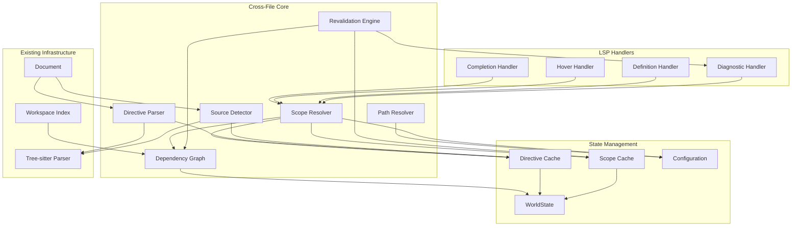

# Design Document: Cross-File Awareness for Rlsp

## Overview

This design document describes the architecture and implementation approach for adding cross-file awareness to Rlsp. The feature enables the LSP to understand relationships between R source files through `source()` calls and special comment directives, providing accurate symbol resolution, diagnostics, and navigation across file boundaries.

The implementation follows Rlsp's existing patterns: tree-sitter for parsing, `RwLock` for thread-safe state, and integration with the existing `WorldState` and `Document` structures. Per project coding guidelines: use `log::trace!` instead of `log::debug!`, use explicit `return Err(anyhow!(...))` instead of `bail!`, and omit `return` in match expressions.

## Architecture




### Data Flow

1. **In-memory document change**: When a document is opened or modified (`didOpen`/`didChange`), the Directive Parser and Source Detector extract cross-file metadata from the in-memory document contents.
2. **Disk/workspace change**: When a file changes on disk (`workspace/didChangeWatchedFiles`), the server invalidates disk-backed caches/index entries for that URI/path and updates workspace indexing (see **Workspace Watching + Indexing (Required)**).
3. **Cache update**: Parsed metadata is stored in the metadata cache; the Dependency Graph is updated.
4. **Invalidation**: Dependent scope caches are invalidated based on the Dependency Graph.
5. **Revalidation**: The Revalidation Engine schedules diagnostics updates for affected open files.
6. **Resolution**: LSP handlers query the Scope Resolver, which lazily computes scope chains using cached data.
7. **Response**: Handlers use resolved scope to provide completions, hover info, definitions, and diagnostics.

## Components and Interfaces

### Unified Cross-File Metadata Model (Single Source of Truth)

#### Position Conventions (Required)

- LSP positions are 0-based for both `line` and `character`.
- Directive syntax `line=` is 1-based for user ergonomics (Requirement 1.4).
- Internally, all stored positions in `CrossFileMetadata`, dependency edges, and scope artifacts MUST be 0-based.
- The implementation MUST convert user-facing 1-based line numbers to internal 0-based representation.

**Full Position Awareness (Required):**
Position-awareness MUST use full `(line, character)` positions, not just line numbers. This is critical for edge cases like:
- `x <- 1; source("a.R"); y <- foo()` on one line
- Completion/hover requests at a character position on the same line as a `source()` call

If only line-based gating is used, symbols may be incorrectly included/excluded for positions on the same line as the call. The implementation MUST:
- Store call sites as full LSP `Position` (`line`, `character`) in events/edges
- Gate symbol availability by `(line, char)` ordering: a symbol from a sourced file is available only at positions strictly after the call site position

**Column Unit Convention (Required):**
LSP `Position.character` is defined as **UTF-16 code units** (per LSP spec). However:
- Tree-sitter provides **byte offsets**
- Ropey uses **Unicode scalar** (code point) indexing

To ensure correct position comparisons (especially for lines with non-ASCII characters):
- All stored `call_site_column` values MUST be in **UTF-16 code units** (LSP convention)
- When extracting positions from tree-sitter, convert byte offsets to UTF-16 columns using the document text
- Conversion helper (required):

```rust
/// Convert a byte offset to UTF-16 column for a given line.
/// This is necessary because LSP uses UTF-16 code units for character positions.
pub fn byte_offset_to_utf16_column(line_text: &str, byte_offset_in_line: usize) -> u32 {
    let prefix = &line_text[..byte_offset_in_line.min(line_text.len())];
    prefix.encode_utf16().count() as u32
}

/// Convert a tree-sitter Point to LSP Position with correct UTF-16 column.
pub fn tree_sitter_point_to_lsp_position(
    point: tree_sitter::Point,
    line_text: &str,
) -> tower_lsp::lsp_types::Position {
    let column = byte_offset_to_utf16_column(line_text, point.column);
    tower_lsp::lsp_types::Position {
        line: point.row as u32,
        character: column,
    }
}
```

This ensures that position comparisons work correctly even on lines containing emoji, CJK characters, or other multi-byte/multi-code-unit text.

**Documented Limitation (Alternative):**
If full `(line, character)` precision is not implemented, the spec MUST explicitly document this as a known limitation: "Symbols from sourced files become available at the start of the line following the source() call, not at the exact character position after the call."

The implementation uses **one** structured representation for cross-file metadata (`CrossFileMetadata`) which is:
- derived from document contents (directives + detected `source()` calls)
- serializable (for debugging/tests)
- used to update the dependency graph and drive scope resolution

```rust
use serde::{Deserialize, Serialize};
use std::collections::HashSet;

/// Complete cross-file metadata for a document
#[derive(Debug, Clone, Default, Serialize, Deserialize)]
pub struct CrossFileMetadata {
    /// Backward directives (this file is sourced by others)
    pub sourced_by: Vec<BackwardDirective>,
    /// Forward directives and detected source() calls
    pub sources: Vec<ForwardSource>,
    /// Working directory override
    pub working_directory: Option<String>,
    /// Lines with @lsp-ignore
    pub ignored_lines: HashSet<u32>,
    /// Lines following @lsp-ignore-next
    pub ignored_next_lines: HashSet<u32>,
}

#[derive(Debug, Clone, Serialize, Deserialize, PartialEq, Eq)]
pub struct BackwardDirective {
    pub path: String,
    pub call_site: CallSiteSpec,
    pub directive_line: u32,
}

#[derive(Debug, Clone, Serialize, Deserialize, PartialEq, Eq)]
pub struct ForwardSource {
    pub path: String,
    pub line: u32,
    pub column: u32,  // Character position for full (line, char) precision
    pub is_directive: bool, // true if @lsp-source, false if detected source()
    pub local: bool,
    pub chdir: bool,
    pub is_sys_source: bool,
}

/// Canonical key for edge deduplication.
/// Used to prevent duplicate edges when both directive and AST detection find the same relationship.
#[derive(Debug, Clone, PartialEq, Eq, Hash)]
pub struct ForwardSourceKey {
    pub resolved_uri: Url,
    pub call_site_line: u32,
    pub call_site_column: u32,
    pub local: bool,
    pub chdir: bool,
    pub is_sys_source: bool,
}

#[derive(Debug, Clone, Serialize, Deserialize, PartialEq, Eq)]
pub enum CallSiteSpec {
    Default,
    Line(u32),
    Match(String),
}

pub trait CrossFileExtractor {
    /// Extract CrossFileMetadata from file content (directives + detected source() calls)
    /// 
    /// IMPORTANT: Forward sources MUST be deduplicated by canonical key before returning.
    /// When both a directive and AST detection produce the same (resolved_uri, call_site, local, chdir, is_sys_source),
    /// only one ForwardSource should be included. Prefer the directive (is_directive=true) for provenance tracking.
    fn extract(&self, content: &str, tree: Option<&tree_sitter::Tree>) -> CrossFileMetadata;

    /// Check if a line should have diagnostics suppressed
    fn is_line_ignored(&self, metadata: &CrossFileMetadata, line: u32) -> bool;
    
    /// Normalize forward sources to canonical set, deduplicating by key.
    /// Returns deduplicated sources with provenance flags preserved.
    fn normalize_forward_sources(&self, sources: Vec<ForwardSource>, base_uri: &Url) -> Vec<ForwardSource>;
}
```

#### Directive Syntax and Synonym Forms

The directive parser MUST be ergonomic and accept multiple equivalent forms.

**Colon is optional for all directives** (even those without a path argument):
- `# @lsp-ignore` and `# @lsp-ignore:`
- `# @lsp-ignore-next` and `# @lsp-ignore-next:`
- `# @lsp-source path.R` and `# @lsp-source: path.R`

**Quotes around paths are optional** (for directives that take a path; both single and double quotes are allowed):
- `# @lsp-source path.R`
- `# @lsp-source "path.R"`
- `# @lsp-source 'path.R'`
- `# @lsp-working-directory: "/data/scripts"`

**Whitespace is flexible**:
- The parser SHOULD tolerate extra spaces around `:` and between tokens.

The directive parser MUST recognize multiple synonym forms for each directive type to improve ergonomics:

**Backward Directives (all equivalent):**
- `@lsp-sourced-by <path>`
- `@lsp-run-by <path>`
- `@lsp-included-by <path>`

**Working Directory Directives (all equivalent):**
- `@lsp-working-directory <path>`
- `@lsp-working-dir <path>`
- `@lsp-current-directory <path>`
- `@lsp-current-dir <path>`
- `@lsp-cd <path>`
- `@lsp-wd <path>`

**Forward Directives:**
- `@lsp-source <path>`

**Ignore Directives:**
- `@lsp-ignore` (suppress diagnostics on current line)
- `@lsp-ignore-next` (suppress diagnostics on next line)

#### Path Resolution Rules

**Workspace-Root-Relative Paths:**
Paths starting with `/` are treated as workspace-root-relative, NOT filesystem-absolute. This convention allows portable references to workspace-level directories.

Example (all equivalent):
```r
# @lsp-working-directory /data/scripts
# @lsp-working-directory: /data/scripts
# @lsp-working-directory "/data/scripts"
# @lsp-working-directory: "/data/scripts"
```
Resolves to `<workspaceRoot>/data/scripts`, not the filesystem root `/data/scripts`.

**File-Relative Paths:**
Paths not starting with `/` are resolved relative to the file's containing directory.

Example (all equivalent):
```r
# @lsp-working-directory ../shared
# @lsp-working-directory: ../shared
# @lsp-working-directory "../shared"
# @lsp-working-directory: "../shared"
```
Resolves to the `shared` directory one level up from the current file's directory.


### Call-Site Resolution (Backward Directives)

Backward directives require identifying where the parent sourced the child. Resolution priority:
1. explicit `line=` (validate in-bounds + validate line contains relevant call)
2. explicit `match=` (find string, map to line)
3. reverse dependency edges (parent → child)
4. text inference in parent file (static string-literal `source()`/`sys.source()` only)
5. config default (`assumeCallSite`)

This mirrors Sight's robustness and is necessary to avoid defaulting too often.

### Source Detection (part of CrossFileExtractor)

Detects `source()` and `sys.source()` calls in R code using tree-sitter.

```rust
/// A detected source() call in the code
#[derive(Debug, Clone, PartialEq, Eq)]
pub struct SourceCall {
    pub path: String,
    pub line: u32,
    pub column: u32,
    pub is_sys_source: bool,
    pub local: bool,      // source(..., local = TRUE)
    pub chdir: bool,      // source(..., chdir = TRUE)
}

pub trait SourceDetector {
    /// Extract all resolvable source() calls from a parsed tree
    fn detect(&self, tree: &Tree, content: &str) -> Vec<SourceCall>;
}
```

#### R `local=TRUE` Semantics (Required)

In R, `source(..., local=TRUE)` evaluates the sourced file in a new local environment. This has important implications for scope inheritance:

**Default behavior (`local=FALSE` or omitted):**
- Sourced file executes in the global environment
- All assignments in the sourced file are visible to the caller
- Functions and variables defined in the sourced file are available after the `source()` call

**With `local=TRUE`:**
- Sourced file executes in a new local environment
- Assignments in the sourced file do NOT populate the caller's environment
- Only the return value of the sourced file is available (typically `NULL` or the last expression)

**LSP Behavior for `local=TRUE`:**
- When `local=TRUE` is detected, symbols defined in the sourced file SHALL NOT be added to the caller's scope
- Undefined variable diagnostics SHALL NOT be suppressed based on definitions in `local=TRUE` sourced files
- Completions SHALL NOT include symbols from `local=TRUE` sourced files
- A configuration option `crossFile.treatLocalAsGlobal` (default: `false`) MAY be provided for projects that use `local=TRUE` unconventionally

**`sys.source()` behavior:**
- `sys.source(file, envir=...)` evaluates in the specified environment
- If `envir` is not statically resolvable (e.g., a variable), the LSP SHALL treat it conservatively as `local=TRUE` (no inheritance)
- If `envir` is `.GlobalEnv` or `globalenv()`, treat as `local=FALSE`

### Path Resolver

Resolves relative paths to absolute paths considering working directory context.

```rust
/// Context for path resolution
#[derive(Debug, Clone)]
pub struct PathContext {
    pub file_path: PathBuf,
    pub working_directory: Option<PathBuf>,
    pub inherited_working_directory: Option<PathBuf>,
}

pub trait PathResolver {
    /// Resolve a path string to an absolute path
    fn resolve(&self, path: &str, context: &PathContext) -> Option<PathBuf>;
    
    /// Get the effective working directory for a context
    fn effective_working_directory(&self, context: &PathContext) -> PathBuf;
}
```


### Dependency Graph

Tracks source relationships between files and drives cache invalidation + diagnostics fanout.

Key properties:
- Supports multiple edges between the same (from,to) at different call sites.
- Stores enough metadata to support backward call-site resolution via reverse deps.
- Uses canonicalized URIs/paths to avoid duplicate nodes for the same file.
- **Uses forward edges only as the canonical representation.** Backward directives are inputs used to infer/confirm forward edges, not separate edges in the graph. This prevents double-triggering invalidation and double-emitting diagnostics.
- **Directive vs AST Conflict Policy (Required):** If both `@lsp-source` directives and AST detection produce edges to the same resolved target URI but disagree on call site position or edge flags, the implementation MUST resolve the conflict deterministically:
  - If any `@lsp-source` directive exists for a `(from_uri, to_uri)` pair, it SHALL be treated as authoritative for that `(from,to)` pair. AST-derived edges to the same `to_uri` from that `from_uri` SHALL NOT create additional semantic edges.
  - The server SHOULD emit a warning diagnostic on the directive line when it suppresses an AST-derived edge due to disagreement (to help users keep directives and code consistent).
  - Provenance (directive vs AST) is retained for debugging, but does not multiply semantic edges.

```rust
use std::collections::{HashMap, HashSet};
use tower_lsp::lsp_types::Url;

/// One call edge (a parent may source the same child multiple times).
///
/// The edge payload MUST include any fields that affect scope semantics so:
/// - reverse-dep call-site inference can validate the relationship
/// - scope resolution can apply correct inheritance rules
/// - cache fingerprints are stable and complete
///
/// IMPORTANT: Edges are deduplicated by canonical key (to_uri, call_site_position, local, chdir, is_sys_source).
/// Provenance flags (is_directive) are tracked separately but do not create separate semantic edges.
///
/// NOTE: EdgeKind is removed. All edges are forward edges (parent sources child).
/// Backward directives are processed as inputs to create/confirm forward edges.
#[derive(Debug, Clone, PartialEq, Eq, Hash)]
pub struct DependencyEdge {
    pub from: Url,  // parent (caller)
    pub to: Url,    // child (callee)

    /// 0-based line number in `from` where the call occurs (if known).
    pub call_site_line: Option<u32>,
    
    /// 0-based character position in `from` where the call occurs (if known).
    /// Required for full (line, char) position-aware scope resolution.
    pub call_site_column: Option<u32>,

    /// `source(..., local=TRUE)` semantics.
    /// When true, symbols from the sourced file are NOT inherited by the caller.
    pub local: bool,

    /// `source(..., chdir=TRUE)` semantics.
    pub chdir: bool,

    /// True for sys.source() edges, false for source() edges.
    pub is_sys_source: bool,

    /// True if declared via @lsp-source directive, false if detected from AST.
    /// This is provenance metadata and does NOT affect edge identity for deduplication.
    pub is_directive: bool,
}

pub struct DependencyGraph {
    /// Forward lookup: parent URI -> edges to children
    forward: HashMap<Url, Vec<DependencyEdge>>,
    /// Reverse lookup: child URI -> edges from parents (same edges, indexed by `to`)
    backward: HashMap<Url, Vec<DependencyEdge>>,
}

impl DependencyGraph {
    pub fn new() -> Self;

    /// Update edges for a file based on extracted metadata.
    /// 
    /// This processes both:
    /// - Forward sources (from `meta.sources`) - creates edges where this file is `from`
    /// - Backward directives (from `meta.sourced_by`) - creates/confirms edges where this file is `to`
    pub fn update_file(&mut self, uri: &Url, meta: &CrossFileMetadata);

    pub fn remove_file(&mut self, uri: &Url);

    /// Get edges where `uri` is the parent (caller)
    pub fn get_dependencies(&self, uri: &Url) -> Vec<&DependencyEdge>;

    /// Get edges where `uri` is the child (callee)
    pub fn get_dependents(&self, uri: &Url) -> Vec<&DependencyEdge>;

    pub fn get_transitive_dependents(&self, uri: &Url, max_depth: usize) -> Vec<Url>;
}
```


### Scope Resolver (Position-Aware)

Scope resolution is position-aware because `source()` introduces symbols only *after* its call site.

The resolver exposes a single core query: **scope at a position**.

```rust
use std::collections::HashMap;
use std::path::PathBuf;
use tower_lsp::lsp_types::Url;

#[derive(Debug, Clone)]
pub struct ScopedSymbol {
    pub name: String,
    pub kind: SymbolKind,
    pub source_uri: Url,

    /// 0-based line of the definition (LSP convention)
    pub defined_line: u32,

    /// 0-based UTF-16 column of the definition (LSP Position.character convention).
    ///
    /// IMPORTANT: defined_column MUST use UTF-16 code units to allow correct same-line
    /// comparisons against call sites and request positions.
    pub defined_column: u32,

    pub signature: Option<String>,
}

#[derive(Debug, Clone)]
pub enum ScopeError {
    MissingFile { path: String, referenced_from: Url, line: u32 },
    CircularDependency { cycle: Vec<Url> },
    MaxDepthExceeded { depth: usize },
    AmbiguousParents { parents: Vec<Url> },
}

/// A reusable per-file artifact: exported interface + a timeline of scope-introducing events.
///
/// IMPORTANT: call-site filtering correctness requires more than a final exported interface.
/// Parents may introduce symbols via their own forward source() calls; children should only
/// see the subset that is in-scope at the parent's call site.
///
/// IMPORTANT (v1 scope model): Exported interface and timeline entries are built from a
/// constrained set of R constructs (see "R Symbol Model (v1)" below).
#[derive(Debug, Clone)]
pub struct ScopeArtifacts {
    /// Public surface used by dependents when importing this file wholesale.
    pub exported_interface: HashMap<String, ScopedSymbol>,

    /// A deterministic, line-ordered event stream used to compute scope-at-line.
    pub timeline: Vec<ScopeEvent>,

    /// Stable hash of exported_interface AND any semantics-bearing aspects of the timeline.
    pub interface_hash: u64,

    pub errors: Vec<ScopeError>,
}

/// A scope-introducing event within a file.
#[derive(Debug, Clone)]
pub enum ScopeEvent {
    /// A symbol definition introduced at a specific position.
    Def { line: u32, column: u32, symbol: ScopedSymbol },

    /// A forward source edge introduced at a call site position.
    /// The sourced file's interface becomes available strictly after `(call_site_line, call_site_column)`.
    Source { call_site_line: u32, call_site_column: u32, edge: DependencyEdge },

    /// A working directory change that affects subsequent path resolution.
    WorkingDirectory { line: u32, absolute_path: PathBuf },
}

/// A computed scope at a particular position in a file.
#[derive(Debug, Clone)]
pub struct ScopeAtPosition {
    pub symbols: HashMap<String, ScopedSymbol>,
    pub chain: Vec<Url>,
    pub errors: Vec<ScopeError>,
}

/// Legacy alias for line-only scope (deprecated, use ScopeAtPosition)
pub type ScopeAtLine = ScopeAtPosition;

pub trait ScopeResolver {
    /// Compute per-file artifacts used by dependents (hashable interface).
    fn compute_artifacts(&self, uri: &Url, state: &WorldState, config: &CrossFileConfig) -> ScopeArtifacts;

    /// Resolve scope visible at a given position in `uri`.
    /// Position is (line, character), both 0-based.
    fn scope_at_position(&self, uri: &Url, line: u32, character: u32, state: &WorldState, config: &CrossFileConfig) -> ScopeAtPosition;
    
    /// Legacy: Resolve scope visible at a given line in `uri` (character=0).
    fn scope_at_line(&self, uri: &Url, line: u32, state: &WorldState, config: &CrossFileConfig) -> ScopeAtPosition {
        self.scope_at_position(uri, line, 0, state, config)
    }
}
```

Implementation notes:
- `timeline` MUST be sufficient to compute `scope_at_position(uri, line, char)` without accidentally including symbols introduced after that position via forward sourcing.
- `scope_at_position` merges local defs + inherited interfaces gated by call-site ordering, using the parent's own position-aware scope at the call site.
- For any definition event, ordering MUST use `(defined_line, defined_column)` on `ScopedSymbol` to avoid same-line off-by-one errors.
- Both use call-site resolution ladder for backward directives (explicit → reverse deps → inference → default).
- Position comparison: `(line1, char1) < (line2, char2)` iff `line1 < line2 || (line1 == line2 && char1 < char2)`.

Required boundary:
- `compute_artifacts(uri, ...)` MUST depend only on the file's own content/AST plus pre-existing dependency metadata (edges), and MUST NOT call `scope_at_position` for other files. This prevents recursion and avoids exponential recomputation.
- `scope_at_position` MAY traverse to other files, but it MUST be bounded by `max_chain_depth` and MUST maintain a visited set to prevent cycles.

**Non-Recursive Artifact Computation (Critical Invariant):**
This separation is essential to prevent exponential recomputation and stack overflow:

1. **`compute_artifacts(uri)`** produces:
   - `exported_interface`: symbols defined in this file (from AST only)
   - `timeline`: ordered list of `ScopeEvent`s including `Source` events with edge metadata
   - `interface_hash`: hash of the exported symbols
   - **NO traversal**: does not read content of other files, does not call `scope_at_position` for other URIs

2. **`scope_at_position(uri, line, col)`** performs:
   - Retrieves artifacts for `uri` (from cache or computes via `compute_artifacts`)
   - Walks the timeline up to `(line, col)`
   - For each `Source` event encountered, **recursively** calls `scope_at_position` on the child file (bounded by depth + visited set)
   - Merges inherited symbols with local symbols (local wins on conflict)

This means `Source` events in the timeline contain edge metadata (target URI, call site, local/chdir flags) but do NOT contain resolved symbols. Symbol resolution happens lazily during `scope_at_position` traversal.

Caching requirement (performance + correctness):
- Cache entries for `ScopeArtifacts` and `scope_at_position` MUST be fingerprinted so that concurrent edits and index updates cannot reuse stale results (see ScopeFingerprint).

Upstream hashing boundary (Required):
- `upstream_interfaces_hash` in `ScopeFingerprint` MUST be computed as a hash of the **directly referenced** children's `interface_hash` values (from cache/index), plus the **edge set hash** for this file, plus this file's own content hash.
- This keeps artifact computation cheap and non-recursive.
- Full transitive correctness is left to `scope_at_position` traversal (bounded + visited set).


### Configuration

Configuration options support all settings from Requirement 11.

```rust
/// Cross-file awareness configuration
#[derive(Debug, Clone)]
pub struct CrossFileConfig {
    /// Maximum depth for backward directive traversal (Requirement 11.1)
    pub max_backward_depth: usize,
    /// Maximum depth for forward source() traversal (Requirement 11.2)
    pub max_forward_depth: usize,
    /// Maximum total chain depth (Requirement 11.3)
    pub max_chain_depth: usize,
    /// Default call site assumption when not specified (Requirement 11.4)
    pub assume_call_site: CallSiteDefault,
    /// Whether to index workspace files (Requirement 11.5)
    pub index_workspace: bool,

    /// Max number of open documents to schedule for diagnostics revalidation per trigger (Requirement 11.6)
    pub max_revalidations_per_trigger: usize,

    /// Debounce delay for cross-file diagnostics fanout (Requirement 11.7)
    pub revalidation_debounce_ms: u64,

    /// Whether undefined variable diagnostics are enabled (Requirement 11.9, 11.10)
    pub undefined_variables_enabled: bool,
    
    /// Severity for missing file diagnostics (Requirement 11.8)
    pub missing_file_severity: DiagnosticSeverity,
    /// Severity for circular dependency diagnostics (Requirement 11.8)
    pub circular_dependency_severity: DiagnosticSeverity,
    /// Severity for out-of-scope symbol diagnostics (Requirement 11.8)
    pub out_of_scope_severity: DiagnosticSeverity,
    /// Severity for ambiguous parent diagnostics (Requirement 11.8)
    pub ambiguous_parent_severity: DiagnosticSeverity,
}

#[derive(Debug, Clone, Copy, PartialEq, Eq)]
pub enum CallSiteDefault {
    End,
    Start,
}

impl Default for CrossFileConfig {
    fn default() -> Self {
        Self {
            max_backward_depth: 10,      // Requirement 11.1
            max_forward_depth: 10,       // Requirement 11.2
            max_chain_depth: 20,         // Requirement 11.3
            assume_call_site: CallSiteDefault::End, // Requirement 11.4
            index_workspace: true,       // Requirement 11.5
            max_revalidations_per_trigger: 10, // Requirement 11.6
            revalidation_debounce_ms: 200,     // Requirement 11.7
            undefined_variables_enabled: true, // Requirement 11.9
            missing_file_severity: DiagnosticSeverity::WARNING,
            circular_dependency_severity: DiagnosticSeverity::ERROR,
            out_of_scope_severity: DiagnosticSeverity::WARNING,
            ambiguous_parent_severity: DiagnosticSeverity::WARNING,
        }
    }
}

/// Configuration change handling (Requirement 11.11)
/// When configuration changes, the LSP must re-resolve scope chains for all open documents.
pub fn on_configuration_changed(state: &mut WorldState, new_config: CrossFileConfig) {
    let old_config = std::mem::replace(&mut state.cross_file_config, new_config);
    
    // If scope-affecting settings changed, invalidate all scope caches
    if old_config.assume_call_site != state.cross_file_config.assume_call_site
        || old_config.max_chain_depth != state.cross_file_config.max_chain_depth
        || old_config.max_backward_depth != state.cross_file_config.max_backward_depth
        || old_config.max_forward_depth != state.cross_file_config.max_forward_depth
    {
        // Invalidate all scope caches
        state.cross_file_cache.invalidate_all();
        
        // Schedule diagnostics revalidation for all open documents
        let open_docs: Vec<Url> = state.documents.keys().cloned().collect();
        for uri in open_docs {
            state.cross_file_revalidation.schedule(uri);
        }
    }
}
```


### Cache Structures (Versioned)

Caches must be versioned/fingerprinted so concurrent edits cannot reuse stale cross-file state. Caches use interior mutability to allow population during read operations (see Issue 9 in Design Review Fixes).

```rust
use parking_lot::RwLock;
use std::collections::HashMap;
use tower_lsp::lsp_types::Url;

#[derive(Debug, Clone, PartialEq, Eq, Hash)]
pub struct ScopeFingerprint {
    /// Hash of the file's own contents (or doc version mapped to a hash).
    pub self_hash: u64,

    /// Hash of the dependency edge set used (including call-site lines and semantics-bearing edge fields).
    pub edges_hash: u64,

    /// Hash of upstream exported interfaces / upstream scope artifacts used.
    pub upstream_interfaces_hash: u64,

    /// Workspace index version to prevent stale reuse across index updates.
    pub workspace_index_version: u64,
}

/// Metadata cache with interior mutability for read-path population
pub struct MetadataCache {
    inner: RwLock<HashMap<Url, CrossFileMetadata>>,
}

impl MetadataCache {
    pub fn get(&self, uri: &Url) -> Option<CrossFileMetadata> {
        self.inner.read().get(uri).cloned()
    }
    
    pub fn insert(&self, uri: Url, meta: CrossFileMetadata) {
        self.inner.write().insert(uri, meta);
    }
    
    pub fn remove(&self, uri: &Url) {
        self.inner.write().remove(uri);
    }
}

/// Artifacts cache with interior mutability for read-path population
pub struct ArtifactsCache {
    inner: RwLock<HashMap<Url, (ScopeFingerprint, ScopeArtifacts)>>,
}

impl ArtifactsCache {
    /// Get cached artifacts if fingerprint matches (read lock on inner)
    pub fn get_if_fresh(&self, uri: &Url, fp: &ScopeFingerprint) -> Option<ScopeArtifacts> {
        let guard = self.inner.read();
        guard.get(uri).and_then(|(cached_fp, artifacts)| {
            if cached_fp == fp {
                Some(artifacts.clone())
            } else {
                None
            }
        })
    }
    
    /// Get cached artifacts without fingerprint check
    pub fn get(&self, uri: &Url) -> Option<ScopeArtifacts> {
        self.inner.read().get(uri).map(|(_, a)| a.clone())
    }
    
    /// Insert or update cache entry (write lock on inner, but callable from read-locked WorldState)
    pub fn insert(&self, uri: Url, fp: ScopeFingerprint, artifacts: ScopeArtifacts) {
        self.inner.write().insert(uri, (fp, artifacts));
    }
    
    /// Invalidate a specific entry
    pub fn invalidate(&self, uri: &Url) {
        self.inner.write().remove(uri);
    }
    
    /// Invalidate all entries
    pub fn invalidate_all(&self) {
        self.inner.write().clear();
    }
}
```

Implementation notes:
- The simplest correct approach is to compute `self_hash` from document text.
- For performance, add Sight-like interface hashing: dependents only invalidate when `interface_hash` or edge set changes.
- Interior mutability (`parking_lot::RwLock`) allows caches to be populated during read operations without requiring a write lock on `WorldState`.

### Closed File Staleness Model (Required)

For files that are not currently open, the system needs a clear policy for when cached data is valid.

```rust
/// Snapshot metadata for a closed file, used to determine cache validity.
#[derive(Debug, Clone, PartialEq, Eq, Hash)]
pub struct FileSnapshot {
    /// File modification time (from filesystem metadata)
    pub mtime: SystemTime,
    /// File size in bytes
    pub size: u64,
    /// Optional content hash (computed on first read, cached)
    pub content_hash: Option<u64>,
}

impl FileSnapshot {
    /// Create snapshot from filesystem metadata
    pub fn from_metadata(metadata: &std::fs::Metadata) -> Self {
        Self {
            mtime: metadata.modified().unwrap_or(SystemTime::UNIX_EPOCH),
            size: metadata.len(),
            content_hash: None,
        }
    }
    
    /// Check if this snapshot matches current disk state
    pub fn matches_disk(&self, current: &FileSnapshot) -> bool {
        self.mtime == current.mtime && self.size == current.size
    }
}
```

**Validity Policy:**
1. Index entries are valid only if their `FileSnapshot` matches current disk metadata (or matches "last watched version" if maintained).
2. On `workspace/didChangeWatchedFiles`, invalidate entries where snapshot no longer matches.
3. On scope resolution for a closed file:
   - Check if index entry exists and snapshot is fresh
   - If fresh, use cached `ScopeArtifacts`
   - If stale or missing, read from disk via `CrossFileFileCache`, update index entry


### Extended WorldState

Rlsp already protects `WorldState` behind an async lock at the server boundary (`Arc<tokio::sync::RwLock<WorldState>>`). This is a *good* fit for cross-file awareness: it enables concurrent read access from request handlers while serializing mutation.

Key rule: **Never spawn background work that holds a borrowed `&mut WorldState`**. Background tasks must reacquire a fresh lock and must guard against publishing stale results.

#### Document Versioning (Required)

To support concurrent editing and to prevent publishing stale diagnostics:
- Each open `Document` MUST store the LSP `TextDocumentItem.version` (monotonic per document while open).
- Each open `Document` MUST expose a stable content revision identifier (e.g., `contents_hash()` or a monotonically increasing in-memory revision counter).
  - This revision identifier MUST change whenever the document contents change.
  - It MUST be available even when `version` is absent.
- Any debounced/background diagnostics task MUST capture a trigger revision snapshot (version + content revision) and MUST re-check it before computing and before publishing.
- If the document is no longer open, tasks MUST no-op.

**Implementation Note (rlsp-specific):**
The current `Document` struct in `crates/rlsp/src/state.rs` does NOT have a version field. This MUST be added:

```rust
pub struct Document {
    pub contents: Rope,
    pub tree: Option<Tree>,
    pub loaded_packages: Vec<String>,
    pub version: Option<i32>,  // NEW: LSP document version for freshness/monotonicity
    revision: u64,              // NEW: Monotonic content revision counter (increments on every change)
}

impl Document {
    /// Returns a stable hash/revision of the document's current contents.
    /// This is used for freshness guards in debounced diagnostics tasks.
    /// 
    /// IMPORTANT: The revision MUST change whenever contents change, even if version is absent.
    /// For simplicity, this can be implemented as a monotonic counter incremented on every change.
    pub fn contents_hash(&self) -> u64 {
        self.revision
    }
}
```

Update points:
- `Document::new()`: accept version parameter, store it; initialize `revision` to 0
- `did_open`: pass `params.text_document.version` to `open_document()`
- `did_change`: update `doc.version` from `params.text_document.version`; increment `doc.revision`
- `did_close`: clear diagnostics gate state (already specified in `on_did_close()`)

#### Diagnostics Publish Gating (Required)

To prevent stale diagnostic publishes when multiple triggers race (e.g., cross-file invalidation + user edits), the server MUST enforce monotonic publishing per URI.

Minimum requirement:
- Track `last_published_version[uri]`.
- Never publish diagnostics for `document.version` if it is `< last_published_version[uri]`.
- Provide a "force republish" mechanism for dependency-triggered revalidation where the document version may be unchanged but scope/diagnostic inputs changed. (Sight uses a `clear_published_version`-style mechanism.)

```rust
/// Extended WorldState with cross-file support
pub struct WorldState {
    // Existing fields
    pub documents: HashMap<Url, Document>,
    pub workspace_folders: Vec<Url>,
    pub library: Library,
    pub workspace_index: HashMap<Url, Document>,
    pub workspace_imports: Vec<String>,
    pub help_cache: HelpCache,

    // Cross-file state (mutated under the server's async write lock)
    pub cross_file_config: CrossFileConfig,
    pub cross_file_meta: MetadataCache,
    pub cross_file_graph: DependencyGraph,
    pub cross_file_cache: ArtifactsCache,

    // Workspace/disk cache for closed files (used by scope resolution)
    pub cross_file_file_cache: CrossFileFileCache,

    // Revalidation bookkeeping (debounce/cancellation keyed by URI)
    pub cross_file_revalidation: CrossFileRevalidationState,

    // Client activity hints (optional but supported by the VS Code extension)
    // Used only for prioritization; never affects correctness.
    pub cross_file_activity: CrossFileActivityState,

    // Diagnostics publish gating / forced republish bookkeeping
    pub cross_file_diagnostics_gate: CrossFileDiagnosticsGate,

    // Workspace index integration (required)
    pub cross_file_workspace_index: CrossFileWorkspaceIndex,

    // Parent selection cache for stability during graph convergence (Issue 11)
    pub cross_file_parent_cache: ParentSelectionCache,
}

/// Cached parent selection to ensure stability during graph convergence.
/// Uses interior mutability to allow population during read operations (consistent with MetadataCache and ArtifactsCache).
#[derive(Debug, Default)]
pub struct ParentSelectionCache {
    /// Map from (child_uri, cache_key) -> selected parent
    /// cache_key includes metadata_fingerprint AND reverse_edges_hash for rename/delete convergence
    inner: RwLock<HashMap<(Url, ParentCacheKey), ParentResolution>>,
}

/// Cache key for parent selection stability.
/// Includes both metadata fingerprint AND reverse edges snapshot to handle rename/delete+create.
#[derive(Debug, Clone, PartialEq, Eq, Hash)]
pub struct ParentCacheKey {
    /// Hash of the child's CrossFileMetadata (backward directives)
    pub metadata_fingerprint: u64,
    /// Hash of the reverse edges pointing to this child (from dependency graph)
    /// This ensures cache invalidation when graph structure changes (e.g., rename events)
    pub reverse_edges_hash: u64,
}

impl ParentSelectionCache {
    /// Get or compute parent selection, ensuring stability.
    /// Uses interior mutability so this can be called from read-locked WorldState.
    /// 
    /// IMPORTANT: cache_key includes reverse_edges_hash to handle rename/delete+create convergence.
    /// When a parent file is renamed, the reverse edges change even if child metadata doesn't.
    pub fn get_or_compute(
        &self,
        child_uri: &Url,
        metadata: &CrossFileMetadata,
        graph: &DependencyGraph,
        config: &CrossFileConfig,
    ) -> ParentResolution {
        let metadata_fingerprint = compute_metadata_fingerprint(metadata);
        let reverse_edges_hash = compute_reverse_edges_hash(graph, child_uri);
        let cache_key = ParentCacheKey { metadata_fingerprint, reverse_edges_hash };
        let key = (child_uri.clone(), cache_key);
        
        // Try read lock first
        if let Some(cached) = self.inner.read().get(&key) {
            return cached.clone();
        }
        
        // Compute and cache under write lock
        let resolution = resolve_parent(metadata, graph, child_uri, config);
        self.inner.write().insert(key, resolution.clone());
        resolution
    }
    
    /// Invalidate cache for a child (called when child's metadata changes OR reverse edges change)
    pub fn invalidate(&self, child_uri: &Url) {
        self.inner.write().retain(|(uri, _), _| uri != child_uri);
    }
    
    /// Invalidate all entries
    pub fn invalidate_all(&self) {
        self.inner.write().clear();
    }
}

/// Compute hash of reverse edges pointing to a child URI.
/// Used for cache key to detect graph structure changes (rename/delete+create).
///
/// IMPORTANT: Include all semantics-bearing fields that could affect parent selection stability
/// or call-site resolution behavior, not just the parent URI.
fn compute_reverse_edges_hash(graph: &DependencyGraph, child_uri: &Url) -> u64 {
    use std::collections::hash_map::DefaultHasher;
    use std::hash::{Hash, Hasher};

    let mut hasher = DefaultHasher::new();

    let mut edges: Vec<_> = graph
        .get_dependents(child_uri)
        .iter()
        .map(|e| {
            (
                e.from.as_str(),
                e.call_site_line,
                e.call_site_column,
                e.local,
                e.chdir,
                e.is_sys_source,
            )
        })
        .collect();

    edges.sort(); // Deterministic ordering
    edges.hash(&mut hasher);
    hasher.finish()
}

/// Tracks client activity hints for revalidation prioritization (Requirement 15)
#[derive(Debug, Clone, Default)]
pub struct CrossFileActivityState {
    /// Currently active document URI (if any)
    pub active_uri: Option<Url>,
    /// Currently visible document URIs
    pub visible_uris: Vec<Url>,
    /// Timestamp of last activity update (for ordering)
    pub timestamp_ms: u64,
    /// Most recently changed/opened URIs (fallback ordering)
    pub recent_uris: Vec<Url>,
}

impl CrossFileActivityState {
    /// Update activity state from client notification
    pub fn update(&mut self, active_uri: Option<Url>, visible_uris: Vec<Url>, timestamp_ms: u64) {
        self.active_uri = active_uri;
        self.visible_uris = visible_uris;
        self.timestamp_ms = timestamp_ms;
    }

    /// Record a document as recently changed/opened
    pub fn record_recent(&mut self, uri: Url) {
        // Remove if already present, then add to front
        self.recent_uris.retain(|u| u != &uri);
        self.recent_uris.insert(0, uri);
        // Keep bounded
        if self.recent_uris.len() > 100 {
            self.recent_uris.truncate(100);
        }
    }

    /// Get priority score for a URI (lower = higher priority)
    pub fn priority_score(&self, uri: &Url) -> usize {
        if Some(uri) == self.active_uri.as_ref() {
            return 0; // Highest priority: active
        }
        if self.visible_uris.contains(uri) {
            return 1; // Second priority: visible
        }
        // Fallback: position in recent list
        self.recent_uris.iter().position(|u| u == uri).unwrap_or(usize::MAX)
    }
}

/// Diagnostics publish gating to enforce monotonic publishing (Requirement 0.7, 0.8)
#[derive(Debug, Clone, Default)]
pub struct CrossFileDiagnosticsGate {
    /// Last published document version per URI
    last_published_version: HashMap<Url, i32>,
    /// URIs that need forced republish (dependency-triggered, version unchanged)
    force_republish: HashSet<Url>,
}

impl CrossFileDiagnosticsGate {
    /// Check if diagnostics can be published for this version
    /// 
    /// CRITICAL: Force republish allows same-version republish but NEVER older versions.
    /// - Normal: publish if `version > last_published_version`
    /// - Forced: publish if `version >= last_published_version` (same version allowed)
    /// - Never: publish if `version < last_published_version`
    pub fn can_publish(&self, uri: &Url, version: i32) -> bool {
        match self.last_published_version.get(uri) {
            Some(&last) => {
                if version < last {
                    return false; // NEVER publish older versions, even when forced
                }
                if self.force_republish.contains(uri) {
                    return version >= last; // Force allows same version
                }
                version > last // Normal requires strictly newer
            }
            None => true, // No previous publish, always allowed
        }
    }

    /// Record that diagnostics were published for this version
    pub fn record_publish(&mut self, uri: &Url, version: i32) {
        self.last_published_version.insert(uri.clone(), version);
        self.force_republish.remove(uri);
    }

    /// Mark a URI for forced republish (when dependency-driven changes occur
    /// without changing the document version)
    pub fn mark_force_republish(&mut self, uri: &Url) {
        self.force_republish.insert(uri.clone());
    }

    /// Clear force republish flag (e.g., after successful publish)
    pub fn clear_force_republish(&mut self, uri: &Url) {
        self.force_republish.remove(uri);
    }

    /// Clear all state for a URI (e.g., when document is closed)
    /// MUST be called in the didClose handler to prevent stale state on reopen.
    pub fn clear(&mut self, uri: &Url) {
        self.last_published_version.remove(uri);
        self.force_republish.remove(uri);
    }
}
```

Notes:
- `cross_file_file_cache` is the disk-backed cache used when resolving files that are not currently open.
- `cross_file_workspace_index` is maintained via file watching and is used to keep closed-file information fresh and to reduce disk IO.


### Real-Time Cross-File Update System (Requirement 0)

The real-time update system ensures diagnostics, completions, hover, and definitions stay correct across all affected open files when any file in the chain is edited.

#### Trigger Model (Diagnostics Fanout)

When a document changes (in-memory `didOpen`/`didChange` *or* on-disk `didChangeWatchedFiles`):
1. **Metadata Update**: Extract `CrossFileMetadata` (directives + detected `source()` calls + working directory).
2. **Graph Update**: Update `DependencyGraph` edges for the changed file.
3. **Change Detection**: Compute whether the semantics-bearing exported interface hash or edge set changed.
4. **Selective Invalidation**: If interface/edges changed, invalidate scope caches for all transitive dependents.
5. **Diagnostics Fanout**: Schedule diagnostics recomputation for affected **open** documents.
6. **Cancellation**: Cancel any outdated pending revalidations for the same files.
7. **Freshness Guard (required)**: Before publishing diagnostics from a background task, verify the document version/hash still matches the triggering version/hash; otherwise do not publish.

**Integration Point (rlsp-specific):**
The current `backend.rs` calls `publish_diagnostics(&uri)` directly in `did_change` and `did_save`, which only publishes for the changed file. This MUST be replaced with the cross-file revalidation system:

```rust
// BEFORE (current backend.rs):
async fn did_change(&self, params: DidChangeTextDocumentParams) {
    // ... apply changes ...
    self.publish_diagnostics(&uri).await;  // Only publishes for changed file
}

// AFTER (with cross-file awareness):
async fn did_change(&self, params: DidChangeTextDocumentParams) {
    let uri = params.text_document.uri;
    let version = params.text_document.version;
    
    let affected = {
        let mut state = self.state.write().await;
        for change in params.content_changes {
            state.apply_change(&uri, change);
        }
        // Update version
        if let Some(doc) = state.documents.get_mut(&uri) {
            doc.version = Some(version);
        }
        // Compute affected files (returns Vec<Url>)
        revalidate_after_change_locked(&mut state, &uri)
    };
    
    // Schedule debounced diagnostics for all affected files
    schedule_diagnostics_debounced(
        self.state.clone(),
        self.client.clone(),
        uri,
        affected,
        self.state.read().await.cross_file_config.max_revalidations_per_trigger,
        false, // not dependency-triggered for the changed file itself
    ).await;
}
```

#### Debouncing and Cancellation

```rust
use std::collections::HashMap;
use tokio::sync::mpsc;
use tokio_util::sync::CancellationToken;

/// Tracks pending revalidation work per file
pub struct CrossFileRevalidationState {
    /// Pending revalidation tasks keyed by URI
    pending: HashMap<Url, CancellationToken>,
    /// Debounce delay in milliseconds
    debounce_ms: u64,

    /// Max number of open documents to schedule per trigger.
    max_revalidations_per_trigger: usize,
}

impl CrossFileRevalidationState {
    pub fn new(debounce_ms: u64, max_revalidations_per_trigger: usize) -> Self {
        Self {
            pending: HashMap::new(),
            debounce_ms,
            max_revalidations_per_trigger,
        }
    }

    /// Schedule revalidation for a file, cancelling any pending work
    pub fn schedule(&mut self, uri: Url) -> CancellationToken {
        // Cancel existing pending work for this URI
        if let Some(old_token) = self.pending.remove(&uri) {
            old_token.cancel();
        }
        
        let token = CancellationToken::new();
        self.pending.insert(uri, token.clone());
        token
    }

    /// Mark revalidation as complete
    pub fn complete(&mut self, uri: &Url) {
        self.pending.remove(uri);
    }
}
```


#### Revalidation Flow

```rust
/// Revalidate a file and its dependents after a change.
///
/// IMPORTANT: this runs under the server's write lock (mutating WorldState).
///
/// NOTE: interface_changed is computed from ScopeArtifacts.interface_hash (symbol surface),
/// NOT from CrossFileMetadata hash. This ensures dependents invalidate when function
/// definitions change, even if directives/source-calls remain identical.
pub fn revalidate_after_change_locked(
    state: &mut WorldState,
    changed_uri: &Url,
) -> Vec<Url> {
    // 1. Update metadata for changed file
    let old_meta = state.cross_file_meta.get(changed_uri).cloned();
    let new_meta = extract_cross_file_metadata(state, changed_uri);
    state.cross_file_meta.insert(changed_uri.clone(), new_meta.clone());

    // 2. Update dependency graph (always, based on metadata)
    state.cross_file_graph.update_file(changed_uri, &new_meta);

    // 3. Get old artifacts (if cached) and compute new artifacts
    let old_artifacts = state.cross_file_cache.get(changed_uri);
    let new_artifacts = compute_scope_artifacts(state, changed_uri);
    
    // 4. Compute if SYMBOL INTERFACE changed (not metadata!)
    // This is the key fix: use interface_hash from ScopeArtifacts
    let old_interface_hash = old_artifacts.as_ref().map(|a| a.interface_hash);
    let new_interface_hash = new_artifacts.interface_hash;
    let interface_changed = old_interface_hash != Some(new_interface_hash);

    // 5. Compute if edges changed (semantic edge set)
    let edges_changed = compute_edges_hash_from_meta(changed_uri, old_meta.as_ref())
        != compute_edges_hash_from_meta(changed_uri, Some(&new_meta));

    // 6. Cache the new artifacts
    let fingerprint = compute_scope_fingerprint(state, changed_uri, &new_meta);
    state.cross_file_cache.insert(changed_uri.clone(), fingerprint, new_artifacts);

    // 7. Get affected files (transitive dependents) - only if interface/edges changed
    let mut affected = vec![changed_uri.clone()];
    if interface_changed || edges_changed {
        let dependents = state.cross_file_graph.get_transitive_dependents(
            changed_uri,
            state.cross_file_config.max_chain_depth,
        );

        for dep in &dependents {
            state.cross_file_cache.invalidate(dep);
        }
        affected.extend(dependents);
    }

    // 8. Filter to only open documents (diagnostics are only pushed for open docs)
    affected.retain(|uri| state.documents.contains_key(uri));

    affected
}

/// Publish diagnostics for affected files with debouncing.
///
/// IMPORTANT: This function MUST be async. Never use `futures::executor::block_on()` 
/// inside a Tokio runtime - it can deadlock or stall under load.
///
/// IMPORTANT: background tasks must not capture `&mut WorldState`.
/// Instead, they re-acquire state via `Arc<RwLock<WorldState>>` and must guard
/// against publishing stale results.
///
/// IMPORTANT: publishing MUST be monotonic per document: do not publish diagnostics for
/// an older document version than what has already been published (Requirement 0.7).
///
/// Lock optimization: To avoid thrashing the lock with many files, this function:
/// 1. Takes a single write lock to compute prioritized work list
/// 2. Spawns tasks that mostly use read locks
/// 3. Only takes brief write locks for bookkeeping updates
pub async fn schedule_diagnostics_debounced(
    state_arc: Arc<tokio::sync::RwLock<WorldState>>,
    client: Client,
    trigger_uri: Url,
    mut affected: Vec<Url>,
    max_to_schedule: usize,
    is_dependency_triggered: bool, // true if triggered by dependency change, not direct edit
) {
    // Single write-lock pass to compute prioritized work list and mark force republish
    //
    // work_items include a revision snapshot (version + content hash) for freshness guarding.
    let work_items: Vec<(Url, Option<i32>, Option<u64>, bool)> = {
        let mut st = state_arc.write().await;
        
        // Read activity state for prioritization (Requirement 15)
        let activity_state = st.cross_file_activity.clone();
        
        affected.sort_by_key(|u| {
            if *u == trigger_uri {
                return 0usize;
            }
            activity_state.priority_score(u) + 1
        });

        // Log if cap exceeded (Requirement 0.10)
        if affected.len() > max_to_schedule {
            log::trace!(
                "Cross-file revalidation cap exceeded: {} affected, scheduling {}. \
                 Skipped documents will be revalidated on-demand.",
                affected.len(),
                max_to_schedule
            );
        }

// Build work items with trigger revision snapshot.
        //
        // NOTE: For open documents, we expect a document version in normal LSP flows,
        // but the freshness guard MUST also include a content hash.
        affected.into_iter()
            .take(max_to_schedule)
            .map(|uri| {
                let is_dep_triggered = is_dependency_triggered && uri != trigger_uri;
                let trigger_version = st.documents.get(&uri).and_then(|d| d.version);
                let trigger_hash = st.documents.get(&uri).map(|d| d.contents_hash());

                // Mark for force republish if dependency-triggered (Requirement 0.8)
                if is_dep_triggered {
                    st.cross_file_diagnostics_gate.mark_force_republish(&uri);
                }

                (uri, trigger_version, trigger_hash, is_dep_triggered)
            })
            .collect()
    };
    
    // Spawn tasks for each work item (mostly read locks from here)
    let debounce_ms = {
        let st = state_arc.read().await;
        st.cross_file_revalidation.debounce_ms
    };

for (uri, trigger_version, trigger_hash, _is_dep_triggered) in work_items {
        let state_arc2 = state_arc.clone();
        let client2 = client.clone();
        let uri2 = uri.clone();

        tokio::spawn(async move {
            // 1) Schedule with cancellation token (brief write lock)
            let token = {
                let mut st = state_arc2.write().await;
                st.cross_file_revalidation.schedule(uri2.clone())
            };

            // 2) Debounce / cancellation (Requirement 0.5)
            tokio::select! {
                _ = token.cancelled() => { return; }
                _ = tokio::time::sleep(Duration::from_millis(debounce_ms)) => {}
            }

// 3) Freshness guard + monotonic publish check (Requirements 0.6, 0.7)
            // Use read lock for diagnostics computation
            //
            // IMPORTANT: Freshness MUST be guarded by (version, content_hash).
            // Version alone is insufficient (dependency-triggered republish may be same-version;
            // and some clients may omit versions).
            let diagnostics_opt = {
                let st = state_arc2.read().await;

                let current_version = st.documents.get(&uri2).and_then(|d| d.version);
                let current_hash = st.documents.get(&uri2).map(|d| d.contents_hash());

                // Check freshness: both version (when present) AND content hash must match.
                // If version is None, only content hash is used.
                if current_version != trigger_version || current_hash != trigger_hash {
                    log::trace!("Skipping stale diagnostics for {}: revision changed", uri2);
                    return;
                }

                // Check monotonic publishing gate (Requirement 0.7)
                if let Some(ver) = current_version {
                    if !st.cross_file_diagnostics_gate.can_publish(&uri2, ver) {
                        log::trace!("Skipping diagnostics for {}: monotonic gate", uri2);
                        return;
                    }
                }

                Some(handlers::diagnostics(&st, &uri2))
            };

            if let Some(diagnostics) = diagnostics_opt {
                // SECOND freshness check: guard against revision changes during diagnostics computation.
                {
                    let st = state_arc2.read().await;
                    let current_version = st.documents.get(&uri2).and_then(|d| d.version);
                    let current_hash = st.documents.get(&uri2).map(|d| d.contents_hash());
                    if current_version != trigger_version || current_hash != trigger_hash {
                        log::trace!("Skipping stale diagnostics publish for {}: revision changed during computation", uri2);
                        return;
                    }
                    if let Some(ver) = current_version {
                        if !st.cross_file_diagnostics_gate.can_publish(&uri2, ver) {
                            log::trace!("Skipping diagnostics for {}: monotonic gate (pre-publish)", uri2);
                            return;
                        }
                    }
                }

                client2.publish_diagnostics(uri2.clone(), diagnostics, None).await;
                
                // Record successful publish (brief write lock)
                let mut st = state_arc2.write().await;
                if let Some(ver) = st.documents.get(&uri2).and_then(|d| d.version) {
                    st.cross_file_diagnostics_gate.record_publish(&uri2, ver);
                }
                st.cross_file_revalidation.complete(&uri2);
            }
        });
    }
}
```


### Multiple Source Calls and Ambiguous Parents

#### Multiple Source Calls at Different Call Sites (Requirement 5.9)

When a file is sourced multiple times at different call sites in the same parent, symbol availability MUST use full `(line, column)` ordering.

```rust
/// Resolve the effective call site when a file is sourced multiple times.
///
/// Returns the earliest call site position using lexicographic ordering:
/// `(l1, c1) < (l2, c2)` iff `l1 < l2 || (l1 == l2 && c1 < c2)`.
pub fn resolve_multiple_source_calls(
    sources: &[ForwardSource],
    target_path: &str,
) -> Option<(u32, u32)> {
    // Find all source calls to the same target
    let calls: Vec<_> = sources
        .iter()
        .filter(|s| s.path == target_path)
        .collect();

    match calls.len() {
        0 => None,
        1 => Some((calls[0].line, calls[0].column)),
        _ => {
            // Multiple calls: use the earliest call site.
            // Symbols become available strictly after the first source() call.
            calls
                .iter()
                .map(|s| (s.line, s.column))
                .min()
        }
    }
}
```

#### Ambiguous Parents (Requirement 5.10)

When a file has multiple possible parents (multiple backward directives or multiple callers), selection MUST be deterministic and the precedence MUST be documented.

Precedence (highest to lowest):
1. Backward directive with explicit `line=`
2. Backward directive with explicit `match=`
3. Reverse-dependency edge (forward resolution) with known call site
4. Backward directive / reverse edge without call site (uses inference/default)
5. Deterministic tiebreak: lexicographic by URI

A warning diagnostic SHOULD be emitted when multiple viable parents exist.

```rust
/// Unified call site position type used throughout the system.
/// All call sites are stored as full (line, column) positions, both 0-based.
#[derive(Debug, Clone, Copy, PartialEq, Eq, Hash, Serialize, Deserialize)]
pub struct CallSitePosition {
    pub line: u32,   // 0-based
    pub column: u32, // 0-based
}

impl CallSitePosition {
    /// Create from 0-based line and column
    pub fn new(line: u32, column: u32) -> Self {
        Self { line, column }
    }
    
    /// Create representing "end of line" for a given 0-based line.
    ///
    /// IMPORTANT: When a user provides a `line=` hint, they are giving line-level precision,
    /// not character-level precision. Treating it as "end of the line" is conservative and
    /// avoids false negatives (e.g., excluding symbols defined earlier on the same line).
    pub fn end_of_line(line: u32) -> Self {
        Self { line, column: u32::MAX }
    }
    
    /// Create from 1-based line (for directive `line=` parameter), interpreted as end-of-line.
    ///
    /// Rationale: `line=` is a coarse hint, so we interpret it as "call happens somewhere on
    /// this line"; end-of-line is the safest approximation.
    pub fn from_user_line(one_based_line: u32) -> Self {
        Self::end_of_line(one_based_line.saturating_sub(1))
    }
    
    /// Lexicographic comparison: (l1, c1) < (l2, c2) iff l1 < l2 || (l1 == l2 && c1 < c2)
    pub fn is_before(&self, other: &CallSitePosition) -> bool {
        self.line < other.line || (self.line == other.line && self.column < other.column)
    }
}

impl Ord for CallSitePosition {
    fn cmp(&self, other: &Self) -> std::cmp::Ordering {
        (self.line, self.column).cmp(&(other.line, other.column))
    }
}

impl PartialOrd for CallSitePosition {
    fn partial_cmp(&self, other: &Self) -> Option<std::cmp::Ordering> {
        Some(self.cmp(other))
    }
}

/// Result of parent resolution
pub enum ParentResolution {
    /// Single unambiguous parent
    Single(Url, Option<CallSitePosition>), // (parent_uri, call_site)
    /// Multiple possible parents - deterministic but ambiguous
    Ambiguous {
        selected: (Url, Option<CallSitePosition>),
        alternatives: Vec<Url>,
    },
    /// No parent found
    None,
}
```


```rust
/// Resolve parent for a file with backward directives.
///
/// IMPORTANT: This implementation MUST respect the documented precedence order:
/// 1) backward directive with explicit line=
/// 2) backward directive with explicit match=
/// 3) reverse-dependency edge with known full call site
/// 4) other candidates (no call site)
/// 5) deterministic tiebreak: lexicographic by URI
pub fn resolve_parent(
    metadata: &CrossFileMetadata,
    graph: &DependencyGraph,
    uri: &Url,
    config: &CrossFileConfig,
) -> ParentResolution {
    #[derive(Debug, Clone)]
    struct Candidate {
        parent: Url,
        call_site: Option<CallSitePosition>,
        precedence: u8,
    }

    let mut candidates: Vec<Candidate> = Vec::new();

    // From backward directives
    for directive in &metadata.sourced_by {
        if let Some(parent_uri) = resolve_path(&directive.path, uri) {
            let (call_site, precedence) = match &directive.call_site {
                CallSiteSpec::Line(n) => (Some(CallSitePosition::from_user_line(*n)), 0),
                CallSiteSpec::Match(pattern) => (find_matching_position(&parent_uri, pattern), 1),
                CallSiteSpec::Default => (None, 3),
            };
            candidates.push(Candidate {
                parent: parent_uri,
                call_site,
                precedence,
            });
        }
    }

    // From reverse dependency edges (forward resolution found us)
    // All edges in the graph are forward edges; we look up edges where this file is `to`
    for edge in graph.get_dependents(uri) {
        let call_site = match (edge.call_site_line, edge.call_site_column) {
            (Some(line), Some(col)) => Some(CallSitePosition::new(line, col)),
            _ => None,
        };

        // Only treat as the "known call site" precedence if we have both line+col.
        // Line-only is not sufficient for same-line correctness.
        let precedence = if call_site.is_some() { 2 } else { 3 };

        // Avoid duplicates by parent URI (best-effort); keep the best (lowest precedence)
        // if the same parent appears multiple times.
        let parent_uri = edge.from.clone();
        if let Some(existing) = candidates.iter_mut().find(|c| c.parent == parent_uri) {
            if precedence < existing.precedence {
                existing.precedence = precedence;
                existing.call_site = call_site;
            }
        } else {
            candidates.push(Candidate {
                parent: parent_uri,
                call_site,
                precedence,
            });
        }
    }

    if candidates.is_empty() {
        return ParentResolution::None;
    }

    // Deterministic selection with precedence, then URI tiebreak.
    candidates.sort_by(|a, b| {
        (a.precedence, a.parent.as_str()).cmp(&(b.precedence, b.parent.as_str()))
    });

    let selected = candidates.remove(0);
    if candidates.is_empty() {
        return ParentResolution::Single(selected.parent, selected.call_site);
    }

    ParentResolution::Ambiguous {
        selected: (selected.parent, selected.call_site),
        alternatives: candidates.into_iter().map(|c| c.parent).collect(),
    }
}
```


When ambiguity is detected, emit a diagnostic suggesting `line=` or `match=` to disambiguate:

```rust
/// Generate diagnostic for ambiguous parent
pub fn ambiguous_parent_diagnostic(
    directive_line: u32,
    selected: &Url,
    alternatives: &[Url],
) -> Diagnostic {
    let alt_list = alternatives.iter()
        .map(|u| u.path())
        .collect::<Vec<_>>()
        .join(", ");
    
    Diagnostic {
        range: line_range(directive_line),
        severity: Some(DiagnosticSeverity::WARNING),
        message: format!(
            "Ambiguous parent: using '{}' but also found: {}. \
             Consider adding line= or match= to disambiguate.",
            selected.path(),
            alt_list
        ),
        ..Default::default()
    }
}
```

## Data Models

### Cross-file metadata

See **Unified Cross-File Metadata Model (Single Source of Truth)** above (`CrossFileMetadata`). That representation is the only directive/source data model.

### R Symbol Model (v1)

Cross-file awareness requires a stable definition of what the LSP considers a "definition" for:
- exported interfaces (what a sourced file provides), and
- timeline events (what becomes in-scope at a particular position).

To keep the feature tractable and predictable, v1 scope tracking MUST use the following constrained model.

#### 1) Functions
Treat as function definitions:
- Top-level assignments of the form `name <- function(...) ...` and `name = function(...) ...`.
- Superassignment of the form `name <<- function(...) ...`.

Notes:
- For v1, the LSP may treat the signature as `function(...)` without attempting to infer parameter defaults.

#### 2) Variables
Treat as variable definitions:
- Top-level assignments of the form `name <- <expr>` and `name = <expr>`.
- Superassignment of the form `name <<- <expr>`.

#### 3) String-literal name assignment helpers
These constructs are common in real R code and MUST be treated as definitions when the target name is statically known:

- `assign("name", <expr>, ...)` is a definition of `name`.
  - If the first argument is not a string literal (e.g., `assign(nm, ...)` or `assign(paste0("x", i), ...)`), it is NOT a definition in v1.
  - `envir=` affects runtime semantics; for v1, `assign("name", ...)` still contributes a definition event, but the implementation MUST NOT assume it always targets `.GlobalEnv` unless `envir` is statically `.GlobalEnv`/`globalenv()` or omitted.

- `set("name", <expr>, ...)` is treated like `assign()` ONLY when it matches a configured/recognized signature that assigns by string name.
  - If `set()` cannot be confidently interpreted as assigning a symbol named by a string literal, it MUST be ignored for scope purposes.

#### 4) Namespace/exports are out of scope (v1)
- Package semantics (NAMESPACE exports/imports) are not part of cross-file awareness; they remain under existing workspace indexing.

#### 5) Conservatism
- If a construct cannot be statically recognized as defining a specific name, it MUST be ignored for scope purposes and MUST NOT suppress undefined-variable diagnostics.

This model MUST be documented (Requirement 16) so users understand which constructs contribute to cross-file scope.

### Position-aware scope artifacts

Cross-file scope is position-aware. The stable "unit of sharing" across files is a file's **exported interface** plus an **interface hash** used for invalidation.

```rust
/// The hashable surface a file exposes to dependents.
#[derive(Debug, Clone)]
pub struct ExportedInterface {
    pub symbols: HashMap<String, ScopedSymbol>,
    pub interface_hash: u64,
}

/// A computed scope at a line in a file.
#[derive(Debug, Clone)]
pub struct ScopeAtLine {
    pub symbols: HashMap<String, ScopedSymbol>,
    pub chain: Vec<Url>,
    pub errors: Vec<ScopeError>,
}
```


## Correctness Properties

*A property is a characteristic or behavior that should hold true across all valid executions of a system—essentially, a formal statement about what the system should do. Properties serve as the bridge between human-readable specifications and machine-verifiable correctness guarantees.*

### Property 1: Backward Directive Synonym Equivalence

*For any* valid path string, parsing `# @lsp-sourced-by <path>`, `# @lsp-run-by <path>`, and `# @lsp-included-by <path>` SHALL produce equivalent `BackwardDirective` structures with the same path.

**Validates: Requirements 1.1, 1.2, 1.3**

### Property 2: Working Directory Synonym Equivalence

*For any* valid path string, parsing `# @lsp-working-directory <path>`, `# @lsp-wd <path>`, `# @lsp-cd <path>`, `# @lsp-current-directory <path>`, `# @lsp-current-dir <path>`, and `# @lsp-working-dir <path>` SHALL produce equivalent working directory configurations.

**Validates: Requirements 3.1, 3.2, 3.3, 3.4, 3.5, 3.6**

### Property 2a: Working Directory Path Resolution (Workspace-Root-Relative)

*For any* working directory path starting with `/`, the Path_Resolver SHALL resolve it relative to the workspace root, not as a filesystem-absolute path. For example, `# @lsp-working-directory /data` SHALL resolve to `<workspaceRoot>/data`, not the filesystem root `/data`.

**Validates: Requirements 3.7**

### Property 2b: Working Directory Path Resolution (File-Relative)

*For any* working directory path not starting with `/`, the Path_Resolver SHALL resolve it relative to the file's containing directory.

**Validates: Requirements 3.8**

### Property 3: Quote Style Equivalence for Source Detection

*For any* valid path string `p`, detecting `source("p")` and `source('p')` SHALL produce equivalent `SourceCall` structures with the same path.

**Validates: Requirements 4.1, 4.2**

### Property 4: Local Symbol Precedence

*For any* scope chain where a symbol `s` is defined in both a sourced file and the current file, the resolved scope SHALL contain the current file's definition of `s`, and completions, hover, and go-to-definition SHALL use the local definition.

**Validates: Requirements 5.4, 7.3, 8.3, 9.2, 9.3**

### Property 5: Diagnostic Suppression

*For any* file containing `# @lsp-ignore` on line `n`, no diagnostics SHALL be emitted for line `n`. *For any* file containing `# @lsp-ignore-next` on line `n`, no diagnostics SHALL be emitted for line `n+1`.

**Validates: Requirements 2.2, 2.3, 10.4, 10.5**

### Property 6: Missing File Diagnostics

*For any* directive or source() call referencing a non-existent file path, the Diagnostic_Engine SHALL emit exactly one warning diagnostic at the location of that reference.

Clarification: "exactly one" means a single diagnostic per (file, line, referenced path) tuple. If the same missing path is referenced multiple times at different lines, each reference may produce its own diagnostic.

**Validates: Requirements 1.8, 2.5, 10.2**

### Property 7: Circular Dependency Detection

*For any* set of files where file A sources file B and file B sources file A (directly or transitively), the Scope_Resolver SHALL detect the cycle, break it, and emit an error diagnostic listing the cycle.

**Validates: Requirements 5.7, 10.6**

### Property 8: Directive Round-Trip Serialization

*For any* valid `CrossFileMetadata` structure, serializing to JSON and then deserializing SHALL produce an equivalent structure. This implies parsing is deterministic.

**Validates: Requirements 14.1, 14.2, 14.3, 14.4**

### Property 9: Call Site Line Parameter Extraction

*For any* backward directive with `line=N` parameter where N is a valid 1-based line number, the parsed `CallSiteSpec` SHALL be `Line(N-1)` (converted to 0-based) with the exact value.

**Validates: Requirements 1.4**

Clarification (Required): `line=` is line-level precision, not character-level precision.
- Internally, a `line=` call-site MUST be treated as a full call-site position at end-of-line: `(call_site_line = N-1, call_site_column = end_of_line)`.
- Call-site filtering MUST then be position-aware: include a definition at `(def_line, def_col)` iff `(def_line, def_col) <= (call_site_line, call_site_col)`.
- This avoids false negatives for symbols defined earlier on the same line as the call.

### Property 10: Call Site Match Parameter Extraction

*For any* backward directive with `match="pattern"` parameter, the parsed `CallSiteSpec` SHALL be `Match(pattern)` with the exact pattern string.

**Validates: Requirements 1.5**

### Property 11: Relative Path Resolution

*For any* file at path `/a/b/c.R` and relative directive path `../d/e.R`, the Path_Resolver SHALL resolve to `/a/d/e.R`.

**Validates: Requirements 1.6, 1.7, 3.7**

### Property 12: Forward Directive Order Preservation

*For any* file containing multiple `@lsp-source` directives, the parsed `ForwardSource` list SHALL maintain the same order as they appear in the document.

**Validates: Requirements 2.4**

### Property 13: Working Directory Inheritance

*For any* source chain A → B → C where only A has a working directory directive, files B and C SHALL inherit A's working directory for path resolution.

**Validates: Requirements 3.5**

### Property 14: Default Working Directory

*For any* file at path `/a/b/c.R` with no working directory directive and no inherited working directory, the effective working directory SHALL be `/a/b/`.

**Validates: Requirements 3.6**

### Property 15: Named Argument Source Detection

*For any* source() call using `source(file = "path.R")` syntax, the Source_Detector SHALL extract "path.R" as the path.

**Validates: Requirements 4.3**

### Property 16: sys.source Detection

*For any* sys.source() call with a string literal path, the Source_Detector SHALL extract the path and mark `is_sys_source` as true.

**Validates: Requirements 4.4**

### Property 17: Dynamic Path Graceful Handling

*For any* source() call where the path argument is a variable, expression, or paste0() call, the Source_Detector SHALL not extract a path and SHALL not emit an error.

**Validates: Requirements 4.5, 4.6**

### Property 18: Source Call Parameter Extraction

*For any* source() call with `local = TRUE`, the extracted `SourceCall` SHALL have `local = true`. *For any* source() call with `chdir = TRUE`, the extracted `SourceCall` SHALL have `chdir = true`.

**Validates: Requirements 4.7, 4.8**

### Property 52: Local Source Scope Isolation

*For any* source() call with `local = TRUE`, symbols defined in the sourced file SHALL NOT be added to the caller's scope. Completions, hover, and go-to-definition at positions after the call SHALL NOT include symbols from the sourced file. Undefined variable diagnostics SHALL NOT be suppressed based on definitions in the sourced file.

**Validates: Requirements 4.7, 5.3, 7.1, 10.1**

### Property 53: sys.source Conservative Handling

*For any* sys.source() call where the `envir` argument is not statically resolvable to `.GlobalEnv` or `globalenv()`, the LSP SHALL treat it as `local = TRUE` (no symbol inheritance).

**Validates: Requirements 4.4**

### Property 19: Backward-First Resolution Order

*For any* file with both backward directives and forward source() calls, the Scope_Resolver SHALL process backward directives before forward sources, resulting in parent symbols being available before sourced file symbols.

**Validates: Requirements 5.1, 5.2**

### Property 20: Call Site Symbol Filtering

*For any* backward directive with `line=N` (user-facing 1-based), after conversion to internal 0-based `call_site_line`, the scope inherited from the parent MUST include exactly the definitions at positions `(def_line, def_col)` such that `(def_line, def_col) <= (call_site_line, call_site_col)`, where `call_site_col` is:
- the exact character position if known (from AST/reverse edges/match inference), or
- end-of-line if the call site came from `line=`.

**Validates: Requirements 5.5**

### Property 21: Default Call Site Behavior

*For any* backward directive without a call site specification, when `assumeCallSite` is "end", all symbols from the parent SHALL be included; when "start", no symbols from the parent SHALL be included.

**Validates: Requirements 5.6**

### Property 22: Maximum Depth Enforcement

*For any* source chain exceeding `maxChainDepth`, the Scope_Resolver SHALL stop traversal at the configured depth and emit a diagnostic.

**Validates: Requirements 5.8**

### Property 23: Dependency Graph Update on Change

*For any* file change that modifies directives or source() calls, the Dependency_Graph edges for that file SHALL reflect the new state.

**Validates: Requirements 0.1, 0.2, 6.1, 6.2**

### Property 24: Scope Cache Invalidation on Interface Change

*For any* file whose exported interface or dependency edges change, all files that depend on it (directly or transitively) SHALL have their scope caches invalidated.

**Validates: Requirements 0.3, 12.4, 12.5**

### Property 25: Dependency Graph Edge Removal

*For any* file that is deleted, the Dependency_Graph SHALL contain no edges where that file is either source or target.

**Validates: Requirements 6.3, 13.3**

### Property 26: Transitive Dependency Query

*For any* file A that sources B, and B sources C, querying dependencies of A SHALL include both B and C. Querying dependents of C SHALL include both B and A.

**Validates: Requirements 6.4, 6.5**

### Property 27: Cross-File Completion Inclusion

*For any* file with a resolved scope chain containing symbol `s` from a sourced file, completions at a position after the source() call SHALL include `s`.

**Validates: Requirements 7.1, 7.4**

### Property 28: Completion Source Attribution

*For any* completion item for a symbol from a sourced file, the completion detail SHALL contain the source file path.

**Validates: Requirements 7.2**

### Property 29: Cross-File Hover Information

*For any* symbol from a sourced file, hovering over a usage SHALL display the source file path and function signature (if applicable).

**Validates: Requirements 8.1, 8.2**

### Property 30: Cross-File Go-to-Definition

*For any* symbol defined in a sourced file, go-to-definition SHALL navigate to the definition location in that file.

**Validates: Requirements 9.1**

### Property 31: Cross-File Undefined Variable Suppression

*For any* symbol `s` defined in a sourced file and used after the source() call, no "undefined variable" diagnostic SHALL be emitted for `s`.

**Validates: Requirements 10.1**

### Property 32: Out-of-Scope Symbol Warning

*For any* symbol `s` defined in a sourced file and used before the source() call, an "out of scope" diagnostic SHALL be emitted.

**Validates: Requirements 10.3**

### Property 33: Undefined Variables Configuration

*For any* configuration with `diagnostics.undefinedVariables = false`, no undefined variable diagnostics SHALL be emitted regardless of symbol resolution.

**Validates: Requirements 11.9, 11.10**

### Property 34: Configuration Change Re-resolution

*For any* configuration change affecting scope resolution (e.g., `assumeCallSite`), all open documents SHALL have their scope chains re-resolved.

**Validates: Requirements 11.11**

### Property 35: Diagnostics Fanout to Open Files

*For any* file change that invalidates dependent files, all affected open files SHALL receive updated diagnostics without requiring user edits to those files.

**Validates: Requirements 0.4, 13.4**

### Property 36: Debounce Cancellation

*For any* sequence of rapid changes to a file, only the final change SHALL result in published diagnostics; intermediate pending revalidations SHALL be cancelled.

**Validates: Requirements 0.5**

### Property 37: Multiple Source Calls - Earliest Call Site

*For any* file that is sourced multiple times at different call sites in the same parent, symbols from that file SHALL become available at the earliest call site.

**Validates: Requirements 5.9**

### Property 38: Ambiguous Parent Determinism

*For any* file with multiple possible parents (via backward directives or reverse edges), the Scope_Resolver SHALL deterministically select the same parent given the same inputs, and SHALL emit an ambiguity diagnostic.

**Validates: Requirements 5.10**

### Property 39: Interface Hash Optimization

*For any* file change where the exported interface hash remains identical and the edge set remains identical, dependent files SHALL NOT have their scope caches invalidated.

**Validates: Requirements 12.8**

### Property 40: Position-Aware Symbol Availability

*For any* source() call at position `(line, column)`, symbols from the sourced file SHALL only be available for positions strictly after `(line, column)` using lexicographic ordering: `(l1, c1) < (l2, c2)` iff `l1 < l2 || (l1 == l2 && c1 < c2)`.

**Validates: Requirements 5.3**

### Property 50: Edge Deduplication

*For any* file where both a directive (`@lsp-source`) and AST detection (`source()` call) identify the same relationship (same target URI, same call site position, same `local`/`chdir`/`is_sys_source` flags), the Dependency_Graph SHALL contain exactly one edge for that relationship, not two.

**Validates: Requirements 6.1, 6.2, 12.5**

### Property 58: Directive Overrides AST For Same (from,to)

*For any* file where both an `@lsp-source` directive and AST detection (`source()` call) identify a relationship to the same resolved target URI but disagree on call site position or edge flags, the Dependency_Graph SHALL contain exactly one semantic relationship for that `(from_uri, to_uri)` pair, and that relationship SHALL use the directive's semantics.

**Validates: Requirements 6.8**

### Property 51: Full Position Precision

*For any* completion, hover, or go-to-definition request at position `(line, column)` on the same line as a `source()` call at position `(line, call_column)`:
- If `column <= call_column`, symbols from the sourced file SHALL NOT be included
- If `column > call_column`, symbols from the sourced file SHALL be included

**Validates: Requirements 5.3, 7.1, 7.4**

### Property 41: Freshness Guard Prevents Stale Diagnostics

*For any* debounced/background diagnostics task, if either the document version (when present) OR the document content hash/revision changes between task scheduling and publishing, the task SHALL NOT publish diagnostics.

**Validates: Requirements 0.6**

### Property 42: Revalidation Prioritization

*For any* invalidation affecting multiple open documents, the trigger document (the document that changed or was saved) SHALL be revalidated before other open documents. If the client provides active/visible document hints (see **Client Activity Signals (VS Code)**), the server SHOULD prioritize: active > visible > other open. If no hints are available, the server SHOULD fall back to most-recently-changed/opened ordering.

**Validates: Requirements 0.9**

### Property 43: Revalidation Cap Enforcement

*For any* invalidation affecting more open documents than `maxRevalidationsPerTrigger`, only the first N documents (prioritized) SHALL be scheduled. Skipped documents SHALL be revalidated on-demand when they become active/visible (or next time they change) and the server SHOULD emit a trace/log indicating that documents were skipped.

**Validates: Requirements 0.9, 0.10**

### Property 44: Workspace Index Version Monotonicity

*For any* sequence of workspace index updates, the version counter SHALL be strictly increasing.

**Validates: Requirements 13.5**

### Property 45: Watched File Cache Invalidation

*For any* watched file that is created or changed on disk, the disk-backed caches for that file SHALL be invalidated.

**Validates: Requirements 13.2**

### Property 46: Forward Directive as Explicit Source

*For any* file containing `# @lsp-source <path>` at line N, the Directive_Parser SHALL treat it as an explicit source() declaration at line N.

**Validates: Requirements 2.1**

### Property 47: Monotonic Diagnostic Publishing

*For any* sequence of diagnostic publish attempts for a document, the server SHALL never publish diagnostics for a document version older than the most recently published version for that document.

**Validates: Requirements 0.7**

### Property 48: Force Republish on Dependency Change

*For any* open document whose dependency-driven scope/diagnostic inputs change without changing its text document version, the server SHALL provide a mechanism to force republish updated diagnostics.

**Validates: Requirements 0.8**

### Property 49: Client Activity Signal Processing

*For any* `rlsp/activeDocumentsChanged` notification received from the client, the server SHALL update its internal activity model and use it to prioritize subsequent cross-file revalidations.

**Validates: Requirements 15.4, 15.5**

### Property 54: Diagnostics Gate Cleanup on Close

*For any* document that is closed via `textDocument/didClose`, the server SHALL clear all diagnostics gate state for that URI. This prevents stale version tracking from affecting the document if it is reopened.

**Validates: Requirements 0.7, 0.8**

### Property 55: URI Canonicalization Stability

*For any* file path, the canonicalized URI SHALL be stable across rename events (delete+create). Two paths that resolve to the same file SHALL produce the same canonical URI.

**Validates: Requirements 6.1, 6.3**

### Property 56: Duplicate Same-Version Publish Tolerance

*For any* sequence of diagnostic publish attempts for the same document version, the server MAY publish diagnostics multiple times for the same version. This does not affect correctness as the client will simply overwrite with equivalent diagnostics. However, the server SHALL NEVER publish diagnostics for a version older than the most recently published version.

**Validates: Requirements 0.7, 0.8**

### Property 57: Parent Selection Stability

*For any* file with backward directives, once a parent is selected for a given (metadata_fingerprint, reverse_edges_hash) cache key, the same parent SHALL be selected on subsequent queries until either the file's `CrossFileMetadata` changes OR the reverse edges pointing to this file change (e.g., due to rename/delete+create of a parent). Parent selection SHALL NOT change due to temporary unavailability of parent files.

**Validates: Requirements 5.10**


## Error Handling

### Critical Design Invariants

These invariants MUST be preserved across all refactoring. They are the core behaviors that make cross-file awareness work correctly during concurrent editing.

1. **Dependency-triggered revalidation MUST bypass "version didn't change" gating** while still respecting "don't publish older-than-last-published". This is the "force republish" behavior. Specifically: force republish allows publishing when `version >= last_published_version` (same version allowed), but NEVER when `version < last_published_version`.

2. **Never use `futures::executor::block_on()` inside Tokio runtime** - always use async/await patterns to avoid deadlocks.

3. **No blocking disk I/O while holding the Tokio WorldState lock (Required)**.
- Never call `std::fs::*` while holding `tokio::sync::RwLock<WorldState>` (read or write).
- If disk reads are needed for scope resolution of closed files or for call-site inference, use `tokio::fs` (preferred) or `tokio::task::spawn_blocking`, and re-check freshness before publishing.
- Heavy computations and I/O MUST follow a two-phase snapshot pattern: (1) capture inputs under lock, (2) compute off-lock, (3) re-check inputs under lock before publish.

4. **Edge deduplication and conflict handling MUST be deterministic**.
- Deduplication is semantic, not syntactic.
- Additionally, directive-vs-AST conflicts MUST have an explicit resolution policy (see "Directive vs AST Conflict Policy" below) so scope does not shift unpredictably.

5. **Open documents are always authoritative** - disk-backed caches MUST NOT overwrite in-memory state for open files. This MUST be enforced at every read path: `CrossFileWorkspaceIndex` and `CrossFileFileCache` APIs MUST check "is it open?" before returning disk-derived data.

6. **Parent resolution MUST be deterministic and stable** - even when some parents are temporarily missing (file deleted or not yet indexed), the same inputs MUST produce the same selected parent. Once a parent is selected for a given (child_uri, metadata_fingerprint, reverse_edges_hash) cache key, it remains until either that child's metadata changes OR the reverse edges pointing to the child change (e.g., rename/delete+create convergence).

7. **compute_artifacts() MUST NOT read other files' content** - it depends only on the file's own content/AST plus pre-existing dependency metadata (edges) and already-indexed interface hashes. This prevents recursion and lock contention.

8. **handlers::diagnostics() MUST NOT mutate WorldState core fields** - it runs under a read lock and must not modify `documents`, `cross_file_graph`, `cross_file_config`, or `cross_file_diagnostics_gate`. However, caches (`cross_file_cache`, `cross_file_meta`, `cross_file_parent_cache`) use interior mutability and MAY be populated during read operations.

9. **Freshness must be guarded by version AND content hash**.
- Version alone is insufficient for dependency-triggered revalidation, and may be absent.
- Any async task that publishes diagnostics MUST validate `(document_version, document_content_hash)` against the snapshot captured at scheduling time.

10. **Interface change detection uses symbol hash, not metadata hash** - `interface_changed` MUST be computed by comparing `ScopeArtifacts.interface_hash` (the actual exported symbol surface), not `CrossFileMetadata` hash. This ensures dependents invalidate when function definitions change, even if directives/source-calls remain identical.

11. **Duplicate same-version diagnostic publishes are acceptable** - The monotonic gate prevents older-version publishes but allows same-version duplicates. This simplifies the implementation while maintaining correctness (client overwrites with equivalent diagnostics).

12. **Interior-mutable cache lock hold-time MUST be minimal** - When populating caches during read operations, hold the inner `RwLock` only for the HashMap lookup/insert. Never hold the cache lock while performing IO (disk reads for inference) or expensive computation. Pattern: compute fingerprint → check cache (read lock) → if miss: compute resolution (no lock) → insert (write lock).

### Missing Files

When a directive or source() call references a non-existent file:
1. Emit a diagnostic at the reference location with configurable severity
2. Continue scope resolution, skipping the missing file
3. Do not propagate the error to dependent files

Deduplication requirement:
- The implementation MUST avoid emitting duplicate missing-file diagnostics for the same (file, line, referenced path) tuple when the same relationship is represented both as a directive and a detected `source()` call.

### Circular Dependencies

When a circular dependency is detected:
1. Emit an error diagnostic listing the cycle (e.g., "Circular dependency: A → B → C → A")
2. Break the cycle by not following the back-edge
3. Continue resolution with partial scope

### Parse Errors

When a directive has invalid syntax:
1. Log a trace message for debugging
2. Skip the malformed directive
3. Continue parsing remaining directives

### Path Resolution Failures

When a path cannot be resolved (e.g., invalid characters):
1. Emit a warning diagnostic
2. Skip the unresolvable path
3. Continue with remaining paths

### Maximum Depth Exceeded

When traversal exceeds configured maximum depth:
1. Emit an info diagnostic indicating truncation
2. Stop traversal at the limit
3. Return partial scope with available symbols

### Ambiguous Parents

When multiple parents are detected for a file:
1. Select a parent using the documented precedence order (explicit line/match first, then reverse edges, then deterministic tiebreak)
2. Emit a warning diagnostic suggesting `line=` or `match=` to disambiguate
3. Continue resolution with the selected parent


## Client Activity Signals (VS Code)

The VS Code extension can provide active/visible editor hints that enable better prioritization of cross-file revalidations (Requirement 15). These hints MUST NOT affect correctness; they only influence the order in which the server schedules work.

### Proposed Custom Notification

Method: `rlsp/activeDocumentsChanged`

Payload:
- `activeUri: string | null`
- `visibleUris: string[]`
- `timestampMs: number`

### Notification Payload Structure

```rust
use serde::{Deserialize, Serialize};

/// Payload for rlsp/activeDocumentsChanged notification (Requirement 15.3)
#[derive(Debug, Clone, Serialize, Deserialize)]
pub struct ActiveDocumentsChangedParams {
    /// The currently active document URI (or null if none)
    #[serde(rename = "activeUri")]
    pub active_uri: Option<String>,
    /// The set of currently visible document URIs
    #[serde(rename = "visibleUris")]
    pub visible_uris: Vec<String>,
    /// Client timestamp for ordering
    #[serde(rename = "timestampMs")]
    pub timestamp_ms: u64,
}
```

### Server Notification Handler

```rust
/// Handle rlsp/activeDocumentsChanged notification (Requirements 15.4, 15.5)
pub async fn handle_active_documents_changed(
    state: Arc<tokio::sync::RwLock<WorldState>>,
    params: ActiveDocumentsChangedParams,
) {
    let mut st = state.write().await;
    
    // Convert string URIs to Url, filtering invalid ones
    let active_uri = params.active_uri
        .and_then(|s| Url::parse(&s).ok());
    let visible_uris: Vec<Url> = params.visible_uris
        .into_iter()
        .filter_map(|s| Url::parse(&s).ok())
        .collect();
    
    // Update activity state
    st.cross_file_activity.update(active_uri, visible_uris, params.timestamp_ms);
    
    log::trace!(
        "Updated activity state: active={:?}, visible_count={}",
        st.cross_file_activity.active_uri,
        st.cross_file_activity.visible_uris.len()
    );
}
```

### VS Code Extension Responsibilities

The extension SHOULD:
- send `rlsp/activeDocumentsChanged` when `vscode.window.onDidChangeActiveTextEditor` fires (Requirement 15.1)
- send `rlsp/activeDocumentsChanged` when `vscode.window.onDidChangeVisibleTextEditors` fires (Requirement 15.2)

### Server Responsibilities

The server SHALL:
- record last-seen activity timestamp per URI
- use these hints to prioritize revalidation scheduling: trigger first, then active, then visible, then other open
- ignore URIs that are not currently open in the server
- fall back to trigger-first + most-recently-changed ordering if client does not support these notifications (Requirement 15.5)

## Workspace Watching + Indexing (Required)

Cross-file awareness MUST remain correct when:
- a dependent file is edited but not currently open
- files are created/renamed/deleted on disk
- open documents have unsaved in-memory changes while related files change on disk

To achieve this, the server MUST implement workspace watcher + indexing integration similar to Sight.

### Authoritative Sources (Required)

1. If a file is currently open in the editor, its in-memory `Document` is authoritative.
2. If a file is not open, the system uses:
   - `cross_file_workspace_index` as the primary fast path for symbols/metadata, and
   - `cross_file_file_cache` (disk read) as a fallback and/or to refresh index entries.

Required watcher rule:
- On `workspace/didChangeWatchedFiles`, if the changed path corresponds to an open document, the server MUST invalidate disk-backed caches/index entries for that path but MUST NOT replace in-memory metadata/artifacts with disk-derived results for that file.

**Open-Docs-Authoritative Enforcement (Required):**

To prevent "I have unsaved changes, but diagnostics keep reverting" bugs, the open-docs-authoritative rule MUST be enforced at every read path:

```rust
/// Trait for content providers that respect open-docs-authoritative rule
pub trait CrossFileContentProvider {
    /// Get content for a URI, preferring open documents over disk.
    /// 
    /// CRITICAL: If the URI is in `open_documents`, return the in-memory content.
    /// Never return disk content for an open document.
    fn get_content(&self, uri: &Url, open_documents: &HashMap<Url, Document>) -> Option<String>;
    
    /// Get metadata for a URI, preferring open documents over index.
    fn get_metadata(&self, uri: &Url, open_documents: &HashMap<Url, Document>) -> Option<CrossFileMetadata>;
    
    /// Get scope artifacts for a URI, preferring open documents over cache.
    fn get_artifacts(&self, uri: &Url, open_documents: &HashMap<Url, Document>) -> Option<ScopeArtifacts>;
}

impl CrossFileWorkspaceIndex {
    /// Update index entry for a URI.
    /// 
    /// CRITICAL: If the URI is currently open, this is a no-op.
    /// Open documents are authoritative; disk changes are ignored until close.
    pub fn update_from_disk(&mut self, uri: &Url, open_documents: &HashSet<Url>) {
        if open_documents.contains(uri) {
            log::trace!("Skipping disk update for open document: {}", uri);
            return;
        }
        // ... proceed with disk-based update
    }
}
```

### Watch Registration

Register watched file patterns for relevant R project files (at minimum `**/*.R` and `**/*.r`, and optionally `**/*.Rprofile`, `**/*.Renviron`).

**Current VS Code Extension State:**
The VS Code extension in `editors/vscode/src/extension.ts` already configures file watching:
```typescript
synchronize: {
    fileEvents: vscode.workspace.createFileSystemWatcher('**/*.{r,R,rmd,Rmd,qmd}'),
},
```

This means the client already sends `workspace/didChangeWatchedFiles` notifications to the server. The server MUST implement the handler.

**Server Handler (Required):**
The server MUST implement `workspace/didChangeWatchedFiles` in `backend.rs`:

```rust
async fn did_change_watched_files(&self, params: DidChangeWatchedFilesParams) {
    let mut state = self.state.write().await;
    for change in params.changes {
        match change.typ {
            FileChangeType::CREATED | FileChangeType::CHANGED => {
                // Invalidate caches, update index, trigger revalidation
                on_watched_file_changed(&mut state, &change.uri);
            }
            FileChangeType::DELETED => {
                on_watched_file_deleted(&mut state, &change.uri);
            }
            _ => {}
        }
    }
    drop(state);
    // Schedule diagnostics fanout for affected open documents
    // (implementation uses schedule_diagnostics_debounced)
}
```

**Dynamic Registration (Optional Enhancement):**
Dynamic registration via `client/registerCapability` is optional since the VS Code client already watches. However, for other LSP clients that don't configure watchers, the server MAY register dynamically:

**LSP Registration Mechanics (Optional):**

The server MAY register file watchers via dynamic registration (`client/registerCapability`) during the `initialized` handler:

```rust
/// Register file watchers for R files (called from initialized handler)
pub async fn register_file_watchers(client: &Client) -> Result<()> {
    let watchers = vec![
        FileSystemWatcher {
            glob_pattern: GlobPattern::String("**/*.R".to_string()),
            kind: Some(WatchKind::Create | WatchKind::Change | WatchKind::Delete),
        },
        FileSystemWatcher {
            glob_pattern: GlobPattern::String("**/*.r".to_string()),
            kind: Some(WatchKind::Create | WatchKind::Change | WatchKind::Delete),
        },
        FileSystemWatcher {
            glob_pattern: GlobPattern::String("**/*.Rprofile".to_string()),
            kind: Some(WatchKind::Create | WatchKind::Change | WatchKind::Delete),
        },
    ];
    
    let registration = Registration {
        id: "rlsp-file-watcher".to_string(),
        method: "workspace/didChangeWatchedFiles".to_string(),
        register_options: Some(serde_json::to_value(DidChangeWatchedFilesRegistrationOptions {
            watchers,
        })?),
    };
    
    client.register_capability(vec![registration]).await?;
    Ok(())
}
```

**Timing:**
- Registration MUST occur in the `initialized` handler (after `initialize` completes)
- The server MUST check `capabilities.workspace.didChangeWatchedFiles.dynamicRegistration` before attempting dynamic registration

**Fallback (if dynamic registration not supported):**
- If the client does not support dynamic registration, the server SHOULD:
  1. Rely on `textDocument/didOpen` and `textDocument/didClose` for open files
  2. Optionally implement periodic workspace rescanning (configurable, default off)
  3. Document this limitation in the extension README
  4. The VS Code extension SHOULD configure file watching on its side (VS Code supports watchers) and forward events to the server

### Document Close Handler (Required)

The `textDocument/didClose` handler MUST clean up all cross-file state for the closed document:

```rust
/// Handle textDocument/didClose - clean up cross-file state
pub fn on_did_close(state: &mut WorldState, uri: &Url) {
    // Clear diagnostics gate state to prevent stale state on reopen
    state.cross_file_diagnostics_gate.clear(uri);
    
    // Cancel any pending revalidation for this document
    if let Some(token) = state.cross_file_revalidation.pending.remove(uri) {
        token.cancel();
    }
    
    // Remove from activity tracking
    state.cross_file_activity.recent_uris.retain(|u| u != uri);
    if state.cross_file_activity.active_uri.as_ref() == Some(uri) {
        state.cross_file_activity.active_uri = None;
    }
    state.cross_file_activity.visible_uris.retain(|u| u != uri);
    
    // Note: Do NOT remove from dependency graph or metadata cache.
    // The file still exists on disk and may be referenced by other files.
    // The workspace index will maintain its metadata.
}
```

### On File Changed/Created

1. Invalidate disk-backed `cross_file_file_cache` entries for that file.
2. Schedule a debounced workspace index update for that file in `cross_file_workspace_index`.
3. If the changed file participates in the dependency graph (as a node or an edge endpoint), update dependency edges (best-effort) and schedule diagnostics fanout for affected open documents.

Notes:
- Rename/move events may arrive as delete+create. The handler SHOULD treat these as independent events and allow the graph/index to converge after debounce.
- Canonicalization failures (e.g., path does not exist yet) MUST be handled gracefully: keep best-effort node identity but avoid panics.
- **URI Canonicalization (Required):** All URIs in the dependency graph MUST be canonical file URIs. Paths with `..` MUST be resolved before storage.
  - The implementation SHOULD canonicalize paths via filesystem resolution (e.g., `std::fs::canonicalize` / async equivalent) when the path exists.
  - The implementation MUST NOT assume case-insensitivity based solely on OS (macOS filesystems may be case-sensitive). Prefer canonicalization via the filesystem rather than ad-hoc case folding.
  - When canonicalization is not possible (e.g., path does not exist yet during create/rename convergence), the implementation MUST fall back to stable normalization (best-effort) and allow the graph/index to converge once the path exists.

### On File Deleted

1. Remove the file from the dependency graph (remove all edges involving it).
2. Invalidate caches that reference it.
3. Emit missing-file diagnostics for open documents that reference it (via directives or `source()` calls).

### Debounce + Yield

During bulk changes, the indexer MUST debounce and MUST yield between work items so the server remains responsive.

### Index Versioning

The workspace index MUST have a monotonically increasing version counter that increments on modifications so scope fingerprints can include `workspace_index_version` where appropriate.

### Workspace Index Contents (Required)

`CrossFileWorkspaceIndex` MUST store enough information for cross-file scope resolution and diagnostics without requiring every dependent file to be open:
- per-file extracted `CrossFileMetadata` (directives + resolvable forward sources)
- per-file `ScopeArtifacts` (at least `exported_interface`, `timeline`, and `interface_hash`)
- per-file bookkeeping: last indexed file timestamp/metadata (e.g., mtime + size) and last seen `workspace_index_version`

The index is not required to be fully consistent at every instant, but it MUST be monotonic and MUST converge quickly after filesystem change events.

### Disk File Cache (Required)

`CrossFileFileCache` is the IO layer for closed files. It MUST:
- read file contents from disk on-demand
- cache by absolute path and file metadata (e.g., mtime + size)
- be invalidated on `didChangeWatchedFiles`

Scope resolution for a closed file SHOULD use `CrossFileWorkspaceIndex` when fresh; otherwise it SHOULD refresh via `CrossFileFileCache` and update the index entry.

## Testing Strategy

### Unit Tests

Unit tests focus on specific examples and edge cases:

1. **Directive Parser Tests**
   - Parse each directive type with various path formats
   - Handle edge cases: empty paths, paths with spaces, Unicode paths
   - Verify line number extraction and 1-based to 0-based conversion
   - Test all directive synonyms (sourced-by, run-by, included-by, etc.)

2. **Source Detector Tests**
   - Detect source() with different argument styles
   - Handle nested calls, comments, strings containing "source"
   - Verify parameter extraction (local, chdir)
   - Test sys.source() detection

3. **Path Resolver Tests**
   - Resolve relative paths with various `..` combinations
   - Handle Windows vs Unix path separators
   - Test working directory inheritance
   - Test relative working directory resolution

4. **Dependency Graph Tests**
   - Add/remove edges correctly
   - Detect cycles of various lengths
   - Query transitive dependencies and dependents
   - Test concurrent read access

5. **Revalidation Tests**
   - Verify debouncing behavior
   - Test cancellation of pending work
   - Verify diagnostics fanout to open files
   - Test prioritization (trigger document first; then active/visible when hints are available)
   - Test cap enforcement and on-demand revalidation
   - Test monotonic diagnostic publishing gate
   - Test force republish mechanism for dependency-triggered changes

6. **Configuration Tests**
   - Verify all default values match requirements
   - Test configuration change triggers re-resolution

7. **Client Activity Signal Tests**
   - Test activity state update from notifications
   - Test priority scoring (active > visible > recent)
   - Test fallback ordering when no activity hints available

### Property-Based Tests

Property-based tests verify universal properties across generated inputs. Each test runs minimum 100 iterations.

**Test Configuration**: Use `proptest` crate with custom generators for:
- Valid R identifiers
- Valid file paths (relative and absolute)
- Directive strings with random parameters
- Source chains of varying depths
- CrossFileMetadata structures for round-trip testing

**Property Test Tags**: Each test is tagged with:
```
// Feature: cross-file-awareness, Property N: <property_text>
```

**Property Test Coverage**:
- Properties 1-3: Directive parsing equivalence
- Properties 4-5: Symbol precedence and diagnostic suppression
- Properties 6-7: Error handling (missing files, circular deps)
- Property 8: Round-trip serialization
- Properties 9-18: Parameter extraction and detection
- Properties 19-22: Scope resolution order and filtering
- Properties 23-26: Dependency graph operations
- Properties 27-32: LSP feature integration
- Properties 33-34: Configuration effects
- Properties 35-46: Real-time updates and workspace watching
- Properties 47-49: Monotonic publishing, force republish, and client activity signals

### Integration Tests

1. **Multi-file workspace tests**
   - Create temporary workspace with multiple R files
   - Verify completions include cross-file symbols
   - Verify diagnostics account for source chains

2. **LSP protocol tests**
   - Send LSP requests and verify responses
   - Test document synchronization with cross-file updates
   - Verify cache invalidation behavior

3. **Real-time update tests**
   - Simulate concurrent edits across multiple files
   - Verify diagnostics update in dependent files
   - Test debouncing under rapid changes
   - Test freshness guard prevents stale diagnostics

4. **Workspace watching tests**
   - Test file watcher registration
   - Verify cache invalidation on disk changes
   - Test diagnostics update when closed files change

### Test File Structure

```
crates/rlsp/src/
├── cross_file/
│   ├── mod.rs
│   ├── directive.rs      # Directive parsing
│   ├── source_detect.rs  # Source() detection
│   ├── path_resolve.rs   # Path resolution
│   ├── dependency.rs     # Dependency graph
│   ├── scope.rs          # Scope resolution
│   ├── config.rs         # Configuration
│   ├── revalidation.rs   # Real-time update system
│   ├── workspace_index.rs # Workspace indexing
│   ├── file_cache.rs     # Disk file cache
│   └── tests/
│       ├── directive_tests.rs
│       ├── source_detect_tests.rs
│       ├── path_resolve_tests.rs
│       ├── dependency_tests.rs
│       ├── scope_tests.rs
│       ├── revalidation_tests.rs
│       ├── workspace_tests.rs
│       └── property_tests.rs  # All property-based tests
```


## Design Review Fixes

This section documents key design decisions made based on review feedback to ensure correctness during concurrent multi-file editing.

### Issue 1: Force-Republish Monotonicity

**Problem:** Original `can_publish()` returned `true` unconditionally when `force_republish` was set, which could allow publishing diagnostics for older versions than previously published.

**Fix:** Force republish now allows same-version republish (`version >= last_published_version`) but NEVER older versions (`version < last_published_version`). This matches Sight's `clear_published_version()` pattern while maintaining monotonicity.

### Issue 2: Full Position Awareness for Backward Resolution

**Problem:** `ParentResolution` and `resolve_parent()` used line-only call sites (`Option<u32>`), but the spec requires full `(line, column)` precision for same-line edge cases.

**Fix:** Introduced `CallSitePosition` struct with full `(line, column)` support. All parent resolution now uses `Option<CallSitePosition>`.

Clarification (required): `line=` is line-level precision only, so `CallSiteSpec::Line` MUST be interpreted as end-of-line for that line (`column = u32::MAX`) to avoid false negatives for same-line definitions (see `CallSitePosition::from_user_line`).

### Issue 3: Edge Deduplication and Graph Representation

**Problem:** Having both `Forward` and `Backward` edge kinds could lead to duplicate edges representing the same relationship, causing double-triggering of invalidation and diagnostics.

**Fix:** Removed `EdgeKind` enum. The dependency graph now uses **forward edges only** as the canonical representation. Backward directives are processed as inputs to create/confirm forward edges, not as separate edges.

### Issue 4: R `local=TRUE` Semantics

**Problem:** The spec recorded `local=TRUE` but didn't specify the actual scope inheritance rules, which could lead to incorrect suppression of undefined-variable diagnostics.

**Fix:** Added explicit rules: when `local=TRUE`, symbols from the sourced file are NOT inherited. Added Properties 52 and 53 to validate this behavior. Added configuration option `crossFile.treatLocalAsGlobal` for unconventional projects.

### Issue 5: Open-Docs-Authoritative Enforcement

**Problem:** The rule was stated but not enforced at every read path, which could cause "unsaved changes but diagnostics revert" bugs.

**Fix:** Added `CrossFileContentProvider` trait and explicit enforcement in `CrossFileWorkspaceIndex::update_from_disk()`. Added to Critical Design Invariants.

### Issue 6: Diagnostics Gate Cleanup on Close

**Problem:** Not explicitly requiring cleanup on `didClose` could leave stale version tracking that affects reopened documents.

**Fix:** Added explicit `on_did_close()` handler requirements and Property 54 to validate cleanup.

### Issue 7: URI Canonicalization

**Problem:** Rename events (delete+create) could fail to converge if URIs weren't properly canonicalized.

**Fix:** Added explicit canonicalization requirements: normalize path casing per platform, resolve `..` before storage. Added Property 55.

### Issue 8: Interface Change Detection Must Use Symbol Hash, Not Metadata Hash

**Problem:** The `revalidate_after_change_locked()` function computed `interface_changed` by comparing `CrossFileMetadata` hashes. However, "exported interface" (what dependents care about) is fundamentally the **symbol surface**, not directives/source-call metadata. If a file changes function definitions but its `source()` calls and directives don't change, `CrossFileMetadata` may be identical while the exported symbol interface changed—dependents must invalidate and re-diagnose, but they wouldn't.

**Fix:** Define three separate change detection concepts:
- `metadata_changed`: Comparison of `CrossFileMetadata` hash (used for graph update, missing-file diagnostics)
- `interface_changed`: Comparison of `ScopeArtifacts.interface_hash` (the actual exported symbol surface)
- `edges_changed`: Comparison of the semantic edge set hash

The invalidation trigger is now:
- Graph update: always on metadata update
- Dependent invalidation: only when `(interface_hash changed) OR (semantic edge set changed)`

Updated `revalidate_after_change_locked()` pseudocode:

```rust
/// Revalidate a file and its dependents after a change.
pub fn revalidate_after_change_locked(
    state: &mut WorldState,
    changed_uri: &Url,
) -> Vec<Url> {
    // 1. Update metadata for changed file
    let old_meta = state.cross_file_meta.get(changed_uri).cloned();
    let new_meta = extract_cross_file_metadata(state, changed_uri);
    state.cross_file_meta.insert(changed_uri.clone(), new_meta.clone());

    // 2. Update dependency graph (always, based on metadata)
    state.cross_file_graph.update_file(changed_uri, &new_meta);

    // 3. Compute old and new ScopeArtifacts to get interface_hash
    // NOTE: This uses cached artifacts if available, or computes fresh ones
    let old_artifacts = state.cross_file_cache.get(changed_uri);
    let new_artifacts = compute_scope_artifacts(state, changed_uri);
    state.cross_file_cache.insert(changed_uri.clone(), new_artifacts.clone());

    // 4. Detect changes using SYMBOL INTERFACE hash, not metadata hash
    let old_interface_hash = old_artifacts.map(|a| a.interface_hash);
    let new_interface_hash = new_artifacts.interface_hash;
    let interface_changed = old_interface_hash != Some(new_interface_hash);

    let edges_changed = compute_edges_hash_from_meta(changed_uri, old_meta.as_ref())
        != compute_edges_hash_from_meta(changed_uri, Some(&new_meta));

    // 5. Get affected files (transitive dependents) - only if interface/edges changed
    let mut affected = vec![changed_uri.clone()];
    if interface_changed || edges_changed {
        let dependents = state.cross_file_graph.get_transitive_dependents(
            changed_uri,
            state.cross_file_config.max_chain_depth,
        );

        for dep in &dependents {
            state.cross_file_cache.invalidate(dep);
        }
        affected.extend(dependents);
    }

    // 6. Filter to only open documents
    affected.retain(|uri| state.documents.contains_key(uri));

    affected
}
```

### Issue 9: Caching and Lock Strategy

**Problem:** The design states "handlers::diagnostics() MUST NOT mutate state" (runs under read lock, must be pure), but the cache APIs (`ArtifactsCache`, `MetadataCache`) are plain `HashMap` requiring `&mut` to populate. If diagnostics computation needs to compute missing artifacts (very likely), this creates a contradiction.

**Fix:** Adopt a two-tier caching strategy with interior mutability for read-path caches:

**Option Selected: Interior Mutability for Caches**

Caches that may be populated during read operations use interior mutability (`parking_lot::RwLock` or `DashMap`) so they can be updated while `WorldState` is read-locked. The invariant becomes: "handlers::diagnostics must not mutate *WorldState core fields* (documents, graph, config), but caches can evolve."

```rust
use parking_lot::RwLock;
use std::collections::HashMap;

/// Artifacts cache with interior mutability for read-path population
pub struct ArtifactsCache {
    /// Inner cache protected by its own lock
    inner: RwLock<HashMap<Url, (ScopeFingerprint, ScopeArtifacts)>>,
}

impl ArtifactsCache {
    /// Get cached artifacts if fingerprint matches (read lock)
    pub fn get_if_fresh(&self, uri: &Url, fp: &ScopeFingerprint) -> Option<ScopeArtifacts> {
        let guard = self.inner.read();
        guard.get(uri).and_then(|(cached_fp, artifacts)| {
            if cached_fp == fp {
                Some(artifacts.clone())
            } else {
                None
            }
        })
    }

    /// Insert or update cache entry (write lock on inner, but callable from read-locked WorldState)
    pub fn insert(&self, uri: Url, fp: ScopeFingerprint, artifacts: ScopeArtifacts) {
        let mut guard = self.inner.write();
        guard.insert(uri, (fp, artifacts));
    }

    /// Invalidate a specific entry
    pub fn invalidate(&self, uri: &Url) {
        let mut guard = self.inner.write();
        guard.remove(uri);
    }

    /// Invalidate all entries
    pub fn invalidate_all(&self) {
        let mut guard = self.inner.write();
        guard.clear();
    }
}
```

**Updated Critical Design Invariant #7:**

> **handlers::diagnostics() MUST NOT mutate WorldState core fields** - it runs under a read lock and must not modify `documents`, `cross_file_graph`, `cross_file_config`, or `cross_file_diagnostics_gate`. However, caches (`cross_file_cache`, `cross_file_meta`, `cross_file_parent_cache`) use interior mutability and MAY be populated during read operations. All state mutations to core fields happen in separate write-lock passes.

### Issue 10: Diagnostic Publish Atomicity and Duplicate Publishes

**Problem:** In `schedule_diagnostics_debounced()`, the sequence is:
1. Read lock: check `can_publish()`
2. Publish diagnostics (async)
3. Write lock: `record_publish()`

This allows a race where Task A checks `can_publish() == true`, Task B publishes first and updates `last_published_version`, then Task A publishes afterward (still same version). This results in duplicate same-version publishes.

**Fix:** Document that duplicate same-version publishes are acceptable, but older-version publishes are forbidden. This keeps implementation simpler while maintaining correctness.

**Explicit Policy:**
- **Duplicate same-version publishes: ACCEPTABLE** - The client simply overwrites with identical diagnostics; no user-visible impact.
- **Older-version publishes: FORBIDDEN** - This would cause stale diagnostics to overwrite fresh ones; the monotonic gate prevents this.

This policy is already enforced by `CrossFileDiagnosticsGate.can_publish()` which allows `version >= last_published_version` when force republish is set, but never `version < last_published_version`.

**Added Property 56: Duplicate Same-Version Publish Tolerance**

*For any* sequence of diagnostic publish attempts for the same document version, the server MAY publish diagnostics multiple times for the same version. This does not affect correctness as the client will simply overwrite with equivalent diagnostics.

**Validates: Requirements 0.7, 0.8**

### Issue 11: Parent Selection Stability During Graph/Index Convergence

**Problem:** Parent selection uses a mixture of backward directives (immediate), reverse edges (depends on indexing), and text inference (depends on disk reads). This can cause the selected parent to *flip* as more info arrives, even if inputs haven't changed, leading to flickering diagnostics during concurrent edits.

**Fix:** Define a strict precedence order that does not change as new evidence appears, unless earlier evidence is invalidated. Add stability rule: once a parent is selected for a given (child URI, metadata fingerprint, reverse_edges_hash) cache key, it remains stable until either the child's metadata changes OR the reverse edges pointing to the child change.

**Parent Selection Stability Rule:**

1. **Precedence is strict and does not upgrade:** If a backward directive is present, we never "upgrade" to a reverse edge later. The precedence order is:
   - Explicit `line=` directive (highest)
   - Explicit `match=` directive
   - Reverse-dependency edge with known call site
   - Backward directive without call site (uses inference/default)
   - Deterministic tiebreak: lexicographic by URI (lowest)

2. **Selection is cached per (child_uri, metadata_fingerprint, reverse_edges_hash):** Once a parent is selected, it remains stable until either the child's `CrossFileMetadata` changes (which changes the fingerprint) OR the reverse edges pointing to the child change (which changes `reverse_edges_hash`).

3. **Missing parents do not cause re-selection:** If a selected parent is temporarily missing (file deleted or not yet indexed), the selection remains stable. The scope resolver will emit a missing-file diagnostic but will not re-run parent selection to pick a different parent.

4. **Rename/delete+create convergence:** The cache key includes `reverse_edges_hash` so that when a parent file is renamed (which changes the graph structure), the cache correctly invalidates and re-selects based on the new graph state.

```rust
/// Cached parent selection to ensure stability during graph convergence.
/// Uses interior mutability to allow population during read operations.
pub struct ParentSelectionCache {
    /// Map from (child_uri, cache_key) -> selected parent
    /// cache_key includes metadata_fingerprint AND reverse_edges_hash
    inner: RwLock<HashMap<(Url, ParentCacheKey), ParentResolution>>,
}

#[derive(Debug, Clone, PartialEq, Eq, Hash)]
pub struct ParentCacheKey {
    pub metadata_fingerprint: u64,
    pub reverse_edges_hash: u64,
}

impl ParentSelectionCache {
    /// Get or compute parent selection, ensuring stability.
    /// Uses interior mutability so this can be called from read-locked WorldState.
    pub fn get_or_compute(
        &self,
        child_uri: &Url,
        metadata: &CrossFileMetadata,
        graph: &DependencyGraph,
        config: &CrossFileConfig,
    ) -> ParentResolution {
        let metadata_fingerprint = compute_metadata_fingerprint(metadata);
        let reverse_edges_hash = compute_reverse_edges_hash(graph, child_uri);
        let cache_key = ParentCacheKey { metadata_fingerprint, reverse_edges_hash };
        let key = (child_uri.clone(), cache_key);
        
        // Try read lock first
        if let Some(cached) = self.inner.read().get(&key) {
            return cached.clone();
        }
        
        // Compute and cache under write lock
        let resolution = resolve_parent(metadata, graph, child_uri, config);
        self.inner.write().insert(key, resolution.clone());
        resolution
    }
    
    /// Invalidate cache for a child (called when child's metadata changes OR reverse edges change)
    pub fn invalidate(&self, child_uri: &Url) {
        self.inner.write().retain(|(uri, _), _| uri != child_uri);
    }
}
```

**Added Property 57: Parent Selection Stability**

*For any* file with backward directives, once a parent is selected for a given (metadata_fingerprint, reverse_edges_hash) cache key, the same parent SHALL be selected on subsequent queries until either the file's `CrossFileMetadata` changes OR the reverse edges pointing to this file change (e.g., due to rename/delete+create of a parent). Parent selection SHALL NOT change due to temporary unavailability of parent files.

**Validates: Requirements 5.10**

### Issue 12: sys.source(envir=environment()) Limitation

**Problem:** The pattern `sys.source("x.R", envir = environment())` inside a function or sourced file is not statically resolvable.

**Fix:** Document this as an expected limitation. The LSP treats non-resolvable `envir` arguments conservatively as `local=TRUE` (no inheritance).

**Documented Limitation:**
> `sys.source()` calls with non-literal `envir` arguments (e.g., `envir = environment()`, `envir = my_env`) are treated conservatively as `local=TRUE`. Symbols from such sourced files will not be inherited by the caller. This is a known limitation of static analysis; runtime evaluation would be required to determine the actual target environment.

### Issue 13: ParentSelectionCache Lock-Mode Consistency

**Problem:** `ParentSelectionCache` was defined as a plain `HashMap` with `&mut self` methods, but parent resolution is called from code paths that only hold a **read lock** on `WorldState` (completion, hover, diagnostics). This creates a lock-mode inconsistency: you cannot populate the cache without taking a write lock on `WorldState`, defeating the purpose of a read-path cache.

**Fix:** Update `ParentSelectionCache` to use interior mutability (`parking_lot::RwLock`) consistent with `MetadataCache` and `ArtifactsCache`. This allows the cache to be populated during read operations without requiring a write lock on `WorldState`.

**Changes:**
- Changed `cache: HashMap<...>` to `inner: RwLock<HashMap<...>>`
- Changed `&mut self` to `&self` on all methods
- Added read-lock-first optimization in `get_or_compute()`: try read lock, only take write lock if cache miss
- Removed `Clone` derive (interior mutability types are not `Clone`)

This ensures all three read-path caches (`MetadataCache`, `ArtifactsCache`, `ParentSelectionCache`) follow the same interior mutability pattern, maintaining consistency with Critical Design Invariant #7.

**Implementation Note (Deadlock Avoidance):**

Even with interior mutability, keep the cache lock hold-time minimal:
1. Compute the fingerprint (no lock)
2. Check cache (read lock, release immediately)
3. If miss: compute resolution **without** holding any lock
4. Insert result (write lock, release immediately)

If `resolve_parent(...)` ever does IO (disk reads for inference), do **not** hold the cache lock during that IO. The pattern in `get_or_compute()` already follows this: the read lock is released before computing, and the write lock is only held for the insert.

**Note:** Duplicate compute on concurrent cache miss is acceptable—correctness is unchanged (same inputs produce same output) and the cache will converge. This avoids the complexity of double-checked locking.

### Issue 14: Freshness Guard Should Check Before Computing, Not Just Before Publishing

**Problem:** The original design checks freshness (document version) only before publishing diagnostics. However, if the document version changes between task scheduling and diagnostics computation, the computation work is wasted.

**Fix:** Check freshness at two points:
1. **Before computing**: If version changed, skip the expensive cross-file resolution entirely
2. **Before publishing**: Final guard to catch races during async publish

```rust
// In schedule_diagnostics_debounced task:
tokio::spawn(async move {
    // ... debounce/cancellation ...
    
    // FIRST freshness check: before expensive computation
    {
        let st = state_arc.read().await;
        let current_version = st.documents.get(&uri).and_then(|d| d.version);
        if current_version != trigger_version {
            log::trace!("Skipping stale diagnostics computation for {}: version changed", uri);
            return; // Don't even compute
        }
    }
    
    // Compute diagnostics (expensive)
    let diagnostics = {
        let st = state_arc.read().await;
        handlers::diagnostics(&st, &uri)
    };
    
    // SECOND freshness check: before publishing (catches races during computation)
    {
        let st = state_arc.read().await;
        let current_version = st.documents.get(&uri).and_then(|d| d.version);
        if current_version != trigger_version {
            log::trace!("Skipping stale diagnostics publish for {}: version changed during computation", uri);
            return;
        }
        // Also check monotonic gate
        if let Some(ver) = current_version {
            if !st.cross_file_diagnostics_gate.can_publish(&uri, ver) {
                return;
            }
        }
    }
    
    // Publish
    client.publish_diagnostics(uri.clone(), diagnostics, None).await;
    // ... record publish ...
});
```

This optimization is especially important for large files or deep source chains where cross-file resolution can be expensive.

## Documentation Updates

### Overview

Comprehensive documentation is essential for users and contributors to effectively use and extend Rlsp's cross-file awareness features. This section addresses Requirement 16 by specifying what documentation must be created or updated.

### README.md Updates (Required)

The README.md file MUST be updated to include a dedicated "Cross-File Awareness" section that documents:

#### LSP Directives

All directive types with syntax, semantics, and examples:

**Backward Directives** (declare that this file is sourced by another):
- `# @lsp-sourced-by <path>` - Standard form
- `# @lsp-run-by <path>` - Synonym
- `# @lsp-included-by <path>` - Synonym
- Optional parameters:
  - `line=N` - Specify 1-based line number in parent where source() call occurs
  - `match="pattern"` - Specify text pattern to find source() call in parent

Example:
```r
# @lsp-sourced-by ../main.R line=15
# This file is sourced by main.R at line 15

my_function <- function(x) {
  x + 1
}
```

**Forward Directives** (explicitly declare source() calls):
- `# @lsp-source <path>` - Treat as explicit source() call at this line

Example:
```r
# @lsp-source utils/helpers.R
# Explicit declaration for dynamic paths that can't be detected
```

**Working Directory Directives** (set working directory context):
- `# @lsp-working-directory <path>` - Standard form
- `# @lsp-working-dir <path>` - Synonym
- `# @lsp-current-directory <path>` - Synonym
- `# @lsp-current-dir <path>` - Synonym
- `# @lsp-cd <path>` - Synonym
- `# @lsp-wd <path>` - Synonym

Path resolution rules:
- Paths starting with `/` are workspace-root-relative (e.g., `/data` → `<workspace>/data`)
- Paths not starting with `/` are file-relative (e.g., `../shared` → parent directory's `shared`)

Example:
```r
# @lsp-working-directory /data/scripts
# All relative paths in source() calls resolve from <workspace>/data/scripts
```

**Diagnostic Suppression Directives**:
- `# @lsp-ignore` - Suppress diagnostics on current line
- `# @lsp-ignore-next` - Suppress diagnostics on next line

Example:
```r
# @lsp-ignore-next
x <- some_dynamic_function()  # No "undefined variable" warning
```

#### Cross-File Behavior

**Automatic source() Detection**:
- The LSP automatically detects `source("path.R")` and `sys.source("path.R")` calls
- Supports both single and double quotes
- Handles named arguments: `source(file = "path.R")`
- Detects `local = TRUE` and `chdir = TRUE` parameters
- Skips dynamic paths (variables, expressions, `paste0()`) gracefully

**Position-Aware Symbol Availability**:
- Symbols from sourced files are only available AFTER the source() call site
- Uses full (line, character) position precision
- Example: `x <- 1; source("a.R"); y <- foo()` - `foo()` is available after the semicolon

**Scope Resolution Across Files**:
- Backward directives establish parent context (symbols available before this file runs)
- Forward source() calls add symbols in document order
- Local definitions shadow inherited symbols
- Call-site filtering: only symbols defined before the call site in parent are inherited

**Working Directory Resolution**:
- Files inherit working directory from parent in source chain
- Default: file's own directory if no directive or inheritance
- Affects relative path resolution in source() calls

**Call Site Identification**:
Resolution priority for backward directives:
1. Explicit `line=N` parameter (highest priority)
2. Explicit `match="pattern"` parameter
3. Reverse dependency edges (from forward resolution)
4. Text inference in parent file (static string-literal source() only)
5. Configuration default (`assumeCallSite`: "end" or "start")

**Circular Dependency Handling**:
- Detected automatically
- Cycle is broken with a diagnostic
- Partial scope is provided

#### Configuration Options

All configuration options with descriptions and defaults:

```json
{
  "rlsp.crossFile.maxBackwardDepth": 10,
  "rlsp.crossFile.maxForwardDepth": 10,
  "rlsp.crossFile.maxChainDepth": 20,
  "rlsp.crossFile.assumeCallSite": "end",
  "rlsp.crossFile.indexWorkspace": true,
  "rlsp.crossFile.maxRevalidationsPerTrigger": 10,
  "rlsp.crossFile.revalidationDebounceMs": 200,
  "rlsp.diagnostics.undefinedVariables": true
}
```

**Configuration Descriptions**:
- `maxBackwardDepth`: Maximum depth for backward directive traversal (default: 10)
- `maxForwardDepth`: Maximum depth for forward source() traversal (default: 10)
- `maxChainDepth`: Maximum total chain depth (default: 20)
- `assumeCallSite`: Default call site when not specified - "end" (symbols available) or "start" (symbols not available) (default: "end")
- `indexWorkspace`: Enable workspace file indexing for closed files (default: true)
- `maxRevalidationsPerTrigger`: Max open documents to revalidate per change (default: 10)
- `revalidationDebounceMs`: Debounce delay for cross-file diagnostics (default: 200ms)
- `undefinedVariables`: Enable undefined variable diagnostics (default: true)

Diagnostic severity settings are also configurable for:
- Missing file warnings
- Circular dependency errors
- Out-of-scope symbol warnings
- Ambiguous parent warnings

#### Practical Usage Examples

**Example 1: Basic Multi-File Project**
```r
# File: utils/helpers.R
add_one <- function(x) { x + 1 }

# File: main.R
source("utils/helpers.R")
result <- add_one(5)  # Completion and hover work for add_one
```

**Example 2: Using Backward Directives**
```r
# File: config.R
# @lsp-sourced-by main.R line=10
DB_HOST <- "localhost"

# File: main.R (line 10)
source("config.R")
connect(DB_HOST)  # No "undefined variable" warning
```

**Example 3: Forward Directives for Dynamic Paths**
```r
# File: main.R
config_file <- "config.R"
# @lsp-source config.R
source(config_file)  # Dynamic path, but directive provides hint
```

**Example 4: Working Directory Configuration**
```r
# File: scripts/analysis.R
# @lsp-working-directory /data
source("raw/input.R")  # Resolves to <workspace>/data/raw/input.R
```

**Example 5: Handling Circular Dependencies**
```r
# File: a.R
source("b.R")
func_a <- function() { func_b() }

# File: b.R
source("a.R")  # Circular dependency detected, diagnostic emitted
func_b <- function() { func_a() }
```

### AGENTS.md Updates (Required)

The AGENTS.md file MUST be updated with cross-file architecture and implementation details:

#### Cross-File Architecture

**Dependency Graph Structure**:
- Forward edges only (parent sources child)
- Backward directives are inputs to create/confirm forward edges
- Edges store call site position (line, column), local/chdir flags
- Supports multiple edges between same (from, to) at different call sites
- Thread-safe with RwLock protection

**Scope Resolution Algorithm**:
- Position-aware: scope depends on (line, character) position in file
- Two-phase: compute per-file artifacts (non-recursive), then traverse for scope-at-position
- Artifacts include: exported interface, timeline of scope events, interface hash
- Timeline contains: symbol definitions, source() calls, working directory changes
- Traversal bounded by max_chain_depth and visited set (cycle prevention)

**Caching and Invalidation Strategy**:
- Three caches with interior mutability: MetadataCache, ArtifactsCache, ParentSelectionCache
- Fingerprinted entries: self_hash, edges_hash, upstream_interfaces_hash, workspace_index_version
- Invalidation triggers: interface hash change OR edge set change
- Interface hash optimization: skip dependent invalidation if interface unchanged

**Real-Time Update Mechanism**:
- Metadata extraction on document change (directives + detected source() calls)
- Dependency graph update
- Selective invalidation based on interface/edge changes
- Debounced diagnostics fanout to affected open files
- Cancellation of outdated pending revalidations
- Freshness guards prevent stale diagnostic publishes
- Monotonic publishing: never publish older version than last published

**Thread-Safety Considerations**:
- WorldState protected by Arc<tokio::sync::RwLock> at server boundary
- Concurrent reads from request handlers (completion, hover, definition)
- Serialized writes for state mutations
- Interior-mutable caches allow population during read operations
- Background tasks reacquire locks, never hold borrowed &mut WorldState
- Minimal lock hold-time for cache operations

#### Implementation Patterns

**Adding New Directive Types**:
1. Add variant to directive enum in `cross_file/directive.rs`
2. Update regex patterns in directive parser
3. Add extraction logic in `CrossFileExtractor::extract()`
4. Update `CrossFileMetadata` struct if needed
5. Add unit tests for parsing
6. Add property test for round-trip serialization
7. Update README.md documentation

**Extending Scope Resolution Logic**:
1. Modify `ScopeResolver::compute_artifacts()` for per-file changes
2. Modify `ScopeResolver::scope_at_position()` for traversal changes
3. Update `ScopeEvent` enum if adding new scope-introducing events
4. Ensure non-recursive artifact computation (Critical Invariant #6)
5. Update fingerprinting to include new semantics-bearing fields
6. Add property tests for new resolution behavior

**Adding Cross-File Diagnostics**:
1. Implement diagnostic logic in `handlers/diagnostics.rs`
2. Use `ScopeResolver::scope_at_position()` for symbol resolution
3. Check `CrossFileMetadata::ignored_lines` for suppression
4. Respect `config.undefined_variables_enabled` flag
5. Use configurable severity from `CrossFileConfig`
6. Ensure diagnostics are position-aware (check call site ordering)
7. Add unit tests for specific diagnostic cases
8. Add property tests for diagnostic suppression

**Testing Strategies for Cross-File Features**:

**Unit Tests**:
- Test each component in isolation (parser, detector, resolver)
- Use temporary files for path resolution tests
- Mock dependency graph for scope resolution tests
- Test edge cases: empty files, Unicode paths, nested calls

**Property-Based Tests** (minimum 100 iterations):
- Use `proptest` crate with custom generators
- Generate valid R identifiers, file paths, directive strings
- Test round-trip serialization (parse → serialize → parse)
- Test equivalence properties (synonym directives produce same result)
- Test invariants (local symbol precedence, call-site filtering)

**Integration Tests**:
- Create temporary workspace with multiple R files
- Test LSP protocol: send requests, verify responses
- Test real-time updates: edit file, verify dependent diagnostics update
- Test workspace watching: modify closed file, verify open dependents update
- Test concurrent editing: rapid changes across multiple files

**Regression Tests**:
- Test each Critical Design Invariant (see Design Review Fixes section)
- Test edge cases from Issue 1-14 in Design Review Fixes
- Test rename/delete+create convergence
- Test force republish mechanism
- Test parent selection stability

### Documentation Testing (Required)

When documentation is updated, examples MUST be tested to ensure accuracy:

1. Create test workspace with example files from README.md
2. Verify directives are parsed correctly
3. Verify completions include cross-file symbols
4. Verify diagnostics behave as documented
5. Verify configuration options have documented effects

### Documentation Validation (Requirement 16.7)

**Validates: Requirements 16.1, 16.2, 16.3, 16.4, 16.5, 16.6, 16.7, 16.8**
