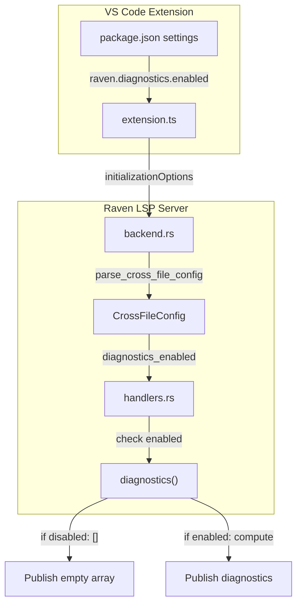

# Design Document: Diagnostics Master Switch

## Overview

This design adds a master switch configuration option (`raven.diagnostics.enabled`) that allows users to completely enable or disable all diagnostics with a single setting. The implementation follows the existing configuration patterns in Raven, adding a new boolean field to `CrossFileConfig` and checking it early in the diagnostics pipeline.

The design prioritizes:
- Minimal code changes by leveraging existing configuration infrastructure
- Early exit in diagnostics computation when disabled (performance)
- Proper clearing of existing diagnostics when toggled off
- Seamless integration with runtime configuration changes

## Architecture



## Components and Interfaces

### 1. VS Code Extension Configuration (package.json)

Add a new configuration property under the `raven.diagnostics` namespace:

```json
{
  "raven.diagnostics.enabled": {
    "type": "boolean",
    "default": true,
    "description": "Enable or disable all diagnostics. When disabled, no diagnostic messages will be shown regardless of individual severity settings."
  }
}
```

This follows the existing pattern of `raven.diagnostics.undefinedVariables` but acts as a master switch.

### 2. CrossFileConfig (config.rs)

Add a new field to the `CrossFileConfig` struct:

```rust
pub struct CrossFileConfig {
    // ... existing fields ...
    
    /// Master switch for all diagnostics
    /// When false, all diagnostics are suppressed regardless of individual severity settings
    pub diagnostics_enabled: bool,
}

impl Default for CrossFileConfig {
    fn default() -> Self {
        Self {
            // ... existing defaults ...
            diagnostics_enabled: true,
        }
    }
}
```

### 3. Configuration Parser (backend.rs)

Update `parse_cross_file_config` to read the new setting:

```rust
fn parse_cross_file_config(settings: &serde_json::Value) -> Option<CrossFileConfig> {
    // ... existing parsing ...
    
    // Parse diagnostics.enabled (master switch)
    if let Some(diag) = settings.get("diagnostics") {
        if let Some(v) = diag.get("enabled").and_then(|v| v.as_bool()) {
            config.diagnostics_enabled = v;
        }
        // ... existing undefinedVariables parsing ...
    }
    
    // Log the setting
    log::info!("  diagnostics_enabled: {}", config.diagnostics_enabled);
    
    Some(config)
}
```

### 4. Diagnostics Function (handlers.rs)

Add an early exit check at the start of the `diagnostics` function:

```rust
pub fn diagnostics(state: &WorldState, uri: &Url) -> Vec<Diagnostic> {
    // Master switch check - return empty if diagnostics disabled
    if !state.cross_file_config.diagnostics_enabled {
        return Vec::new();
    }
    
    // ... existing diagnostics logic ...
}
```

### 5. Runtime Configuration Change Handler (backend.rs)

The existing `did_change_configuration` handler already recomputes diagnostics for open documents. When the master switch is toggled:

- **Enabled → Disabled**: `diagnostics()` returns empty, which gets published, clearing existing diagnostics
- **Disabled → Enabled**: `diagnostics()` computes normally, publishing fresh diagnostics

No additional changes needed for runtime toggling since the existing infrastructure handles it.

## Data Models

### Configuration Flow

```
VS Code Settings
    ↓
initializationOptions JSON
    {
      "diagnostics": {
        "enabled": true/false,
        "undefinedVariables": true/false
      },
      "crossFile": { ... },
      "packages": { ... }
    }
    ↓
parse_cross_file_config()
    ↓
CrossFileConfig {
    diagnostics_enabled: bool,
    undefined_variables_enabled: bool,
    // ... other fields
}
    ↓
WorldState.cross_file_config
    ↓
diagnostics() checks state.cross_file_config.diagnostics_enabled
```

### Precedence Rules

1. `diagnostics_enabled = false` → All diagnostics suppressed (highest precedence)
2. `diagnostics_enabled = true` → Individual settings apply:
   - `undefined_variables_enabled` controls undefined variable diagnostics
   - Individual severity settings control diagnostic levels
   - Other diagnostic types computed normally

## Correctness Properties

*A property is a characteristic or behavior that should hold true across all valid executions of a system—essentially, a formal statement about what the system should do. Properties serve as the bridge between human-readable specifications and machine-verifiable correctness guarantees.*

Property 1: Master switch disabled suppresses all diagnostics
*For any* document URI and any WorldState where `diagnostics_enabled` is `false`, calling `diagnostics(state, uri)` SHALL return an empty vector regardless of document content, syntax errors, or other configuration settings (including individual severity settings).
**Validates: Requirements 1.4, 3.1, 3.4**

Property 2: Master switch enabled preserves normal diagnostics behavior
*For any* document URI and any WorldState where `diagnostics_enabled` is `true`, calling `diagnostics(state, uri)` SHALL return the same diagnostics as if the master switch check did not exist (i.e., the master switch is transparent when enabled).
**Validates: Requirements 1.3, 3.3**

Property 3: Configuration parsing round-trip for explicit boolean
*For any* boolean value `b`, if initialization options JSON contains `diagnostics.enabled` set to `b`, parsing SHALL produce a `CrossFileConfig` with `diagnostics_enabled` equal to `b`.
**Validates: Requirements 2.3**

Property 4: Configuration parsing defaults to enabled when absent
*For any* initialization options JSON that does not contain `diagnostics.enabled`, parsing SHALL produce a `CrossFileConfig` with `diagnostics_enabled = true`.
**Validates: Requirements 2.4**

## Error Handling

### Invalid Configuration Values

If `diagnostics.enabled` is present but not a boolean:
- The parser ignores the invalid value
- The default value (`true`) is used
- No error is raised (consistent with existing configuration parsing behavior)

### Missing Configuration Section

If the `diagnostics` section is entirely missing:
- All diagnostics settings use their defaults
- `diagnostics_enabled` defaults to `true`
- This maintains backward compatibility with existing configurations

## Testing Strategy

### Unit Tests

1. **Configuration parsing tests** (backend.rs):
   - Test parsing with `diagnostics.enabled: true`
   - Test parsing with `diagnostics.enabled: false`
   - Test parsing with missing `diagnostics.enabled`
   - Test parsing with invalid `diagnostics.enabled` value

2. **Diagnostics function tests** (handlers.rs):
   - Test that diagnostics returns empty when `diagnostics_enabled = false`
   - Test that diagnostics returns normally when `diagnostics_enabled = true`

3. **Default value tests** (config.rs):
   - Test that `CrossFileConfig::default()` has `diagnostics_enabled = true`

### Property-Based Tests

Property tests should verify:
- **Property 1**: For randomly generated documents and configs with `diagnostics_enabled = false`, diagnostics always returns empty
- **Property 2**: For randomly generated documents and configs with `diagnostics_enabled = true`, diagnostics returns the same result as the baseline (without master switch check)

### Integration Tests

1. **VS Code extension tests**:
   - Verify setting appears in VS Code settings UI
   - Verify setting is sent in initializationOptions
   - Verify toggling setting triggers configuration change notification

2. **End-to-end tests**:
   - Open a file with syntax errors
   - Verify diagnostics appear when enabled
   - Toggle setting to disabled
   - Verify diagnostics are cleared
   - Toggle setting back to enabled
   - Verify diagnostics reappear
