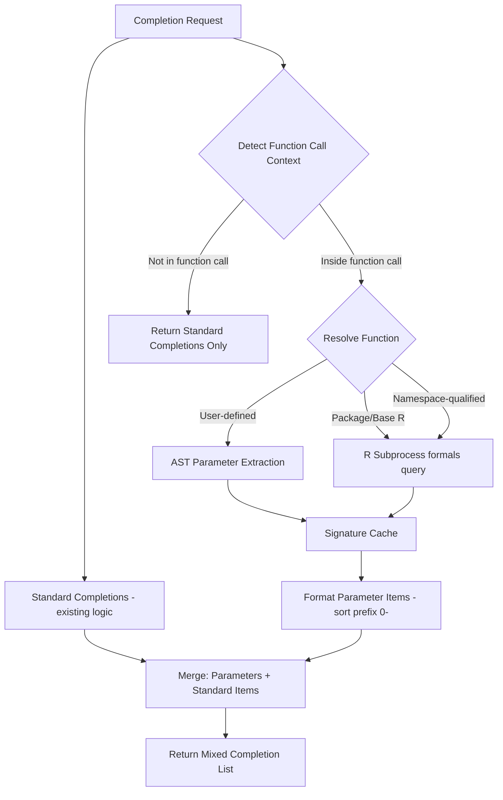

# Design Document: Function Parameter Completions

## Overview

This design adds function parameter completions to Raven's LSP completion handler. When the cursor is inside a function call's parentheses, parameter names are added to the standard completion list with highest sort priority (`"0-"` prefix). Standard completions (variables, functions, keywords) remain available since argument values often reference local variables.

Key design decisions informed by research on the official R language server (languageserver package):

- **Mixed completions**: Parameters are ADDED to standard completions, not replacing them. This matches R-LS behavior where `filter(df, ` shows both `filter`'s params AND local variables needed as argument values.
- **AST-based context detection with fallback**: Raven uses tree-sitter for context detection and falls back to a bracket heuristic for incomplete syntax, matching R-LS robustness while preserving AST accuracy when available.
- **Embedded-R scope gating**: In R Markdown or embedded-R documents, parameter completions only appear inside R code blocks (mirrors R-LS behavior).
- **Case-insensitive substring matching**: Parameter filtering uses case-insensitive substring matches rather than strict prefix-only matches (R-LS parity).
- **Dots inclusion**: `...` is included in parameter completions to match R-LS (even though it’s not always useful to insert).
- **Sort prefix `0-` with index**: Parameters sort before all other completion types. Within parameters, they sort by definition order (e.g., `0-001`, `0-002`) rather than alphabetically, to match R-LS behavior and user expectation.
- **`options()` support**: Special handling for `base::options()` to suggest global option names (e.g., `width`, `digits`) as parameters.
- **`CompletionItemKind::VARIABLE`**: Matches R-LS parameter completion kind; detail is `parameter` (default values are optional enhancements).
- **Namespace-qualified token suppression**: When the current token uses `::`/`:::`, parameter completions are suppressed to avoid fighting namespace completions (R-LS parity).
- **Parameter documentation on resolve**: `completionItem/resolve` pulls argument docs from Rd `\\arguments` (package functions) or roxygen2-style comments (user-defined).

The implementation leverages existing infrastructure:
- Tree-sitter AST for context detection and user-defined function parameter extraction
- R subprocess for querying base R and package function signatures
- Cross-file scope resolution for functions defined in sourced files
- Package library for resolving which package a function belongs to
- Existing `completionItem/resolve` pattern for lazy documentation loading

## Architecture



### Completion Flow Detail

When a completion request arrives:

1. **File path context** is checked first (existing behavior, unchanged).
2. **Embedded-R scope gating**: if the document is R Markdown/embedded-R and the cursor is outside an R code block, return standard completions only (no parameter completions).
3. **Token detection**: detect the token at cursor and check for namespace accessor (`::` or `:::`). This happens BEFORE call detection (matching R-LS ordering where `detect_token()` precedes `detect_call()`).
4. **Special-case context gating**: if the cursor is inside a function call with a special-case handler (e.g., `library()`, `require()` showing installed packages), use that handler and skip parameter completions. The official R-LS skips parameter completions entirely for these functions.
5. **Standard completions** are always collected (keywords, constants, document symbols, package exports, cross-file symbols) — this is the existing `completion()` logic.
6. **Namespace-token suppression**: if the token from step 3 has a namespace accessor (`::`/`:::`), skip call detection and parameter completions entirely. Only namespace completions are shown. (This is how R-LS works: `detect_call()` is never invoked when an accessor is present.)
7. **Function call context** is checked via AST walk (with string-aware bracket-heuristic fallback). If detected, proceed; otherwise return standard completions only.
8. **Parameter completions** are prepended to the standard list with `"0-"` sort prefix when eligible.

This ordering ensures that inside `filter(df, col > `, the user sees:
- `filter`'s parameters (`.data`, `.preserve`, etc.) at the top
- Local variables (`df`, `col`) and other completions below

## Components and Interfaces

### 1. Completion Context Detection

New module: `crates/raven/src/completion_context.rs`

```rust
/// Information about a detected function call at cursor position
pub struct FunctionCallContext {
    /// Name of the function being called
    pub function_name: String,
    /// Optional namespace qualifier (e.g., "dplyr" in dplyr::filter)
    pub namespace: Option<String>,
    /// Whether the call uses internal access (:::)
    pub is_internal: bool,
}

/// Detect if cursor is inside a function call's argument list.
/// Returns None if cursor is outside all function calls, inside a string, etc.
pub fn detect_function_call_context(
    tree: &Tree,
    text: &str,
    position: Position,
) -> Option<FunctionCallContext>;

/// Walk up the AST from cursor to find enclosing function call.
/// Returns the innermost function call when nested.
fn find_enclosing_function_call(
    node: Node,
    text: &str,
    position: Position,
) -> Option<FunctionCallContext>;

```

**Context detection strategy** (tree-sitter AST walk):
1. If the document is embedded-R (e.g., R Markdown), ensure the cursor is inside an R code block; otherwise return `None`
2. Find the node at cursor position
3. Walk up ancestors looking for `call` nodes
4. Verify cursor is inside the argument list (between `(` and `)`)
5. For nested calls: the innermost `call` ancestor wins
6. For namespace-qualified calls (`pkg::func(`): extract both namespace and function name from the `namespace_operator` node. Detect if operator is `::` or `:::` and set `is_internal` accordingly.
7. Skip if cursor is inside a `string` node (no parameter completions inside string literals)
8. If the AST walk fails to find a call (e.g., due to incomplete syntax), fall back to a bracket-based heuristic with a finite state machine (FSM) modeled on the official R language server's C implementation (`fsm.c`/`search.c`):
   - Scan backward from the cursor position through the document text, character by character
   - **Multi-bracket nesting**: Track all three bracket types — `(` / `)`, `[` / `]`, `{` / `}` — using a stack. Opening brackets push, closing brackets pop. Only an unmatched `(` (not `[` or `{`) triggers parameter completions, but all types must be tracked for correct nesting depth. This prevents incorrect matches in `df[func(x, |)]` where the `[` must be counted.
   - **String boundary tracking**: Maintain FSM state to detect when the scanner is inside single-quoted (`'...'`), double-quoted (`"..."`), backtick-quoted (`` `...` ``), or R 4.0+ raw strings (`r"(...)"`, `R"(...)"`, `r'(...)'`, `R'(...)'`, and variants with dash delimiters like `r"-(..)-"`). Brackets inside strings are ignored. This prevents `f("(", |)` from being confused by the `(` inside the string literal.
   - **Comment handling**: When the scanner encounters `#` outside of any string literal, it must skip backward to the beginning of that line (the `#` starts a comment that extends to end-of-line, so everything from `#` rightward is comment text). This prevents brackets inside comments from affecting nesting, e.g., `f(x, # adjust ( balance\n  |)` must detect `f`.
   - **Backslash escapes**: Track `\` to handle escaped quotes inside strings (e.g., `f("a\"(b", |)` must detect `f` despite the escaped quote).
   - Once the unmatched `(` is found, extract the function name token immediately before it: scan backward from the `(` position, skipping whitespace, then collecting identifier characters including `.` and `::` / `:::` namespace qualifiers. Stop at any character that cannot be part of an R identifier or namespace accessor.
   - This matches R-LS robustness for incomplete/malformed syntax

### 2. Parameter Resolver

New module: `crates/raven/src/parameter_resolver.rs`

```rust
#[derive(Debug, Clone)]
pub struct FunctionSignature {
    pub name: String,
    pub parameters: Vec<ParameterInfo>,
    pub source: SignatureSource,
}

#[derive(Debug, Clone)]
pub struct ParameterInfo {
    pub name: String,
    pub default_value: Option<String>,
    pub is_dots: bool,
}

#[derive(Debug, Clone)]
pub enum SignatureSource {
    RSubprocess { package: Option<String> },
    CurrentFile { uri: Url, line: u32 },
    CrossFile { uri: Url, line: u32 },
}

/// Thread-safe LRU signature cache
pub struct SignatureCache {
    /// Package function signatures ("package::function" -> signature)
    package_signatures: RwLock<LruCache<String, FunctionSignature>>,
    /// User-defined function signatures ("file:///path#func" -> signature)
    user_signatures: RwLock<LruCache<String, FunctionSignature>>,
}

impl SignatureCache {
    pub fn new(max_package: usize, max_user: usize) -> Self;
    pub fn get_package(&self, key: &str) -> Option<FunctionSignature>;
    pub fn get_user(&self, key: &str) -> Option<FunctionSignature>;
    pub fn insert_package(&self, key: String, sig: FunctionSignature);
    pub fn insert_user(&self, key: String, sig: FunctionSignature);
    /// Invalidate all user-defined signatures from a specific file
    pub fn invalidate_file(&self, uri: &Url);
}

/// Resolve function parameters with two-phase resolution:
/// Phase 1 (local): AST-based extraction for user-defined functions
/// Phase 2 (package): R subprocess formals() query for package functions
pub struct ParameterResolver<'a> {
    state: &'a WorldState,
    cache: &'a SignatureCache,
}

impl<'a> ParameterResolver<'a> {
    /// Resolve parameters for a function (synchronous, may block).
    ///
    /// Resolution order:
    /// 1. Cache lookup (instant)
    /// 2. User-defined: current file AST, then cross-file scope (instant)
    /// 3. Package: namespace-qualified or guess_package + R subprocess (blocks)
    ///
    /// For package functions on cache miss, this calls R subprocess via
    /// `get_function_formals()` with a short timeout (5 seconds). The first
    /// request for a given package function may take up to the timeout
    /// duration; subsequent requests are instant via cache.
    ///
    /// **Threading model**: The backend's `completion()` async wrapper runs
    /// parameter resolution inside `tokio::task::spawn_blocking` to prevent
    /// R subprocess calls from blocking the async runtime. Standard completion
    /// collection (keywords, symbols, etc.) runs first under the WorldState
    /// read lock, then parameter resolution runs in `spawn_blocking` with
    /// cloned `SignatureCache` and `PackageLibrary` Arc references. This
    /// follows the same pattern used by `completion_resolve()` in backend.rs.
    pub fn resolve(
        &self,
        function_name: &str,
        namespace: Option<&str>,
        is_internal: bool,
        current_uri: &Url,
        position: Position,
    ) -> Option<FunctionSignature>;

    /// Extract parameters from a function_definition AST node
    fn extract_from_ast(
        func_node: Node,
        text: &str,
    ) -> Vec<ParameterInfo>;
}
```

**Resolution priority** (matches R-LS two-phase approach):
1. **Cache**: Check signature cache first
2. **Local AST**: Search the current file for the nearest in-scope function definition that appears before the cursor, then extract params from its `formal_parameters` node (works for untitled/unsaved documents using in-memory text)
3. **Cross-file**: Use cross-file scope to find function in sourced files
4. **Package**: If namespace is provided (`dplyr::filter`), query `formals(dplyr::filter)` directly. Otherwise, use the scope resolver's position-aware package list (the same `loaded_packages` + `inherited_packages` used by the completion handler) to determine which packages are in scope at the cursor position, then check which of those packages exports the function. This ensures that when multiple packages export the same name, the one actually loaded at the cursor's position wins — not a global "most recently loaded" heuristic.

**Package resolution example** — ambiguous function names:
```r
library(stats)      # line 1: stats::filter (time series)
x <- filter(data, ) # line 2: cursor here → uses stats::filter
library(dplyr)      # line 3: dplyr::filter (data frame subsetting)
y <- filter(df, )   # line 4: cursor here → uses dplyr::filter
```
At line 2, `loaded_packages` = `[stats]` at this position, so `filter` resolves to `stats::filter`. At line 4, `loaded_packages` = `[stats, dplyr]`, and since `dplyr` loads after `stats`, it masks `stats::filter`, so `filter` resolves to `dplyr::filter`.

**Edge cases**:
- **No loaded package exports the function**: Fall back to cross-file scope and user-defined function resolution. If no match, return no parameter completions (standard completions still appear).
- **Function name exists in multiple loaded packages**: The last `library()` call before the cursor position wins (R's masking semantics). This is already handled by the scope resolver's position-aware package list.

**Performance**: Resolution checks only `loaded_packages` + `inherited_packages` at the cursor position (typically 5-15 packages), not all installed packages. Package export lookups use the pre-loaded `PackageLibrary` cache, so no R subprocess is needed for the lookup itself — only `formals()` requires R subprocess on cache miss.

### 3. R Subprocess Extensions

Extensions to `crates/raven/src/r_subprocess.rs`:

```rust
impl RSubprocess {
    /// Query function parameters using formals().
    /// For package functions: formals(pkg::func) or formals(pkg:::func)
    /// For unqualified functions: formals(func)
    pub async fn get_function_formals(
        &self,
        function_name: &str,
        package: Option<&str>,
        exported_only: bool,
    ) -> Result<Vec<ParameterInfo>>;
}
```

R code for querying formals (tab-separated output, one param per line):
```r
tryCatch({
  # Resolve function object first, then handle primitives via args()
  fn <- if (is.null(pkg_name)) get(func_name, mode = "function")
        else if (exported_only) getExportedValue(pkg_name, func_name)
        else get(func_name, envir = asNamespace(pkg_name))
  f <- if (is.primitive(fn)) formals(args(fn)) else formals(fn)
  
  if (is.null(f)) cat("")
  else for (name in names(f)) {
    default <- if (is.symbol(f[[name]]) && nchar(as.character(f[[name]])) == 0) ""
               else deparse(f[[name]], width.cutoff = 500)[1]
    cat(name, "\t", default, "\n", sep = "")
  }
}, error = function(e) cat("__RLSP_ERROR__:", conditionMessage(e), sep = ""))
```

**Output parsing convention**: Each line is `name\tdefault\n`. An empty string after the tab (i.e., `name\t\n`) means the parameter has no default value — the parser should treat this as `default_value = None`, not as an empty-string default.

### 4. Roxygen/Comment Extraction (Shared Utility)

New module: `crates/raven/src/roxygen.rs`

This module provides shared comment extraction used by both parameter documentation resolve (Requirement 7) and function documentation resolve (Requirement 8). It parses roxygen2-style tags when present and falls back to plain comment text when not.

```rust
/// Parsed roxygen/comment block from the contiguous comment lines above a function definition
#[derive(Debug, Clone)]
pub struct RoxygenBlock {
    /// Title line (first non-tag line)
    pub title: Option<String>,
    /// Description paragraph (lines after title, before first tag)
    pub description: Option<String>,
    /// @param entries: param_name -> description
    pub params: HashMap<String, String>,
    /// Fallback markdown/text when no roxygen tags are present
    pub fallback: Option<String>,
}

/// Extract roxygen comment block by scanning backward from a function definition line.
/// Collects consecutive comment lines immediately above the function (`#'` preferred, `#` fallback).
pub fn extract_roxygen_block(text: &str, func_line: u32) -> Option<RoxygenBlock>;

/// Extract @param description for a specific parameter from a roxygen block.
pub fn get_param_doc(block: &RoxygenBlock, param_name: &str) -> Option<String>;

/// Get the function-level documentation (title + description, or fallback text).
pub fn get_function_doc(block: &RoxygenBlock) -> Option<String>;
```

### 5. Documentation on Resolve (Parameters and Functions)

Extension to `crates/raven/src/handlers.rs` `completion_item_resolve()`:

Parameter completion items store resolve data in the `data` field. All parameter completions include `"type": "parameter"` for unambiguous dispatch (matching the official R language server's `token_data` pattern):

For package function parameters:
```json
{
  "type": "parameter",
  "param_name": "x",
  "function_name": "filter",
  "package": "dplyr"
}
```

For user-defined function parameters:
```json
{
  "type": "parameter",
  "param_name": "threshold",
  "function_name": "process_data",
  "uri": "file:///path/to/file.R",
  "func_line": 5
}
```

For user-defined function name completions (no `param_name`):
```json
{
  "type": "user_function",
  "function_name": "process_data",
  "uri": "file:///path/to/file.R",
  "func_line": 5
}
```

**Resolve handler dispatch order** (in `completion_item_resolve()`):

The resolve handler inspects the `type` field in the completion item's `data` to determine which resolution path to use. This explicit discriminator avoids fragile heuristics based on which fields happen to be present and matches the R-LS pattern. Dispatch proceeds in this order:

1. **Parameter completion** (`type == "parameter"`):
   - For package functions (has `package`): fetch structured Rd arguments (or parse Rd `\\arguments`) via `help_cache`/help subsystem, then extract the argument description for that parameter name.
   - For user-defined functions (has `uri` + `func_line`): locate the function definition, call `extract_roxygen_block()`, then `get_param_doc()` (roxygen2-style tags with fallback to plain comments).
   - If no documentation found, return the item unchanged.

2. **User-defined function name completion** (`type == "user_function"`):
   - Use `uri` and `func_line`, call `extract_roxygen_block()`, then `get_function_doc()` to get the title/description.
   - If no roxygen block found, return the item unchanged.

3. **Package export completion** (has `topic` and `package`, existing behavior):
   - Existing resolve logic (unchanged) — fetches R help via `help_cache`.

4. **No recognized `type`**: Return the item unchanged.

```rust
/// Extract parameter description for a specific argument from Rd/structured help
fn extract_param_description(help_doc: &HelpDoc, param_name: &str) -> Option<String>;
```

### 6. Integration with Completion Handler

Modified `crates/raven/src/handlers.rs`:

```rust
const SORT_PREFIX_PARAM: &str = "0-";    // NEW: highest priority
const SORT_PREFIX_SCOPE: &str = "1-";    // existing
const SORT_PREFIX_WORKSPACE: &str = "2-"; // existing
const SORT_PREFIX_PACKAGE: &str = "4-";  // existing
const SORT_PREFIX_KEYWORD: &str = "5-";  // existing

pub fn completion(
    state: &WorldState,
    uri: &Url,
    position: Position,
) -> Option<CompletionResponse> {
    // ... existing file path context check (unchanged) ...

    // Build standard completions (existing logic: keywords, constants,
    // document symbols, package exports, cross-file symbols)
    let mut items = build_standard_completions(state, uri, position, tree, &text);

    // Check if inside function call — if so, prepend parameter completions
    // Skip param completions if the current token is namespace-qualified (R-LS parity)
    let call_context = detect_function_call_context(tree, &text, position);
    if let Some(ctx) = call_context {
        if token_accessor_is_empty {
            let param_items = get_parameter_completions(
                state, uri, &ctx.function_name, ctx.namespace.as_deref(),
                ctx.is_internal, token, position,
            );
            items.splice(0..0, param_items);
        }
    }

    Some(CompletionResponse::Array(items))
}

fn get_parameter_completions(
    state: &WorldState,
    uri: &Url,
    function_name: &str,
    namespace: Option<&str>,
    is_internal: bool,
    token: &str,
    position: Position,
) -> Vec<CompletionItem> {
    let resolver = ParameterResolver::new(state, &state.signature_cache);
    // resolve() is synchronous: instant for user-defined (AST), may block
    // briefly for package functions (R subprocess with 5s timeout on cache miss)
    let signature = match resolver.resolve(function_name, namespace, is_internal, uri, position) {
        Some(sig) => sig,
        None => return Vec::new(),
    };
    
    // Special handling for base::options()
    let mut parameters = signature.parameters;
    if function_name == "options" && (namespace.is_none() || namespace == Some("base")) {
        // In a real implementation we might query names(.Options) from R
        // For now, we assume RSubprocess returns them if we requested them special-case
        // OR we can append them here if we have a list.
        // Given the spec requirement is to match R-LS, and R-LS appends them in `arg_completion`.
        // We will leave this implementation detail to the coder but note it in the design.
    }

    parameters.iter()
        .enumerate() // Capture index for stable sorting
        .filter(|(_, p)| match_with_case_insensitive_substring(&p.name, token))
        .map(|(idx, p)| {
            let detail = Some(match p.default_value.as_ref() {
                Some(d) => format!("parameter = {}", d), // optional enhancement
                None => "parameter".to_string(),
            });
            // For `...`, insert as-is (no ` = `) since `... = value` is invalid R.
            // For all other params, append ` = ` for convenience.
            let insert = if p.is_dots {
                p.name.clone()
            } else {
                format!("{} = ", p.name)
            };
            // Note: filter_text is intentionally omitted.
            CompletionItem {
                label: p.name.clone(),
                kind: Some(CompletionItemKind::VARIABLE),
                detail,
                insert_text: Some(insert),
                insert_text_format: Some(InsertTextFormat::PLAIN_TEXT),
                // Sort by index (0-001, 0-002) to preserve definition order
                sort_text: Some(format!("{}{:03}", SORT_PREFIX_PARAM, idx)),
                data: Some(serde_json::json!({
                    "type": "parameter",
                    "param_name": p.name,
                    "function_name": function_name,
                    "package": namespace,
                })),
                ..Default::default()
            }
        })
        .collect()
}
```

**Matching rule**: Parameter filtering uses case-insensitive substring matching (same semantics as R-LS `match_with`), not strict prefix-only matching. The matching MUST treat all characters literally (not as regex patterns). In particular, `.` in R identifiers like `na.rm` must match literally, not as a regex wildcard. Implementation should use a simple `contains`-style check (e.g., `str::contains` with lowercased inputs), NOT regex `grepl`. The R-LS achieves this by escaping `.` before passing to `grepl`.
**Backend threading model**: The `completion()` async wrapper in `backend.rs` must use `tokio::task::spawn_blocking` to wrap the parameter resolution path, since `resolve()` may block on R subprocess. The pattern is:

1. Acquire WorldState read lock, collect standard completions and detect function call context (fast, non-blocking)
2. Release the read lock
3. If function call context detected, clone `SignatureCache` and `PackageLibrary` `Arc` references, then run `get_parameter_completions()` inside `spawn_blocking`
4. Merge parameter items into the completion list and return

This follows the same pattern already used by `completion_resolve()` in `backend.rs`, which clones `help_cache` Arc and runs the sync handler inside `spawn_blocking`.

**User-defined function name completions**: The existing `collect_document_completions` and cross-file symbol completions should be extended to include `data` with `uri` and `func_line` for function symbols, so that `completionItem/resolve` can locate the roxygen block. This applies to items with `CompletionItemKind::FUNCTION` that come from the current file or cross-file scope (not package exports, which already have resolve data).

## Data Models

### Signature Cache Key Format

```text
Package functions: "package::function" (e.g., "dplyr::filter")
Base R functions:  "base::print" (base R uses same format)
User functions:    "file:///path/to/file.R#my_func"
```

### Sort Prefix Hierarchy

```text
"0-" — function parameters (highest priority, new)
"1-" — local scope definitions
"2-" — cross-file workspace symbols
"3-" — (reserved, unused)
"4-" — package exports
"5-" — keywords / constants (lowest priority)
```

Note: `"3-"` is intentionally unused (reserved for future use). The official R language server uses `"3-"` for NAMESPACE-imported objects (`importFrom()` directives). This gap is consistent with the existing codebase sort prefix constants in `handlers.rs` and leaves room for future parity (see requirements.md Out of Scope item 10).

### Cache Configuration

| Cache | Type | Default Capacity | Eviction |
|-------|------|-----------------|----------|
| `SignatureCache` (package) | `LruCache<String, FunctionSignature>` | 500 | LRU |
| `SignatureCache` (user) | `LruCache<String, FunctionSignature>` | 200 | LRU |

All caches use `RwLock` with `peek()` for reads (no LRU promotion under read lock) and `push()` for writes, consistent with existing Raven cache patterns.

**`invalidate_file()` implementation note**: The user-defined signature cache keys are strings like `"file:///path/to/file.R#my_func"`. To invalidate all entries for a given URI, the implementation must iterate the LRU cache and collect keys matching the URI prefix, then remove them. This is O(n) in cache size but acceptable given the small capacity (200 entries). An alternative is a secondary index (`HashMap<Url, Vec<String>>`) mapping URIs to cache keys for O(1) invalidation, but this adds complexity that is not warranted at the default capacity.


## Correctness Properties

*A property is a characteristic or behavior that should hold true across all valid executions of a system—essentially, a formal statement about what the system should do. Properties serve as the bridge between human-readable specifications and machine-verifiable correctness guarantees.*

### Property 1: Function Call Context Detection

*For any* R code containing function calls and *for any* cursor position, the context detector SHALL return a `FunctionCallContext` with the correct function name when the cursor is inside the argument list (after `(`, before `)`, or after a comma), and SHALL return `None` when the cursor is outside all function call parentheses.

**Validates: Requirements 1.1, 1.2, 1.4**

### Property 2: Nested Function Call Resolution

*For any* R code containing nested function calls (e.g., `outer(inner(x))`), when the cursor is inside the inner function's parentheses, the context detector SHALL return the innermost function name.

**Validates: Requirements 1.3**

### Property 3: Parameter Extraction Round-Trip

*For any* user-defined R function with parameters, extracting parameters from the AST SHALL produce parameter names that match the original formal parameter names in declaration order.

**Validates: Requirements 4.1**

### Property 4: Default Value Preservation (Optional Enhancement)

*For any* function parameter with a default value (user-defined or package), if the completion item includes a default in its detail, it SHALL match the parameter’s default value string representation.

**Validates: Requirements 2.3, 4.3, 5.2**

### Property 5: Dots Parameter Inclusion

*For any* function with a `...` (dots) parameter, the parameter completions SHALL include `...` as a completion item.

**Validates: Requirements 5.5**

### Property 6: Parameter Completion Formatting

*For any* parameter completion item, the item SHALL have `kind = CompletionItemKind::VARIABLE`, `insert_text_format = InsertTextFormat::PLAIN_TEXT`, `sort_text` starting with `0-` followed by digits, and: for non-dots parameters, `insert_text` ending with ` = `; for the `...` parameter, `insert_text` equal to `"..."` (no ` = ` suffix).

**Validates: Requirements 5.1, 5.3, 5.6, 5.7**

### Property 7: Case-Insensitive Substring Matching

*For any* typed token inside a function call, parameter completions SHALL include parameters whose names contain the token as a case-insensitive substring.

**Validates: Requirements 5.4**

### Property 8: Namespace-Qualified Token Suppression

*For any* completion request where the current token uses a namespace accessor (`::` or `:::`), parameter completions SHALL be suppressed.

**Validates: Requirements 6.5**

### Property 9: Mixed Completions in Function Call Context

*For any* function call context where parameter completions are available, the completion list SHALL contain both parameter items (with `"0-"` sort prefix) and standard completion items (keywords, local variables, package exports).

**Validates: Requirements 6.1, 6.2**

### Property 10: Cache Consistency

*For any* function signature inserted into the cache, subsequent lookups with the same key SHALL return the cached signature without invoking R subprocess.

**Validates: Requirements 2.5, 3.4**

### Property 11: R Subprocess Input Validation

*For any* function name containing characters outside `[a-zA-Z0-9._]` or starting with invalid characters, the R subprocess query methods SHALL reject the input without executing R code.

**Validates: Requirements 10.2**

### Property 12: Parameter Documentation Extraction

*For any* Rd help data containing `\\arguments` entries or roxygen2-style comment blocks containing `@param name description`, the extraction function SHALL return the description for the specified parameter name.

**Validates: Requirements 7.2, 7.3**

### Property 13: Cache Invalidation on File Change

*For any* user-defined function signature in the cache, invalidating the file that defines it SHALL remove the signature from the cache so subsequent lookups return None.

**Validates: Requirements 9.2**

### Property 14: Roxygen Function Documentation Extraction

*For any* roxygen comment block containing a title line and/or `@description` tag above a function definition, the extraction function SHALL return the title and description as the function's documentation.

**Validates: Requirements 8.1, 8.2, 8.3**

## Error Handling

### R Subprocess Failures

1. **Timeout**: If R subprocess query exceeds the configured timeout (30s default for general queries, 5s for completion-path `formals()` queries), return `Err` and log at **warn** level with the timeout duration and function name. Timeouts indicate a potentially serious issue (hung R process, expensive query, or configuration problem) and warrant operator visibility. The completion handler returns standard completions without parameters.
2. **Invalid Output**: If R output cannot be parsed (missing tab separators, unexpected format), return empty parameter list.
3. **Package Not Found**: If package doesn't exist, return empty parameter list.
4. **Function Not Found**: If function doesn't exist in package, return empty parameter list.

### AST Parsing Failures

1. **Malformed Code**: If tree-sitter cannot parse, fall back to a bracket-based heuristic for call detection; if that fails, return standard completions (no parameter items).
2. **Missing Nodes**: If expected AST nodes are missing (e.g., no `formal_parameters` child), return empty parameter list.
3. **Invalid Position**: If cursor position is outside document bounds, return None.

Note: Non-timeout errors in AST parsing and cache operations are logged at trace level per Requirement 11.3, since these are expected edge cases rather than operational issues.

### Cache Failures

1. **Lock Contention**: Use `peek()` for reads (takes `&self`, no LRU promotion) under read locks. Use `push()` for writes under write locks. Consistent with existing Raven cache patterns.
2. **Memory Pressure**: LRU eviction handles memory bounds automatically.

### Documentation Resolve Failures

1. **No Help Text**: If R help text is unavailable for a package function, return the completion item without documentation.
2. **No Comment Block**: If a user-defined function has no contiguous comment block (roxygen or plain), return the completion item without documentation.
3. **Param Not Found**: If the argument name is not found in Rd `\\arguments` or roxygen tags, return the completion item without documentation.

## Out of Scope

The following are explicitly excluded from this spec and may be addressed in follow-up work:

1. **Pipe operator argument exclusion**: R's pipe operators (`|>` and `%>%`) supply the first argument implicitly (e.g., `df |> filter(col > 5)` pipes `df` as `.data`). This spec does not exclude the piped-in parameter from completions. The official R-LS does not handle this either.

2. **Anonymous and lambda function calls**: Parameter completions do not fire for calls to anonymous functions (`(function(x, y) x + y)(1, )`) or R 4.1+ lambda syntax (`(\(x, y) x + y)(1, )`). The context detector only handles identifier and namespace-qualified callees.

3. **Dollar-sign completions**: `list$` and `dataframe$` member completions are deferred to a separate follow-up spec.
4. **Filtering out already-specified named arguments**: Not required for R-LS parity; may be added later as an enhancement.

5. **Cross-session cache persistence**: Requirement 9.3 has been deferred (see requirements.md). The signature cache is in-memory only and rebuilt each session.

6. **Workspace-but-not-sourced function resolution**: See requirements.md Out of Scope item 5.

7. **Completion count limiting**: See requirements.md Out of Scope item 6.

8. **`textDocument/signatureHelp`**: See requirements.md Out of Scope item 7. Infrastructure (parameter resolver, signature cache, roxygen extraction) is designed to be reusable.

9. **`getOption()` special handling**: See requirements.md Out of Scope item 8.

10. **S4 slot access (`@`) completions**: See requirements.md Out of Scope item 9.

## Testing Strategy

### Unit Tests

Unit tests verify specific examples and edge cases:

1. **Context Detection**
   - Cursor at various positions in `func(a, b, c)`
   - Nested calls `outer(inner(x))`
   - Namespace-qualified calls `dplyr::filter(df, )`
   - Cursor inside string literals (should not trigger)
   - Cursor outside parentheses (should not trigger)
   - Incomplete syntax / unbalanced parentheses still finds the call
   - Brackets inside string literals: `f("(", |)` should detect `f`, not be confused by the `(` in the string
   - Brackets inside R comments: `f(x, # adjust ( balance\n  |)` should detect `f`
   - Mixed bracket types: `df[func(x, |)]` should detect `func`, not be confused by the `[`
   - R 4.0+ raw strings: `f(r"(hello(world))", |)` should detect `f`
   - Escaped quotes: `f("a\"(b", |)` should detect `f`
   - Cursor at column 0 (beginning of line): should not crash or trigger false detection
   - R Markdown: inside R code block triggers; outside code block does not
   - `library(|)` and `require(|)`: special-case handler takes precedence (if implemented)

2. **Parameter Extraction**
   - Simple function `function(x, y)`
   - With defaults `function(x = 1, y = "hello")`
   - With dots `function(...)` — includes `...`, insert text is `"..."` (no ` = `)
   - Mixed `function(x, y = 1, ...)` — includes `x`, `y`, and `...`; `x` and `y` get ` = ` but `...` does not

3. **Mixed Completions**
   - Inside `filter(df, ` — verify both params and local vars present
   - Verify parameter items have `"0-"` sort prefix
   - Verify standard items retain their existing sort prefixes
   - Case-insensitive substring matching (e.g., `OBJ` matches `object`); dots are literal (`.` in `na.rm` matches only `.`)
   - Namespace-qualified token suppression (e.g., `str(stats::o` yields no parameter items)
   - `insertTextFormat` is `PlainText` on all parameter items

4. **Parameter Documentation Resolve**
   - Package function with Rd `\\arguments` entry
   - User-defined function with roxygen `@param`
   - User-defined function with plain `#` comments (fallback)
   - Missing documentation (graceful fallback)

5. **Cache Behavior**
   - Cache hit returns same value
   - Cache invalidation on file change
   - LRU eviction when capacity exceeded

### Property-Based Tests

Property-based tests verify universal properties across generated inputs. Each test runs minimum 100 iterations.

**Test Configuration**: Use `proptest` crate with custom strategies for generating:
- Valid R function definitions with varying parameter counts and default values
- Function calls with various argument patterns (named, positional, mixed)
- Cursor positions within generated code
- Rd argument sections and roxygen blocks with `@param` entries (plus plain-comment fallbacks)

**Tag Format**: Each property test is tagged with:
`Feature: function-parameter-completions, Property N: [property description]`

### Integration Tests

1. **End-to-End Completion Flow**
   - Open document, request completions inside function call
   - Verify parameter items AND standard items both present
   - Verify sort order (params first)

2. **Cross-File Parameter Resolution**
   - Multi-file setup with sourced functions
   - Verify parameters from sourced files are available

3. **Namespace-Qualified Completions**
   - `dplyr::filter(` triggers parameter completions for dplyr's filter

4. **completionItem/resolve for Parameters**
   - Select a parameter completion, verify documentation is returned

5. **Embedded-R / Untitled Documents**
   - R Markdown: parameter completions appear only inside R code blocks
   - Untitled document URIs: local function parameter completions still work
