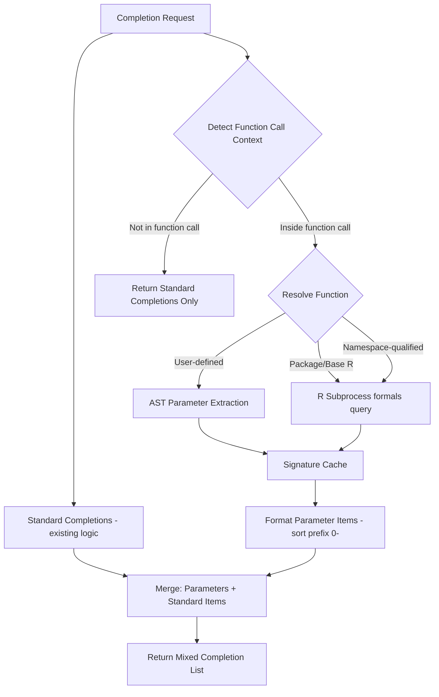

# Design Document: Function Parameter Completions

## Overview

This design adds function parameter completions to Raven's LSP completion handler. When the cursor is inside a function call's parentheses, parameter names are added to the standard completion list with highest sort priority (`"0-"` prefix). Standard completions (variables, functions, keywords) remain available since argument values often reference local variables.

Key design decisions informed by research on the official R language server (languageserver package):

- **Mixed completions**: Parameters are ADDED to standard completions, not replacing them. This matches R-LS behavior where `filter(df, ` shows both `filter`'s params AND local variables needed as argument values.
- **AST-based context detection**: Raven uses tree-sitter for context detection (more robust than R-LS's character-level backward scanning).
- **Dots exclusion**: `...` is excluded from parameter completions (R-LS includes it, but excluding is better UX).
- **Sort prefix `"0-"`**: Parameters sort before all other completion types, matching R-LS's `"0-"` prefix convention.
- **`CompletionItemKind::FIELD`**: Chosen over R-LS's `Variable` kind because FIELD better communicates "named parameter of a function" semantically.
- **Parameter documentation on resolve**: `completionItem/resolve` lazily loads `@param` descriptions from R help docs or roxygen comments.

The implementation leverages existing infrastructure:
- Tree-sitter AST for context detection and user-defined function parameter extraction
- R subprocess for querying base R and package function signatures
- Cross-file scope resolution for functions defined in sourced files
- Package library for resolving which package a function belongs to
- Existing `completionItem/resolve` pattern for lazy documentation loading

## Architecture



### Completion Flow Detail

When a completion request arrives:

1. **File path context** is checked first (existing behavior, unchanged).
2. **Standard completions** are always collected (keywords, constants, document symbols, package exports, cross-file symbols) — this is the existing `completion()` logic.
3. **Function call context** is checked via AST walk. If detected, parameter completions are prepended to the standard list with `"0-"` sort prefix.
4. If no function call context, return standard completions only.

This ordering ensures that inside `filter(df, col > `, the user sees:
- `filter`'s parameters (`.data`, `.preserve`, etc.) at the top
- Local variables (`df`, `col`) and other completions below

## Components and Interfaces

### 1. Completion Context Detection

New module: `crates/raven/src/completion_context.rs`

```rust
/// Information about a detected function call at cursor position
pub struct FunctionCallContext {
    /// Name of the function being called
    pub function_name: String,
    /// Optional namespace qualifier (e.g., "dplyr" in dplyr::filter)
    pub namespace: Option<String>,
    /// Parameters already specified as named arguments in the call
    pub existing_params: Vec<String>,
}

/// Detect if cursor is inside a function call's argument list.
/// Returns None if cursor is outside all function calls, inside a string, etc.
pub fn detect_function_call_context(
    tree: &Tree,
    text: &str,
    position: Position,
) -> Option<FunctionCallContext>;

/// Walk up the AST from cursor to find enclosing function call.
/// Returns the innermost function call when nested.
fn find_enclosing_function_call(
    node: Node,
    text: &str,
    position: Position,
) -> Option<FunctionCallContext>;

/// Extract already-specified named parameter names from function call arguments.
/// Scans argument nodes for `name = value` patterns.
fn extract_existing_parameters(call_node: Node, text: &str) -> Vec<String>;
```

**Context detection strategy** (tree-sitter AST walk):
1. Find the node at cursor position
2. Walk up ancestors looking for `call` nodes
3. Verify cursor is inside the argument list (between `(` and `)`)
4. For nested calls: the innermost `call` ancestor wins
5. For namespace-qualified calls (`pkg::func(`): extract both namespace and function name from the `namespace_operator` node
6. Skip if cursor is inside a `string` node (no parameter completions inside string literals)

### 2. Parameter Resolver

New module: `crates/raven/src/parameter_resolver.rs`

```rust
#[derive(Debug, Clone)]
pub struct FunctionSignature {
    pub name: String,
    pub parameters: Vec<ParameterInfo>,
    pub source: SignatureSource,
}

#[derive(Debug, Clone)]
pub struct ParameterInfo {
    pub name: String,
    pub default_value: Option<String>,
    pub is_dots: bool,
}

#[derive(Debug, Clone)]
pub enum SignatureSource {
    RSubprocess { package: Option<String> },
    CurrentFile { uri: Url, line: u32 },
    CrossFile { uri: Url, line: u32 },
}

/// Thread-safe LRU signature cache
pub struct SignatureCache {
    /// Package function signatures ("package::function" -> signature)
    package_signatures: RwLock<LruCache<String, FunctionSignature>>,
    /// User-defined function signatures ("file:///path#func" -> signature)
    user_signatures: RwLock<LruCache<String, FunctionSignature>>,
}

impl SignatureCache {
    pub fn new(max_package: usize, max_user: usize) -> Self;
    pub fn get_package(&self, key: &str) -> Option<FunctionSignature>;
    pub fn get_user(&self, key: &str) -> Option<FunctionSignature>;
    pub fn insert_package(&self, key: String, sig: FunctionSignature);
    pub fn insert_user(&self, key: String, sig: FunctionSignature);
    /// Invalidate all user-defined signatures from a specific file
    pub fn invalidate_file(&self, uri: &Url);
}

/// Resolve function parameters with two-phase resolution:
/// Phase 1 (local): AST-based extraction for user-defined functions
/// Phase 2 (package): R subprocess formals() query for package functions
pub struct ParameterResolver<'a> {
    state: &'a WorldState,
    cache: &'a SignatureCache,
}

impl<'a> ParameterResolver<'a> {
    /// Resolve parameters for a function.
    /// Resolution order:
    /// 1. Cache lookup
    /// 2. User-defined (current file AST, then cross-file scope)
    /// 3. Package function (namespace-qualified or guess_package + R subprocess)
    pub async fn resolve(
        &self,
        function_name: &str,
        namespace: Option<&str>,
        current_uri: &Url,
        position: Position,
    ) -> Option<FunctionSignature>;

    /// Synchronous resolve for use in completion handler.
    /// Returns cached result or triggers async fetch for next request.
    pub fn resolve_sync(
        &self,
        function_name: &str,
        namespace: Option<&str>,
        current_uri: &Url,
        position: Position,
    ) -> Option<FunctionSignature>;

    /// Extract parameters from a function_definition AST node
    fn extract_from_ast(
        func_node: Node,
        text: &str,
    ) -> Vec<ParameterInfo>;
}
```

**Resolution priority** (matches R-LS two-phase approach):
1. **Cache**: Check signature cache first
2. **Local AST**: Search current file for function definition, extract params from `formal_parameters` node
3. **Cross-file**: Use cross-file scope to find function in sourced files
4. **Package**: If namespace is provided (`dplyr::filter`), query `formals(dplyr::filter)` directly. Otherwise, use the scope resolver's position-aware package list (the same `loaded_packages` + `inherited_packages` used by the completion handler) to determine which packages are in scope at the cursor position, then check which of those packages exports the function. This ensures that when multiple packages export the same name, the one actually loaded at the cursor's position wins — not a global "most recently loaded" heuristic.

### 3. R Subprocess Extensions

Extensions to `crates/raven/src/r_subprocess.rs`:

```rust
impl RSubprocess {
    /// Query function parameters using formals().
    /// For package functions: formals(pkg::func)
    /// For unqualified functions: formals(func)
    pub async fn get_function_formals(
        &self,
        function_name: &str,
        package: Option<&str>,
    ) -> Result<Vec<ParameterInfo>>;
}
```

R code for querying formals (tab-separated output, one param per line):
```r
tryCatch({
  f <- formals(pkg::func)
  if (is.null(f)) cat("")
  else for (name in names(f)) {
    default <- if (is.symbol(f[[name]]) && nchar(as.character(f[[name]])) == 0) ""
               else deparse(f[[name]], width.cutoff = 500)[1]
    cat(name, "\t", default, "\n", sep = "")
  }
}, error = function(e) cat("__RLSP_ERROR__:", conditionMessage(e), sep = ""))
```

### 4. Roxygen Comment Extraction (Shared Utility)

New module: `crates/raven/src/roxygen.rs`

This module provides shared roxygen extraction used by both parameter documentation resolve (Requirement 7) and function documentation resolve (Requirement 8).

```rust
/// Parsed roxygen block from `#'` comment lines above a function definition
#[derive(Debug, Clone)]
pub struct RoxygenBlock {
    /// Title line (first non-tag line)
    pub title: Option<String>,
    /// Description paragraph (lines after title, before first tag)
    pub description: Option<String>,
    /// @param entries: param_name -> description
    pub params: HashMap<String, String>,
}

/// Extract roxygen comment block by scanning backward from a function definition line.
/// Collects consecutive `#'` lines immediately above the function.
pub fn extract_roxygen_block(text: &str, func_line: u32) -> Option<RoxygenBlock>;

/// Extract @param description for a specific parameter from a roxygen block.
pub fn get_param_doc(block: &RoxygenBlock, param_name: &str) -> Option<String>;

/// Get the function-level documentation (title + description) from a roxygen block.
pub fn get_function_doc(block: &RoxygenBlock) -> Option<String>;
```

### 5. Documentation on Resolve (Parameters and Functions)

Extension to `crates/raven/src/handlers.rs` `completion_item_resolve()`:

Parameter completion items store resolve data in the `data` field:
```json
{
  "param_name": "x",
  "function_name": "filter",
  "package": "dplyr"
}
```

For user-defined functions (both parameter and function completions):
```json
{
  "param_name": "threshold",
  "function_name": "process_data",
  "uri": "file:///path/to/file.R",
  "func_line": 5
}
```

For user-defined function name completions (no `param_name`):
```json
{
  "function_name": "process_data",
  "uri": "file:///path/to/file.R",
  "func_line": 5
}
```

The resolve handler:

**For parameter completions** (has `param_name` in data):
1. For package functions: fetch R help text via `help_cache.get_or_fetch()`, then extract the `@param` description for that parameter name.
2. For user-defined functions: use `uri` and `func_line` to locate the function definition, call `extract_roxygen_block()`, then `get_param_doc()`.
3. If no documentation found, return the item unchanged.

**For function name completions** (has `func_line` but no `param_name`):
1. For package functions: existing resolve logic (already works via `help_cache`).
2. For user-defined functions: use `uri` and `func_line`, call `extract_roxygen_block()`, then `get_function_doc()` to get the title/description.
3. If no documentation found, return the item unchanged.

```rust
/// Extract @param description for a specific parameter from R help text
fn extract_param_description(help_text: &str, param_name: &str) -> Option<String>;
```

### 6. Integration with Completion Handler

Modified `crates/raven/src/handlers.rs`:

```rust
const SORT_PREFIX_PARAM: &str = "0-";    // NEW: highest priority
const SORT_PREFIX_SCOPE: &str = "1-";    // existing
const SORT_PREFIX_WORKSPACE: &str = "2-"; // existing
const SORT_PREFIX_PACKAGE: &str = "4-";  // existing
const SORT_PREFIX_KEYWORD: &str = "5-";  // existing

pub fn completion(
    state: &WorldState,
    uri: &Url,
    position: Position,
) -> Option<CompletionResponse> {
    // ... existing file path context check (unchanged) ...

    // Build standard completions (existing logic: keywords, constants,
    // document symbols, package exports, cross-file symbols)
    let mut items = build_standard_completions(state, uri, position, tree, &text);

    // Check if inside function call — if so, prepend parameter completions
    let call_context = detect_function_call_context(tree, &text, position);
    if let Some(ctx) = call_context {
        let param_items = get_parameter_completions(
            state, uri, &ctx.function_name, ctx.namespace.as_deref(),
            &ctx.existing_params, position,
        );
        items.splice(0..0, param_items);
    }

    Some(CompletionResponse::Array(items))
}

fn get_parameter_completions(
    state: &WorldState,
    uri: &Url,
    function_name: &str,
    namespace: Option<&str>,
    existing_params: &[String],
    position: Position,
) -> Vec<CompletionItem> {
    let resolver = ParameterResolver::new(state, &state.signature_cache);
    let signature = match resolver.resolve_sync(function_name, namespace, uri, position) {
        Some(sig) => sig,
        None => return Vec::new(),
    };

    signature.parameters.iter()
        .filter(|p| !p.is_dots)                          // Exclude ...
        .filter(|p| !existing_params.contains(&p.name))  // Exclude already-specified
        .map(|p| {
            let detail = p.default_value.as_ref().map(|d| format!("= {}", d));
            CompletionItem {
                label: p.name.clone(),
                kind: Some(CompletionItemKind::FIELD),
                detail,
                insert_text: Some(format!("{} = ", p.name)),
                sort_text: Some(format!("{}{}", SORT_PREFIX_PARAM, p.name)),
                data: Some(serde_json::json!({
                    "param_name": p.name,
                    "function_name": function_name,
                    "package": namespace,
                })),
                ..Default::default()
            }
        })
        .collect()
}
```

**User-defined function name completions**: The existing `collect_document_completions` and cross-file symbol completions should be extended to include `data` with `uri` and `func_line` for function symbols, so that `completionItem/resolve` can locate the roxygen block. This applies to items with `CompletionItemKind::FUNCTION` that come from the current file or cross-file scope (not package exports, which already have resolve data).

## Data Models

### Signature Cache Key Format

```text
Package functions: "package::function" (e.g., "dplyr::filter")
Base R functions:  "base::print" (base R uses same format)
User functions:    "file:///path/to/file.R#my_func"
```

### Sort Prefix Hierarchy

```text
"0-" — function parameters (highest priority, new)
"1-" — local scope definitions
"2-" — cross-file workspace symbols
"4-" — package exports
"5-" — keywords / constants (lowest priority)
```

### Cache Configuration

| Cache | Type | Default Capacity | Eviction |
|-------|------|-----------------|----------|
| `SignatureCache` (package) | `LruCache<String, FunctionSignature>` | 500 | LRU |
| `SignatureCache` (user) | `LruCache<String, FunctionSignature>` | 200 | LRU |

All caches use `RwLock` with `peek()` for reads (no LRU promotion under read lock) and `push()` for writes, consistent with existing Raven cache patterns.


## Correctness Properties

*A property is a characteristic or behavior that should hold true across all valid executions of a system—essentially, a formal statement about what the system should do. Properties serve as the bridge between human-readable specifications and machine-verifiable correctness guarantees.*

### Property 1: Function Call Context Detection

*For any* R code containing function calls and *for any* cursor position, the context detector SHALL return a `FunctionCallContext` with the correct function name when the cursor is inside the argument list (after `(`, before `)`, or after a comma), and SHALL return `None` when the cursor is outside all function call parentheses.

**Validates: Requirements 1.1, 1.2, 1.4**

### Property 2: Nested Function Call Resolution

*For any* R code containing nested function calls (e.g., `outer(inner(x))`), when the cursor is inside the inner function's parentheses, the context detector SHALL return the innermost function name.

**Validates: Requirements 1.3**

### Property 3: Parameter Extraction Round-Trip

*For any* user-defined R function with parameters, extracting parameters from the AST SHALL produce parameter names that match the original formal parameter names in declaration order.

**Validates: Requirements 4.1**

### Property 4: Default Value Preservation

*For any* function parameter with a default value (user-defined or package), the completion item's detail field SHALL contain the string representation of that default value.

**Validates: Requirements 2.3, 4.3, 5.2**

### Property 5: Dots Parameter Exclusion

*For any* function with a `...` (dots) parameter, the parameter completions SHALL NOT include `...` as a completion item.

**Validates: Requirements 4.4**

### Property 6: Parameter Completion Formatting

*For any* parameter completion item, the item SHALL have `kind = CompletionItemKind::FIELD`, `insert_text` ending with ` = `, and `sort_text` starting with `"0-"`.

**Validates: Requirements 5.1, 5.3, 5.6**

### Property 7: Already-Specified Parameter Exclusion

*For any* function call with some parameters already specified as named arguments, the parameter completions SHALL NOT include any parameter names that appear in the existing named arguments.

**Validates: Requirements 5.5**

### Property 8: Mixed Completions in Function Call Context

*For any* function call context where parameter completions are available, the completion list SHALL contain both parameter items (with `"0-"` sort prefix) and standard completion items (keywords, local variables, package exports).

**Validates: Requirements 6.1, 6.2**

### Property 9: Cache Consistency

*For any* function signature inserted into the cache, subsequent lookups with the same key SHALL return the cached signature without invoking R subprocess.

**Validates: Requirements 2.5, 3.4**

### Property 10: R Subprocess Input Validation

*For any* function name containing characters outside `[a-zA-Z0-9._]` or starting with invalid characters, the R subprocess query methods SHALL reject the input without executing R code.

**Validates: Requirements 9.2**

### Property 11: Parameter Documentation Extraction

*For any* R help text containing argument descriptions or roxygen comment block containing `@param name description`, the extraction function SHALL return the description for the specified parameter name.

**Validates: Requirements 7.2, 7.3**

### Property 12: Cache Invalidation on File Change

*For any* user-defined function signature in the cache, invalidating the file that defines it SHALL remove the signature from the cache so subsequent lookups return None.

**Validates: Requirements 9.2**

### Property 13: Roxygen Function Documentation Extraction

*For any* roxygen comment block containing a title line and/or `@description` tag above a function definition, the extraction function SHALL return the title and description as the function's documentation.

**Validates: Requirements 8.1, 8.2, 8.3**

## Error Handling

### R Subprocess Failures

1. **Timeout**: If R subprocess query exceeds the configured timeout (30s default), return `Err` and log at trace level. The completion handler returns standard completions without parameters.
2. **Invalid Output**: If R output cannot be parsed (missing tab separators, unexpected format), return empty parameter list.
3. **Package Not Found**: If package doesn't exist, return empty parameter list.
4. **Function Not Found**: If function doesn't exist in package, return empty parameter list.

### AST Parsing Failures

1. **Malformed Code**: If tree-sitter cannot parse, fall back to standard completions (no function call context detected).
2. **Missing Nodes**: If expected AST nodes are missing (e.g., no `formal_parameters` child), return empty parameter list.
3. **Invalid Position**: If cursor position is outside document bounds, return None.

### Cache Failures

1. **Lock Contention**: Use `peek()` for reads (takes `&self`, no LRU promotion) under read locks. Use `push()` for writes under write locks. Consistent with existing Raven cache patterns.
2. **Memory Pressure**: LRU eviction handles memory bounds automatically.

### Documentation Resolve Failures

1. **No Help Text**: If R help text is unavailable for a package function, return the completion item without documentation.
2. **No Roxygen**: If user-defined function has no roxygen comments, return the completion item without documentation.
3. **Param Not Found**: If `@param` for the specific parameter name is not found in the help text, return the completion item without documentation.

## Testing Strategy

### Unit Tests

Unit tests verify specific examples and edge cases:

1. **Context Detection**
   - Cursor at various positions in `func(a, b, c)`
   - Nested calls `outer(inner(x))`
   - Namespace-qualified calls `dplyr::filter(df, )`
   - Cursor inside string literals (should not trigger)
   - Cursor outside parentheses (should not trigger)

2. **Parameter Extraction**
   - Simple function `function(x, y)`
   - With defaults `function(x = 1, y = "hello")`
   - With dots `function(...)` — dots excluded
   - Mixed `function(x, y = 1, ...)` — only x and y appear

3. **Mixed Completions**
   - Inside `filter(df, ` — verify both params and local vars present
   - Verify parameter items have `"0-"` sort prefix
   - Verify standard items retain their existing sort prefixes

4. **Parameter Documentation Resolve**
   - Package function with `@param` in help text
   - User-defined function with roxygen `@param`
   - Missing documentation (graceful fallback)

5. **Cache Behavior**
   - Cache hit returns same value
   - Cache invalidation on file change
   - LRU eviction when capacity exceeded

### Property-Based Tests

Property-based tests verify universal properties across generated inputs. Each test runs minimum 100 iterations.

**Test Configuration**: Use `proptest` crate with custom strategies for generating:
- Valid R function definitions with varying parameter counts and default values
- Function calls with various argument patterns (named, positional, mixed)
- Cursor positions within generated code
- R help text and roxygen blocks with `@param` entries

**Tag Format**: Each property test is tagged with:
`Feature: function-parameter-completions, Property N: [property description]`

### Integration Tests

1. **End-to-End Completion Flow**
   - Open document, request completions inside function call
   - Verify parameter items AND standard items both present
   - Verify sort order (params first)

2. **Cross-File Parameter Resolution**
   - Multi-file setup with sourced functions
   - Verify parameters from sourced files are available

3. **Namespace-Qualified Completions**
   - `dplyr::filter(` triggers parameter completions for dplyr's filter

4. **completionItem/resolve for Parameters**
   - Select a parameter completion, verify documentation is returned