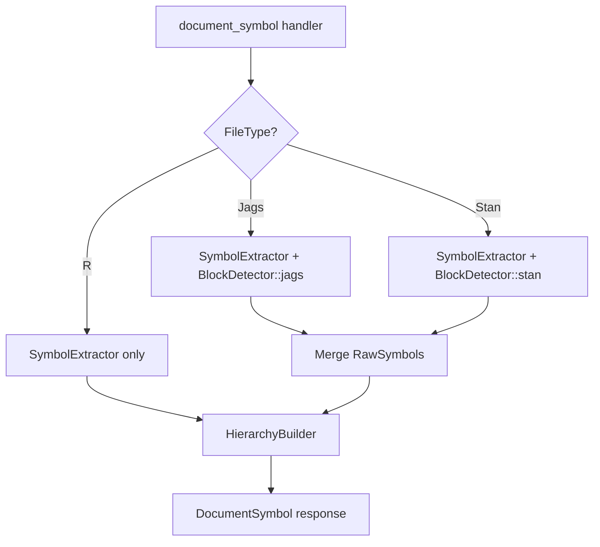

# Design Document: JAGS/Stan Outline Hierarchy

## Overview

This design adds text-based block detection for JAGS and Stan files so that language-specific block structures (`data { }`, `model { }`, `transformed parameters { }`, etc.) appear as top-level sections in the document outline. The detected blocks are represented as `RawSymbol` entries with `DocumentSymbolKind::Module` and `section_level: Some(1)`, which feeds directly into the existing `HierarchyBuilder` section-nesting machinery. Symbols extracted by the tree-sitter-based `SymbolExtractor` (which parses JAGS/Stan as R on a best-effort basis) then nest under their containing block automatically.

The implementation is a single new component — `BlockDetector` — plus a small integration point in the `document_symbol` handler that dispatches to the correct detector based on `FileType`.

## Architecture



The flow is:

1. `document_symbol` handler gets the document text and tree.
2. `SymbolExtractor::extract_all()` runs as today (AST-based extraction of assignments, sections, S4 methods, etc.).
3. If `file_type` is `Jags` or `Stan`, `BlockDetector::detect()` runs on the raw text and returns additional `RawSymbol` entries for each detected block.
4. The block symbols are merged into the symbol list.
5. `HierarchyBuilder::build()` runs unchanged — it already knows how to nest symbols inside sections (symbols with `section_level`).

## Components and Interfaces

### 1. BlockDetector

A new struct in `handlers.rs` (or a small submodule) that performs text-based regex detection of JAGS/Stan blocks.

```rust
/// Detects top-level block structures in JAGS and Stan files.
/// Returns RawSymbol entries with kind=Module and section_level=1.
pub struct BlockDetector;

impl BlockDetector {
    /// Detect JAGS blocks: "data" and "model"
    pub fn detect_jags(text: &str) -> Vec<RawSymbol> { ... }

    /// Detect Stan blocks: "functions", "data", "transformed data",
    /// "parameters", "transformed parameters", "model", "generated quantities"
    pub fn detect_stan(text: &str) -> Vec<RawSymbol> { ... }
}
```

Both methods share a common internal routine:

```rust
/// Core detection: given a regex pattern and source text, find block
/// keyword matches and compute their ranges via brace matching.
fn detect_blocks(text: &str, pattern: &Regex) -> Vec<RawSymbol> { ... }
```

### 2. Regex Patterns

JAGS pattern:
```text
^\s*(data|model)\s*\{?
```
Matches `data` or `model` at the start of a line (with optional leading whitespace), optionally followed by `{` on the same line.

Stan pattern:
```text
^\s*(functions|data|transformed\s+data|parameters|transformed\s+parameters|model|generated\s+quantities)\s*\{?
```
Matches any of the 7 Stan block keywords at the start of a line. Multi-word keywords like `transformed data` allow flexible whitespace between words.

Both patterns are compiled once via `lazy_static!` or `std::sync::OnceLock`.

### 3. Brace Matching

After a keyword match, the detector finds the opening `{` (on the same line or a subsequent line) and then walks forward tracking nesting depth:

```rust
fn find_matching_brace(
    lines: &[&str],
    start_line: usize,
    start_col: usize,
) -> Option<(usize, usize)> {
    // depth starts at 1 (we've found the opening brace)
    // increment on '{', decrement on '}'
    // skip braces inside // line comments, /* */ block comments, and string literals
    // return (line, col) of matching '}'
    // if no match found, return None (caller extends to EOF)
}
```

Comment/string skipping uses a simple state machine:
- Track `in_line_comment` (from `//` or `#` to end of line)
- Track `in_block_comment` (from `/*` to `*/`)
- Track `in_string` (from `"` to `"`, handling `\"` escapes)

### 4. Integration in document_symbol handler

The existing `document_symbol` function is modified minimally:

```rust
pub fn document_symbol(state: &WorldState, uri: &Url) -> Option<DocumentSymbolResponse> {
    let doc = state.get_document(uri)?;
    let tree = doc.tree.as_ref()?;
    let text = doc.text();

    let extractor = SymbolExtractor::new(&text, tree.root_node());
    let mut raw_symbols = extractor.extract_all();

    // NEW: Detect JAGS/Stan blocks based on file type
    let block_symbols = match doc.file_type {
        FileType::Jags => BlockDetector::detect_jags(&text),
        FileType::Stan => BlockDetector::detect_stan(&text),
        FileType::R => Vec::new(),
    };
    raw_symbols.extend(block_symbols);

    let line_count = text.lines().count() as u32;
    let builder = HierarchyBuilder::new(raw_symbols, line_count);
    let doc_symbols = builder.build();

    // ... rest unchanged
}
```

### 5. RawSymbol Output Format

Each detected block produces a `RawSymbol` like:

```rust
RawSymbol {
    name: "model".to_string(),          // or "transformed data", etc.
    kind: DocumentSymbolKind::Module,
    range: Range {                       // keyword line to closing brace line
        start: Position { line: 5, character: 0 },
        end: Position { line: 20, character: 1 },
    },
    selection_range: Range {             // keyword text only
        start: Position { line: 5, character: 0 },
        end: Position { line: 5, character: 5 },  // len("model")
    },
    detail: None,
    section_level: Some(1),             // top-level section
    children: Vec::new(),
}
```

The `section_level: Some(1)` is critical — it tells `HierarchyBuilder` to treat these as top-level sections, and the existing `nest_in_sections` logic handles nesting other symbols within them by position.

## Data Models

### Block Keywords

JAGS blocks (from `jags_builtins.rs`):
| Keyword | Name in outline |
|---------|----------------|
| `data`  | "data"         |
| `model` | "model"        |

Stan blocks (from `stan_builtins.rs` `STAN_BLOCK_KEYWORDS`):
| Keyword | Name in outline |
|---------|----------------|
| `functions` | "functions" |
| `data` | "data" |
| `transformed data` | "transformed data" |
| `parameters` | "parameters" |
| `transformed parameters` | "transformed parameters" |
| `model` | "model" |
| `generated quantities` | "generated quantities" |

### Block Range Computation

```text
Given text:
  Line 5:  model {
  Line 6:    for (i in 1:N) {
  Line 7:      y[i] ~ dnorm(mu, tau)
  Line 8:    }
  Line 9:  }

Block range:     (5, 0) to (9, 1)    — keyword line to closing brace
Selection range: (5, 0) to (5, 5)    — "model" keyword only
```

For unbalanced braces (no matching `}`):
```text
Block range:     (5, 0) to (EOF_line, EOF_col)
```

### Brace Matching State Machine

```text
States: Normal, InLineComment, InBlockComment, InString
Transitions:
  Normal + '//' → InLineComment
  Normal + '#'  → InLineComment  (JAGS uses # for comments)
  Normal + '/*' → InBlockComment
  Normal + '"'  → InString
  Normal + '{'  → depth++
  Normal + '}'  → depth--; if depth==0, return position
  InLineComment + '\n' → Normal
  InBlockComment + '*/' → Normal
  InString + '"' (unescaped) → Normal
  InString + '\"' → stay InString
```


## Correctness Properties

*A property is a characteristic or behavior that should hold true across all valid executions of a system — essentially, a formal statement about what the system should do. Properties serve as the bridge between human-readable specifications and machine-verifiable correctness guarantees.*

### Property 1: Block keyword detection produces correctly named Module symbols

*For any* valid JAGS block keyword (`data`, `model`) in a JAGS file, or valid Stan block keyword (`functions`, `data`, `transformed data`, `parameters`, `transformed parameters`, `model`, `generated quantities`) in a Stan file, with any amount of leading whitespace before the keyword, the `BlockDetector` shall produce a `RawSymbol` with `name` equal to the keyword text and `kind` equal to `DocumentSymbolKind::Module`.

**Validates: Requirements 1.1, 1.2, 1.3, 2.1, 2.2, 2.3, 2.4, 2.5, 2.6, 2.7, 2.8**

### Property 2: Block range spans from keyword line to matching closing brace line

*For any* detected block with balanced braces, the `range.start.line` shall equal the line containing the block keyword, and `range.end.line` shall equal the line containing the matching closing brace (determined by nesting depth tracking). For blocks with unbalanced braces (no matching `}`), the range shall extend to the end of the file.

**Validates: Requirements 1.4, 2.9, 5.1, 5.2**

### Property 3: Selection range spans the block keyword only

*For any* detected block, the `selection_range` shall be contained within `range`, and shall span exactly the block keyword text on the keyword line (i.e., `selection_range.start.line == selection_range.end.line == range.start.line`, and the character span equals the keyword length).

**Validates: Requirements 1.5, 2.10**

### Property 4: Symbols nest within their containing block

*For any* JAGS or Stan file with detected blocks and extracted symbols, a symbol whose position falls within a block's range shall appear as a child (direct or transitive) of that block in the final `DocumentSymbol` hierarchy, and a symbol whose position falls outside all block ranges shall appear at the root level.

**Validates: Requirements 3.1, 3.2**

### Property 5: File type dispatch correctness

*For any* document, if `file_type` is `Jags` then only JAGS block keywords are detected, if `file_type` is `Stan` then only Stan block keywords are detected, and if `file_type` is `R` then no block detection occurs (even if the text contains block-like patterns).

**Validates: Requirements 4.1, 4.2, 4.3**

### Property 6: Brace matching ignores braces in comments and strings

*For any* block containing braces inside line comments (`//`, `#`), block comments (`/* */`), or string literals (`"..."`), those braces shall not affect the nesting depth computation, and the block range shall end at the correct matching brace.

**Validates: Requirements 5.3**

## Error Handling

### Unbalanced Braces

When a block's opening `{` has no matching `}` (e.g., truncated file), the block range extends to the last line of the file. This ensures the block still appears in the outline and symbols within it are still nested correctly.

### No Blocks Detected

When a JAGS or Stan file contains no recognizable block keywords (e.g., only comments), `BlockDetector` returns an empty `Vec<RawSymbol>`. The symbol extraction pipeline continues normally — any AST-extracted symbols appear at root level.

### Malformed Block Keywords

Text that partially matches a block keyword (e.g., `modeler {` or `data_frame {`) is not detected because the regex requires an exact keyword match followed by whitespace or `{`. No special error handling needed — the text is simply not matched.

### Empty Block Bodies

Blocks with empty bodies (`model { }`) are valid and produce a `RawSymbol` with a range spanning the keyword line to the closing brace line. The block appears in the outline with no children.

### Multiple Blocks of Same Type

If a file contains duplicate block keywords (e.g., two `model { }` blocks), both are detected and returned. This is unusual but not an error — the outline will show both.

## Testing Strategy

### Unit Tests

Unit tests verify specific examples and edge cases:

1. **JAGS data block**: Detect `data { ... }` in a simple JAGS file, verify name/kind/range
2. **JAGS model block**: Detect `model { ... }` in a simple JAGS file
3. **Stan all 7 blocks**: Detect each of the 7 Stan block types in a complete Stan file
4. **Multi-word keywords**: Verify `transformed data` and `generated quantities` are detected with flexible whitespace
5. **Brace on next line**: Verify detection when `{` is on the line after the keyword
6. **Nested braces**: Verify range correctness with `for` loops and nested `{ }` inside a block
7. **Unbalanced braces**: Verify range extends to EOF when closing `}` is missing
8. **Comments with braces**: Verify `// }` and `/* } */` inside a block don't end it early
9. **Strings with braces**: Verify `"}"` inside a block doesn't end it early
10. **R file no detection**: Verify no blocks detected for R file content with `model <- function() {}`
11. **Hierarchical nesting**: Verify symbols inside a block appear as children in the DocumentSymbol output
12. **Leading whitespace**: Verify blocks with indented keywords are detected

### Property-Based Tests

Property tests verify universal properties across generated inputs. Each test runs minimum 100 iterations. Use the `proptest` crate with custom strategies.

Each correctness property is implemented by a single property-based test:

- **Feature: jags-stan-outline-hierarchy, Property 1: Block keyword detection** — Generate random JAGS/Stan files with valid block keywords and varying whitespace; verify each detected symbol has the correct name and kind.
- **Feature: jags-stan-outline-hierarchy, Property 2: Block range correctness** — Generate blocks with random nesting depths of inner braces; verify range.start.line is the keyword line and range.end.line is the matching brace line.
- **Feature: jags-stan-outline-hierarchy, Property 3: Selection range correctness** — For any detected block, verify selection_range is contained within range and spans exactly the keyword length.
- **Feature: jags-stan-outline-hierarchy, Property 4: Symbol nesting** — Generate JAGS/Stan files with blocks and symbols at known positions; verify symbols inside blocks are children and symbols outside are at root level.
- **Feature: jags-stan-outline-hierarchy, Property 5: File type dispatch** — Generate text containing block-like patterns and test with each FileType; verify only the correct detector runs.
- **Feature: jags-stan-outline-hierarchy, Property 6: Brace matching ignores comments/strings** — Generate blocks containing braces inside comments and strings; verify the block range is unaffected.

### Test Data Generators

```rust
/// Generate a random JAGS block keyword ("data" or "model")
fn arb_jags_keyword() -> impl Strategy<Value = &'static str>;

/// Generate a random Stan block keyword from the 7 valid keywords
fn arb_stan_keyword() -> impl Strategy<Value = &'static str>;

/// Generate a block body with random nesting depth (0..4 levels of inner braces)
fn arb_block_body(max_depth: usize) -> impl Strategy<Value = String>;

/// Generate a complete JAGS file with 1-2 blocks and random content
fn arb_jags_file() -> impl Strategy<Value = String>;

/// Generate a complete Stan file with 1-7 blocks and random content
fn arb_stan_file() -> impl Strategy<Value = String>;

/// Generate leading whitespace (0-8 spaces or 0-2 tabs)
fn arb_leading_whitespace() -> impl Strategy<Value = String>;
```
