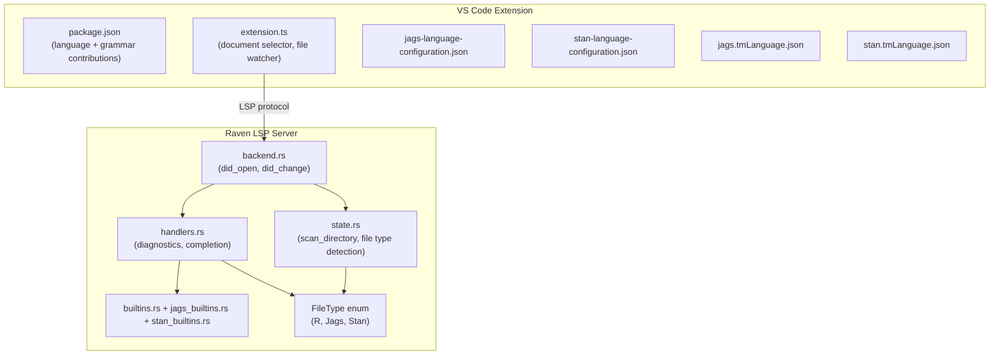

# Design Document: JAGS and Stan Language Support

## Overview

This feature adds first-class support for JAGS (`.jags`, `.bugs`) and Stan (`.stan`) files to the Raven LSP server and its VS Code extension. The core goals are:

1. Suppress all diagnostics for JAGS/Stan files (they are not R code, so R-based diagnostics produce false positives).
2. Preserve best-effort LSP features (find references, go to definition, hover, document outline) by continuing to parse these files with the R tree-sitter parser.
3. Provide language-specific completions (JAGS/Stan built-ins + file-local symbols, excluding R-specific items).
4. Register JAGS and Stan as VS Code languages with TextMate grammars for syntax highlighting.
5. Include JAGS/Stan files in workspace indexing so their symbols appear in cross-file find references from R files.

The design is split across two layers: the Rust LSP server (`crates/raven/`) and the VS Code extension (`editors/vscode/`).

## Architecture



The key architectural decision is introducing a `FileType` enum (`R`, `Jags`, `Stan`) that is derived from the file URI extension. This enum is checked at two critical points:

1. **Diagnostics pipeline** (`handlers::diagnostics` and `handlers::diagnostics_from_snapshot`): Early return with empty `Vec<Diagnostic>` for non-R file types.
2. **Completion handler** (`handlers::completion`): Branch to a language-specific completion path for JAGS/Stan files.

All other LSP features (find references, go to definition, hover, document symbols) continue to use the R tree-sitter parser unchanged — they already work on a best-effort basis since the parser produces partial ASTs for non-R syntax.

## Components and Interfaces

### 1. FileType Detection (Rust)

A new `FileType` enum and helper function in `handlers.rs` (or a small utility module):

```rust
#[derive(Debug, Clone, Copy, PartialEq, Eq)]
pub enum FileType {
    R,
    Jags,
    Stan,
}

pub fn file_type_from_uri(uri: &Url) -> FileType {
    let path = uri.path();
    let lower_path = path.to_ascii_lowercase();
    if lower_path.ends_with(".jags") || lower_path.ends_with(".bugs") {
        FileType::Jags
    } else if lower_path.ends_with(".stan") {
        FileType::Stan
    } else {
        FileType::R
    }
}
```

This is intentionally simple — extension-based detection from the URI path. No need for content sniffing.

### 2. Diagnostics Suppression (Rust)

In `handlers::diagnostics_from_snapshot()`, add an early return:

```rust
pub(crate) fn diagnostics_from_snapshot(
    snapshot: &DiagnosticsSnapshot,
    uri: &Url,
    cancel: &DiagCancelToken,
) -> Option<Vec<Diagnostic>> {
    if !snapshot.cross_file_config.diagnostics_enabled {
        return Some(Vec::new());
    }

    // Suppress diagnostics for non-R files (JAGS, Stan)
    if file_type_from_uri(uri) != FileType::R {
        return Some(Vec::new());
    }

    // ... existing R diagnostics logic
}
```

This suppression must happen in `diagnostics_from_snapshot()` because that is the function invoked by the background diagnostic threads. The synchronous `handlers::diagnostics()` should also have this early return to remain consistent.

### 3. Completion Filtering (Rust)

In `handlers::completion()`, detect file type early and branch:

- **R files**: Existing completion logic (unchanged).
- **JAGS files**: Return JAGS keywords + JAGS distributions + JAGS math functions + file-local symbols (from `collect_document_completions`). Exclude R keywords, R reserved words, R builtins, package exports, and cross-file symbols.
- **Stan files**: Return Stan block keywords + Stan types + Stan control flow + Stan built-in functions + file-local symbols. Exclude R keywords, R reserved words, R builtins, package exports, and cross-file symbols.

```rust
pub fn completion(state: &WorldState, uri: &Url, position: Position, context: Option<CompletionContext>) -> Option<CompletionResponse> {
    let doc = state.get_document(uri)?;
    let tree = doc.tree.as_ref()?;
    let text = doc.text();

    match file_type_from_uri(uri) {
        FileType::Jags => return jags_completion(tree, &text, uri, position),
        FileType::Stan => return stan_completion(tree, &text, uri, position),
        FileType::R => { /* existing logic */ }
    }
    // ...
}
```

### 4. JAGS/Stan Built-in Lists (Rust)

Two new modules define the built-in symbol lists as static data:

**`crates/raven/src/jags_builtins.rs`**:
- `JAGS_DISTRIBUTIONS`: `["dnorm", "dbern", "dgamma", "dunif", "dpois", "dbin", "dbeta", "dexp", "dt", "dweib", "dlnorm", "dchisqr", "dlogis", "dmulti", "ddirch", "dwish", "dmnorm", "dmt", "dinterval", "dcat"]`
- `JAGS_FUNCTIONS`: `["abs", "sqrt", "log", "exp", "pow", "sin", "cos", "sum", "prod", "min", "max", "mean", "sd", "inverse", "logit", "probit", "cloglog", "ilogit", "phi", "step", "equals", "round", "trunc", "inprod", "interp.lin", "logfact", "loggam", "rank", "sort", "ifelse", "T"]`
- `JAGS_KEYWORDS`: `["model", "data", "for", "in", "if", "else"]`

**`crates/raven/src/stan_builtins.rs`**:
- `STAN_TYPES`: `["int", "real", "vector", "row_vector", "matrix", "simplex", "unit_vector", "ordered", "positive_ordered", "corr_matrix", "cov_matrix", "cholesky_factor_corr", "cholesky_factor_cov", "void", "array", "complex", "complex_vector", "complex_row_vector", "complex_matrix", "tuple"]`
- `STAN_BLOCK_KEYWORDS`: `["functions", "data", "transformed data", "parameters", "transformed parameters", "model", "generated quantities"]`
- `STAN_CONTROL_FLOW`: `["for", "in", "while", "if", "else", "return", "break", "continue", "print", "reject", "profile"]`
- `STAN_FUNCTIONS`: A representative list of common Stan math/distribution functions (e.g., `log`, `exp`, `sqrt`, `fabs`, `inv_logit`, `logit`, `softmax`, `to_vector`, `to_matrix`, `to_array_1d`, `rep_vector`, `rep_matrix`, `append_row`, `append_col`, `normal_lpdf`, `bernoulli_lpmf`, `normal_rng`, etc.)

These are defined as `&[&str]` static arrays — no `HashSet` needed since the lists are small and only iterated during completion.

### 5. VS Code Language Registration

**`editors/vscode/package.json`** additions to `contributes.languages`:

```json
{
  "id": "jags",
  "aliases": ["JAGS", "jags"],
  "extensions": [".jags", ".bugs"],
  "configuration": "./jags-language-configuration.json"
},
{
  "id": "stan",
  "aliases": ["Stan", "stan"],
  "extensions": [".stan"],
  "configuration": "./stan-language-configuration.json"
}
```

**`contributes.grammars`** (new section):

```json
[
  {
    "language": "jags",
    "scopeName": "source.jags",
    "path": "./syntaxes/jags.tmLanguage.json"
  },
  {
    "language": "stan",
    "scopeName": "source.stan",
    "path": "./syntaxes/stan.tmLanguage.json"
  }
]
```

**`activationEvents`**: Add `"onLanguage:jags"` and `"onLanguage:stan"`.

### 6. Document Selector and File Watcher

In `editors/vscode/src/extension.ts`, update `clientOptions`:

```typescript
documentSelector: [
    { scheme: 'file', language: 'r' },
    { scheme: 'untitled', language: 'r' },
    { scheme: 'file', language: 'jags' },
    { scheme: 'untitled', language: 'jags' },
    { scheme: 'file', language: 'stan' },
    { scheme: 'untitled', language: 'stan' },
],
synchronize: {
    fileEvents: vscode.workspace.createFileSystemWatcher(
        '**/*.{r,R,rmd,Rmd,qmd,jags,bugs,stan}'
    ),
},
```

### 7. Language Configuration Files

**`editors/vscode/jags-language-configuration.json`**: JAGS uses `#` for line comments, curly braces for blocks, and `<-` / `~` as operators. Brackets: `{}`, `[]`, `()`.

**`editors/vscode/stan-language-configuration.json`**: Stan uses `//` for line comments and `/* */` for block comments. Brackets: `{}`, `[]`, `()`. Auto-closing pairs for strings and brackets.

### 8. TextMate Grammars

**`editors/vscode/syntaxes/jags.tmLanguage.json`**: Tokenization rules for:
- Block keywords (`model`, `data`) → `keyword.control.jags`
- Control flow (`for`, `in`, `if`, `else`) → `keyword.control.flow.jags`
- Distribution names (`dnorm`, `dbern`, ...) → `support.function.distribution.jags`
- Math functions (`abs`, `sqrt`, ...) → `support.function.math.jags`
- Comments (`#`) → `comment.line.number-sign.jags`
- Numeric literals → `constant.numeric.jags`
- String literals → `string.quoted.double.jags`
- Operators (`<-`, `~`, `+`, `-`, etc.) → `keyword.operator.jags`

**`editors/vscode/syntaxes/stan.tmLanguage.json`**: Tokenization rules for:
- Program blocks (`functions`, `data`, `transformed data`, ...) → `keyword.control.block.stan`
- Type keywords (`int`, `real`, `vector`, ...) → `storage.type.stan`
- Constraint keywords (`lower`, `upper`, `offset`, `multiplier`) → `storage.modifier.stan`
- Control flow (`for`, `while`, `if`, ...) → `keyword.control.flow.stan`
- Line comments (`//`) → `comment.line.double-slash.stan`
- Block comments (`/* */`) → `comment.block.stan`
- Operators → `keyword.operator.stan`
- Numeric literals (int, real, scientific) → `constant.numeric.stan`
- String literals → `string.quoted.double.stan`
- Distribution suffixes (`_lpdf`, `_lpmf`, `_lcdf`, `_lccdf`, `_rng`) → `support.function.distribution.stan`

### 9. Workspace Indexing

In `state.rs::scan_directory()`, extend the file extension check to include JAGS/Stan files:

```rust
if ext.eq_ignore_ascii_case("r")
    || ext.eq_ignore_ascii_case("jags")
    || ext.eq_ignore_ascii_case("bugs")
    || ext.eq_ignore_ascii_case("stan")
{
    // ... existing indexing logic (parse, compute artifacts, etc.)
}
```

This ensures JAGS/Stan files are indexed during workspace scan, making their symbols available for cross-file find references. The R tree-sitter parser will produce partial/best-effort ASTs for these files, which is sufficient for symbol extraction (assignments like `x <- ...` are syntactically similar in JAGS).

### 10. Activity Notification Filter

In `extension.ts`, the `isRFile` helper in `sendActivityNotification` should be updated to also include JAGS/Stan extensions:

```typescript
const isRFile = (uri: vscode.Uri) => {
    const ext = path.extname(uri.fsPath).toLowerCase();
    return ['.r', '.rmd', '.qmd', '.jags', '.bugs', '.stan'].includes(ext);
};
```

## Data Models

### FileType Enum

```rust
#[derive(Debug, Clone, Copy, PartialEq, Eq)]
pub enum FileType {
    R,
    Jags,
    Stan,
}
```

No new persistent data structures are needed. The `FileType` is computed on-the-fly from the URI and not stored. Existing data structures (`Document`, `IndexEntry`, `ScopeArtifacts`, `CrossFileMetadata`) are reused as-is for JAGS/Stan files.

### Built-in Lists

Static `&[&str]` arrays in `jags_builtins.rs` and `stan_builtins.rs`. These are compile-time constants with no runtime allocation.

### TextMate Grammar Files

Standard JSON files following the TextMate grammar specification. Each grammar file contains:
- `scopeName`: `source.jags` or `source.stan`
- `patterns`: Array of tokenization rules with `match`/`begin`/`end` regex patterns
- `repository`: Named pattern groups for reuse

### Language Configuration Files

Standard VS Code language configuration JSON files defining:
- `comments`: Line and block comment tokens
- `brackets`: Matching bracket pairs
- `autoClosingPairs`: Auto-close rules
- `surroundingPairs`: Surround-with rules


## Correctness Properties

*A property is a characteristic or behavior that should hold true across all valid executions of a system — essentially, a formal statement about what the system should do. Properties serve as the bridge between human-readable specifications and machine-verifiable correctness guarantees.*

### Property 1: File type detection is consistent with extension

*For any* URI string ending in `.jags` or `.bugs`, `file_type_from_uri` shall return `FileType::Jags`. *For any* URI string ending in `.stan`, it shall return `FileType::Stan`. *For any* URI string ending in `.r`, `.R`, `.rmd`, `.Rmd`, or `.qmd`, it shall return `FileType::R`.

**Validates: Requirements 1.1, 2.1, 10.1**

### Property 2: JAGS files produce empty diagnostics

*For any* file content string and any URI with a `.jags` or `.bugs` extension, calling `diagnostics()` shall return an empty `Vec<Diagnostic>`.

**Validates: Requirements 1.1, 1.2**

### Property 3: Stan files produce empty diagnostics

*For any* file content string and any URI with a `.stan` extension, calling `diagnostics()` shall return an empty `Vec<Diagnostic>`.

**Validates: Requirements 2.1, 2.2**

### Property 4: R files with syntax errors still produce diagnostics

*For any* R code string that contains at least one syntax error (e.g., unmatched braces, incomplete assignment) and any URI with a `.r` or `.R` extension, calling `diagnostics()` shall return a non-empty `Vec<Diagnostic>`.

**Validates: Requirements 10.1, 10.2**

### Property 5: JAGS completions exclude R-specific items

*For any* JAGS file content and cursor position, the completion list shall contain no items whose labels match R reserved words (e.g., `function`, `library`, `require`, `next`, `repeat`, `while`), R builtins, or R package exports.

**Validates: Requirements 12.1**

### Property 6: JAGS completions include all JAGS built-ins

*For any* JAGS file content and valid cursor position (not inside a comment or string), the completion list shall contain all JAGS distribution names, all JAGS math function names, and all JAGS keywords.

**Validates: Requirements 12.2, 12.3, 12.4**

### Property 7: JAGS completions include file-local symbols

*For any* JAGS file content that contains at least one assignment (`x <- ...`), the completion list at a position after that assignment shall include the assigned variable name.

**Validates: Requirements 12.5**

### Property 8: Stan completions exclude R-specific items

*For any* Stan file content and cursor position, the completion list shall contain no items whose labels match R reserved words, R builtins, or R package exports.

**Validates: Requirements 13.1**

### Property 9: Stan completions include all Stan built-ins

*For any* Stan file content and valid cursor position (not inside a comment or string), the completion list shall contain all Stan type keywords, all Stan block keywords, all Stan control flow keywords, and all Stan built-in function names.

**Validates: Requirements 13.2, 13.3, 13.4, 13.5**

### Property 10: Stan completions include file-local symbols

*For any* Stan file content that contains at least one assignment (`x <- ...`), the completion list at a position after that assignment shall include the assigned variable name.

**Validates: Requirements 13.6**

### Property 11: Workspace indexing includes JAGS/Stan files

*For any* file path with a `.jags`, `.bugs`, or `.stan` extension present in a workspace directory, after `scan_directory` completes, the workspace index shall contain an entry for that file's URI.

**Validates: Requirements 11.1**

## Error Handling

### File Type Detection

- Unknown or missing file extensions default to `FileType::R` (conservative — existing behavior preserved).
- URI parsing failures (malformed URIs) are handled by existing `Url` error handling in the backend; `file_type_from_uri` operates on the path string and cannot fail.

### Diagnostics Suppression

- The early return for non-R files happens after the master `diagnostics_enabled` check, so the global disable switch still takes precedence.
- No error conditions are introduced — the function simply returns an empty Vec.

### Completion Filtering

- If the tree-sitter parse fails for a JAGS/Stan file (returns `None` for the tree), the completion handler returns `None` (no completions), same as for R files.
- File-local symbol extraction uses the same `collect_document_completions` function as R files. If the R parser produces an empty or error AST, fewer local symbols will be found — this is expected "best effort" behavior.

### Workspace Indexing

- If a JAGS/Stan file cannot be read (permissions, encoding), `fs::read_to_string` returns `Err` and the file is silently skipped, same as for R files.
- The R tree-sitter parser may produce partial ASTs for JAGS/Stan syntax. `compute_artifacts_with_metadata` handles this gracefully — it extracts whatever symbols it can find.

### TextMate Grammars

- Malformed grammar JSON files will cause VS Code to fall back to plain text highlighting. No runtime errors in the extension.
- Missing grammar files are reported by VS Code's extension host at activation time.

## Testing Strategy

### Unit Tests

Unit tests cover specific examples and edge cases:

- File type detection: Verify case-insensitive combinations (e.g. `.JAGS`, `.Bugs`, `.stan`, `.r`, `.R`, `.rmd`, `.Rmd`, `.qmd`) map to correct `FileType`.
- Diagnostics suppression: Open a JAGS file with intentionally invalid R syntax, verify empty diagnostics. Same for Stan.
- R non-regression: Open an R file with a known syntax error, verify diagnostics are produced.
- JAGS completion: Request completions in a JAGS file, verify JAGS keywords/distributions/functions are present and R keywords are absent.
- Stan completion: Request completions in a Stan file, verify Stan types/blocks/functions are present and R keywords are absent.
- Workspace indexing: Create a temp directory with `.jags`, `.bugs`, `.stan`, and `.r` files, run `scan_directory`, verify all are indexed.
- VS Code configuration: Parse `package.json` and verify language registrations, grammar paths, document selector entries.

### Property-Based Tests

Property-based tests use the `proptest` crate (already a dependency in the project) with a minimum of 100 iterations per property. Each test is tagged with a comment referencing the design property.

- **Feature: jags-stan-support, Property 1: File type detection is consistent with extension** — Generate random URI strings with known case-insensitive extensions, verify `file_type_from_uri` returns the correct variant.
- **Feature: jags-stan-support, Property 2: JAGS files produce empty diagnostics** — Generate random text content, create a WorldState with a `.jags` URI document, call `diagnostics()`, assert empty.
- **Feature: jags-stan-support, Property 3: Stan files produce empty diagnostics** — Same as Property 2 but with `.stan` URI.
- **Feature: jags-stan-support, Property 4: R files with syntax errors still produce diagnostics** — Generate R code with injected syntax errors (e.g., `x <-` with no RHS), verify non-empty diagnostics.
- **Feature: jags-stan-support, Property 5: JAGS completions exclude R-specific items** — Generate JAGS file content, request completions, verify no R reserved words or R-only builtins appear.
- **Feature: jags-stan-support, Property 6: JAGS completions include all JAGS built-ins** — Generate JAGS file content, request completions, verify all JAGS distributions/functions/keywords are present.
- **Feature: jags-stan-support, Property 7: JAGS completions include file-local symbols** — Generate JAGS content with random assignments, verify assigned names appear in completions.
- **Feature: jags-stan-support, Property 8: Stan completions exclude R-specific items** — Same pattern as Property 5 for Stan.
- **Feature: jags-stan-support, Property 9: Stan completions include all Stan built-ins** — Same pattern as Property 6 for Stan.
- **Feature: jags-stan-support, Property 10: Stan completions include file-local symbols** — Same pattern as Property 7 for Stan.
- **Feature: jags-stan-support, Property 11: Workspace indexing includes JAGS/Stan files** — Generate random file names with JAGS/Stan extensions, create temp files, run scan, verify indexed.

Each correctness property is implemented by a single property-based test. The `proptest` library handles randomized input generation and shrinking.
