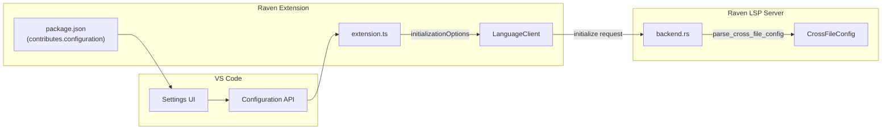

# Design Document: VS Code Settings Exposure

## Overview

This design describes how to expose all Raven LSP server configuration settings through the VS Code extension. The implementation involves two main changes:

1. **package.json**: Add all configuration properties to the `contributes.configuration` section with proper types, defaults, descriptions, and enums
2. **extension.ts**: Read settings from VS Code configuration and pass them as `initializationOptions` to the LSP client

The design follows VS Code's standard patterns for extension configuration and LSP client initialization.

## Architecture



### Data Flow

1. User configures settings via VS Code Settings UI
2. VS Code stores settings and exposes them via `workspace.getConfiguration()`
3. On extension activation, `extension.ts` reads all `raven.*` settings
4. Settings are transformed into the JSON structure expected by the LSP server
5. The `initializationOptions` are passed to `LanguageClient` constructor
6. LSP server receives options in `initialize` request and calls `parse_cross_file_config()`

## Components and Interfaces

### Component 1: package.json Configuration Schema

The `contributes.configuration` section defines all settings with their metadata.

**Structure:**
```json
{
  "contributes": {
    "configuration": {
      "type": "object",
      "title": "Raven",
      "properties": {
        "raven.crossFile.maxBackwardDepth": { ... },
        "raven.crossFile.maxForwardDepth": { ... },
        ...
      }
    }
  }
}
```

**Setting Categories:**
- `raven.server.*` - Server binary configuration (existing)
- `raven.editor.*` - Editor behavior (existing)
- `raven.crossFile.*` - Cross-file awareness settings
- `raven.crossFile.onDemandIndexing.*` - On-demand indexing settings
- `raven.diagnostics.*` - Diagnostic settings
- `raven.packages.*` - Package awareness settings

### Component 2: Settings Reader (extension.ts)

A function that reads all Raven settings and constructs the `initializationOptions` object.

**Interface:**
```typescript
interface RavenInitializationOptions {
  crossFile?: {
    maxBackwardDepth?: number;
    maxForwardDepth?: number;
    maxChainDepth?: number;
    assumeCallSite?: "start" | "end";
    indexWorkspace?: boolean;
    maxRevalidationsPerTrigger?: number;
    revalidationDebounceMs?: number;
    missingFileSeverity?: SeverityLevel;
    circularDependencySeverity?: SeverityLevel;
    outOfScopeSeverity?: SeverityLevel;
    ambiguousParentSeverity?: SeverityLevel;
    maxChainDepthSeverity?: SeverityLevel;
    onDemandIndexing?: {
      enabled?: boolean;
      maxTransitiveDepth?: number;
      maxQueueSize?: number;
    };
  };
  diagnostics?: {
    undefinedVariables?: boolean;
  };
  packages?: {
    enabled?: boolean;
    additionalLibraryPaths?: string[];
    rPath?: string;
    missingPackageSeverity?: SeverityLevel;
  };
}

type SeverityLevel = "error" | "warning" | "information" | "hint";
```

**Function:**
```typescript
function getInitializationOptions(): RavenInitializationOptions {
  const config = vscode.workspace.getConfiguration('raven');
  // Read settings and construct options object
  // Only include settings that are explicitly configured
}
```

### Component 3: Configuration Change Handler

Listens for configuration changes and sends updated settings to the LSP server.

**Interface:**
```typescript
function registerConfigurationChangeHandler(
  context: vscode.ExtensionContext,
  client: LanguageClient
): void;
```

**Behavior:**
When a `raven.*` setting changes, the handler:
1. Reads the current configuration using `getInitializationOptions()`
2. Sends a `workspace/didChangeConfiguration` notification to the LSP server
3. The LSP server's `did_change_configuration` handler applies the new settings without restart

## Data Models

### VS Code Setting Definition

Each setting in `package.json` follows this structure:

```typescript
interface SettingDefinition {
  type: "string" | "number" | "boolean" | "array";
  default: any;
  description: string;
  enum?: string[];           // For enum types
  enumDescriptions?: string[]; // Descriptions for each enum value
  items?: { type: string };  // For array types
  minimum?: number;          // For number types
  maximum?: number;          // For number types
}
```

### Settings Mapping

| VS Code Setting | JSON Path | Type | Default |
|----------------|-----------|------|---------|
| `raven.crossFile.maxBackwardDepth` | `crossFile.maxBackwardDepth` | number | 10 |
| `raven.crossFile.maxForwardDepth` | `crossFile.maxForwardDepth` | number | 10 |
| `raven.crossFile.maxChainDepth` | `crossFile.maxChainDepth` | number | 20 |
| `raven.crossFile.assumeCallSite` | `crossFile.assumeCallSite` | enum | "end" |
| `raven.crossFile.indexWorkspace` | `crossFile.indexWorkspace` | boolean | true |
| `raven.crossFile.maxRevalidationsPerTrigger` | `crossFile.maxRevalidationsPerTrigger` | number | 10 |
| `raven.crossFile.revalidationDebounceMs` | `crossFile.revalidationDebounceMs` | number | 200 |
| `raven.crossFile.missingFileSeverity` | `crossFile.missingFileSeverity` | enum | "warning" |
| `raven.crossFile.circularDependencySeverity` | `crossFile.circularDependencySeverity` | enum | "error" |
| `raven.crossFile.outOfScopeSeverity` | `crossFile.outOfScopeSeverity` | enum | "warning" |
| `raven.crossFile.ambiguousParentSeverity` | `crossFile.ambiguousParentSeverity` | enum | "warning" |
| `raven.crossFile.maxChainDepthSeverity` | `crossFile.maxChainDepthSeverity` | enum | "warning" |
| `raven.crossFile.onDemandIndexing.enabled` | `crossFile.onDemandIndexing.enabled` | boolean | true |
| `raven.crossFile.onDemandIndexing.maxTransitiveDepth` | `crossFile.onDemandIndexing.maxTransitiveDepth` | number | 2 |
| `raven.crossFile.onDemandIndexing.maxQueueSize` | `crossFile.onDemandIndexing.maxQueueSize` | number | 50 |
| `raven.diagnostics.undefinedVariables` | `diagnostics.undefinedVariables` | boolean | true |
| `raven.packages.enabled` | `packages.enabled` | boolean | true |
| `raven.packages.additionalLibraryPaths` | `packages.additionalLibraryPaths` | array | [] |
| `raven.packages.rPath` | `packages.rPath` | string | "" |
| `raven.packages.missingPackageSeverity` | `packages.missingPackageSeverity` | enum | "warning" |


## Correctness Properties

*A property is a characteristic or behavior that should hold true across all valid executions of a system—essentially, a formal statement about what the system should do. Properties serve as the bridge between human-readable specifications and machine-verifiable correctness guarantees.*

### Property 1: Settings Transmission Correctness

*For any* configured Raven setting and its value, when `getInitializationOptions()` is called, the returned object SHALL contain that value at the correct JSON path corresponding to the LSP server's expected structure.

**Validates: Requirements 1.4, 2.3, 3.2, 4.3, 5.6, 6.4, 7.2, 8.5, 10.2**

### Property 2: Description Completeness

*For any* setting defined in `package.json` under `contributes.configuration.properties`, the setting SHALL have a non-empty `description` field.

**Validates: Requirements 9.1**

### Property 3: Unconfigured Settings Omission

*For any* Raven setting that is not explicitly configured (uses VS Code's undefined/default), the `getInitializationOptions()` function SHALL NOT include that setting in the returned object, allowing the LSP server to use its own defaults.

**Validates: Requirements 10.4**

## Error Handling

### Invalid Configuration Values

- **Out-of-range numbers**: VS Code's schema validation handles minimum/maximum constraints. Invalid values are rejected by VS Code before reaching the extension.
- **Invalid enum values**: VS Code's schema validation ensures only valid enum values are accepted.
- **Invalid array items**: For `additionalLibraryPaths`, VS Code validates that items are strings.

### Missing Configuration

- If `vscode.workspace.getConfiguration('raven')` returns undefined for a setting, the setting is omitted from `initializationOptions`.
- The LSP server's `parse_cross_file_config()` handles missing fields by using `CrossFileConfig::default()` values.

### Configuration Read Errors

- If configuration reading fails, the extension should log the error and proceed with an empty `initializationOptions` object.
- The LSP server will use all default values in this case.

## Testing Strategy

### Unit Tests

Unit tests verify specific examples and edge cases:

1. **Schema validation tests**: Verify package.json contains all expected settings with correct types and defaults
2. **Settings reader tests**: Verify `getInitializationOptions()` produces correct output for specific configurations
3. **Configuration change handler tests**: Verify the handler is registered and responds to changes

### Property-Based Tests

Property-based tests verify universal properties across all inputs:

1. **Settings transmission property test**: Generate random valid configurations and verify output structure
2. **Description completeness property test**: Iterate all settings and verify descriptions exist
3. **Unconfigured omission property test**: Generate partial configurations and verify omitted settings

### Test Configuration

- Property tests should run minimum 100 iterations
- Use fast-check or similar library for TypeScript property-based testing
- Tag format: **Feature: vscode-settings-exposure, Property {number}: {property_text}**

### Integration Tests

1. **End-to-end initialization**: Start extension with various configurations and verify LSP server receives correct options
2. **Configuration change flow**: Change a setting and verify `workspace/didChangeConfiguration` notification is sent to the server
