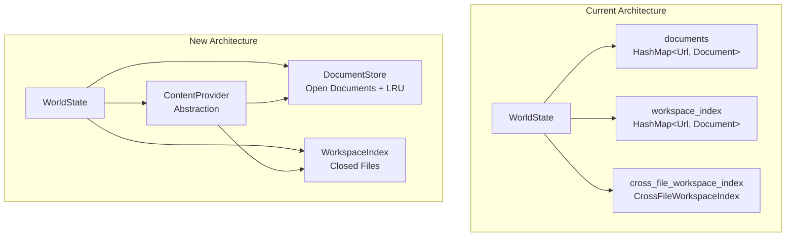
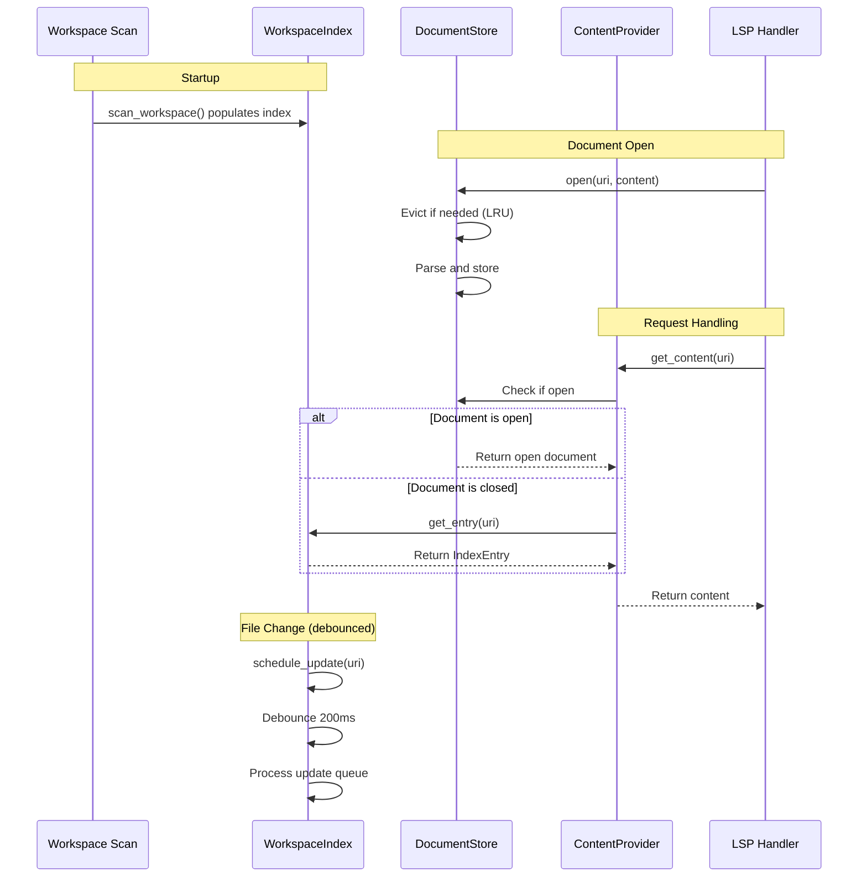

# Design Document: Workspace Index Consolidation

## Overview

This design consolidates the two workspace indexes in rlsp (`workspace_index` and `cross_file_workspace_index`) into a single unified `WorkspaceIndex`, while also introducing a proper `DocumentStore` for open documents following Sight's architecture pattern.

The key architectural changes are:
1. **DocumentStore**: A new component for open documents with LRU eviction and memory limits
2. **WorkspaceIndex**: Consolidates legacy and cross-file indexes for closed files
3. **ContentProvider**: Abstraction for file reading that respects open-docs-authoritative rule
4. **Debounced Updates**: Batch rapid file changes to avoid excessive re-indexing

This approach:
- Eliminates duplicate storage between legacy and cross-file indexes
- Provides clear separation between open docs (authoritative) and workspace index (closed files)
- Adds memory management with LRU eviction
- Improves testability through content provider abstraction

## Architecture



### Data Flow



## Components and Interfaces

### DocumentStore

Manages open documents with LRU eviction and memory limits:

```rust
/// Configuration for DocumentStore
pub struct DocumentStoreConfig {
    /// Maximum number of documents to keep in memory
    pub max_documents: usize,
    /// Maximum total memory usage in bytes
    pub max_memory_bytes: usize,
}

impl Default for DocumentStoreConfig {
    fn default() -> Self {
        Self {
            max_documents: 50,
            max_memory_bytes: 100 * 1024 * 1024, // 100MB
        }
    }
}

/// State for an open document
pub struct DocumentState {
    pub uri: Url,
    pub version: i32,
    pub contents: Rope,
    pub tree: Option<Tree>,
    pub loaded_packages: Vec<String>,
    pub metadata: CrossFileMetadata,
    pub artifacts: ScopeArtifacts,
    pub revision: u64,
}

/// Store for open documents with LRU eviction
pub struct DocumentStore {
    /// Documents by URI
    documents: HashMap<Url, DocumentState>,
    /// LRU tracking via insertion order
    access_order: IndexSet<Url>,
    /// Active async update trackers (watch-based)
    update_trackers: HashMap<Url, UpdateTracker>,
    /// Configuration
    config: DocumentStoreConfig,
    /// Metrics
    metrics: DocumentStoreMetrics,
}

impl DocumentStore {
    pub fn new(config: DocumentStoreConfig) -> Self { ... }
    
    /// Open a document (evicts if needed)
    pub async fn open(&mut self, uri: Url, content: &str, version: i32) { ... }
    
    /// Update a document with changes
    pub async fn update(&mut self, uri: &Url, changes: Vec<TextDocumentContentChangeEvent>, version: i32) { ... }
    
    /// Close a document
    pub fn close(&mut self, uri: &Url) { ... }
    
    /// Get a document (updates LRU)
    pub fn get(&mut self, uri: &Url) -> Option<&DocumentState> { ... }
    
    /// Get a document without updating LRU
    pub fn get_without_touch(&self, uri: &Url) -> Option<&DocumentState> { ... }
    
    /// Check if document is open
    pub fn contains(&self, uri: &Url) -> bool { ... }
    
    /// Wait for any active update to complete
    pub async fn wait_for_update(&self, uri: &Url) { ... }
    
    /// Get all open URIs
    pub fn uris(&self) -> Vec<Url> { ... }
    
    // Private methods
    fn evict_if_needed(&mut self, incoming_bytes: usize) { ... }
    fn touch_access(&mut self, uri: &Url) { ... }
    fn estimate_memory_usage(&self) -> usize { ... }
}
```

### WorkspaceIndex

Unified index for closed files with debounced updates:

```rust
/// Entry in the workspace index
pub struct IndexEntry {
    pub contents: Rope,
    pub tree: Option<Tree>,
    pub loaded_packages: Vec<String>,
    pub snapshot: FileSnapshot,
    pub metadata: CrossFileMetadata,
    pub artifacts: ScopeArtifacts,
    pub indexed_at_version: u64,
}

/// Configuration for WorkspaceIndex
pub struct WorkspaceIndexConfig {
    /// Debounce delay for file updates in milliseconds
    pub debounce_ms: u64,
    /// Maximum files to index
    pub max_files: usize,
    /// Maximum file size to index in bytes
    pub max_file_size_bytes: usize,
}

impl Default for WorkspaceIndexConfig {
    fn default() -> Self {
        Self {
            debounce_ms: 200,
            max_files: 1000,
            max_file_size_bytes: 512 * 1024, // 512KB
        }
    }
}

/// Unified workspace index for closed files
pub struct WorkspaceIndex {
    /// Index entries by URI
    inner: RwLock<HashMap<Url, IndexEntry>>,
    /// Monotonic version counter
    version: AtomicU64,
    /// Configuration
    config: WorkspaceIndexConfig,
    /// Pending debounced updates
    pending_updates: RwLock<HashMap<Url, tokio::time::Instant>>,
    /// Update queue
    update_queue: RwLock<HashSet<Url>>,
    /// Metrics
    metrics: RwLock<WorkspaceIndexMetrics>,
}

impl WorkspaceIndex {
    pub fn new(config: WorkspaceIndexConfig) -> Self { ... }
    
    // === Read Operations ===
    
    /// Get entry for a URI
    pub fn get(&self, uri: &Url) -> Option<IndexEntry> { ... }
    
    /// Get entry only if fresh
    pub fn get_if_fresh(&self, uri: &Url, snapshot: &FileSnapshot) -> Option<IndexEntry> { ... }
    
    /// Get metadata for a URI
    pub fn get_metadata(&self, uri: &Url) -> Option<CrossFileMetadata> { ... }
    
    /// Get artifacts for a URI
    pub fn get_artifacts(&self, uri: &Url) -> Option<ScopeArtifacts> { ... }
    
    /// Check if URI is indexed
    pub fn contains(&self, uri: &Url) -> bool { ... }
    
    /// Get all indexed URIs
    pub fn uris(&self) -> Vec<Url> { ... }
    
    /// Iterate over all entries
    pub fn iter(&self) -> Vec<(Url, IndexEntry)> { ... }
    
    /// Get current version
    pub fn version(&self) -> u64 { ... }
    
    // === Write Operations ===
    
    /// Insert entry directly
    pub fn insert(&self, uri: Url, entry: IndexEntry) { ... }
    
    /// Schedule a debounced update
    pub fn schedule_update(&self, uri: Url) { ... }
    
    /// Process pending updates (called periodically)
    pub async fn process_update_queue(&self, open_uris: &HashSet<Url>) { ... }
    
    /// Invalidate entry for a URI
    pub fn invalidate(&self, uri: &Url) { ... }
    
    /// Invalidate all entries
    pub fn invalidate_all(&self) { ... }
}
```

### ContentProvider

Abstraction for file content access with both sync and async methods:

```rust
/// Trait for content providers (sync operations)
pub trait ContentProvider: Send + Sync {
    /// Get content for a URI (prefers open docs)
    fn get_content(&self, uri: &Url) -> Option<String>;
    
    /// Get metadata for a URI
    fn get_metadata(&self, uri: &Url) -> Option<CrossFileMetadata>;
    
    /// Get artifacts for a URI
    fn get_artifacts(&self, uri: &Url) -> Option<ScopeArtifacts>;
    
    /// Check if URI exists in cache (no I/O)
    fn exists_cached(&self, uri: &Url) -> bool;
    
    /// Check if URI is currently open
    fn is_open(&self, uri: &Url) -> bool;
}

/// Async extension for file existence checking (non-blocking I/O)
#[async_trait]
pub trait AsyncContentProvider: ContentProvider {
    /// Check if URIs exist on disk (batched, non-blocking)
    /// Returns map of URI -> exists
    async fn check_existence_batch(&self, uris: &[Url]) -> HashMap<Url, bool>;
    
    /// Check if a single URI exists (non-blocking)
    async fn exists(&self, uri: &Url) -> bool {
        let result = self.check_existence_batch(&[uri.clone()]).await;
        result.get(uri).copied().unwrap_or(false)
    }
}

/// Default content provider using DocumentStore and WorkspaceIndex
pub struct DefaultContentProvider<'a> {
    document_store: &'a DocumentStore,
    workspace_index: &'a WorkspaceIndex,
    file_cache: &'a CrossFileFileCache,
}

impl<'a> ContentProvider for DefaultContentProvider<'a> {
    fn get_content(&self, uri: &Url) -> Option<String> {
        // 1. Check DocumentStore (open docs are authoritative)
        if let Some(doc) = self.document_store.get_without_touch(uri) {
            return Some(doc.contents.to_string());
        }
        
        // 2. Check WorkspaceIndex
        if let Some(entry) = self.workspace_index.get(uri) {
            return Some(entry.contents.to_string());
        }
        
        // 3. Check file cache (no synchronous disk I/O)
        self.file_cache.get(uri)
    }
    
    fn get_metadata(&self, uri: &Url) -> Option<CrossFileMetadata> {
        // 1. Check DocumentStore
        if let Some(doc) = self.document_store.get_without_touch(uri) {
            return Some(doc.metadata.clone());
        }
        
        // 2. Check WorkspaceIndex
        self.workspace_index.get_metadata(uri)
    }
    
    fn get_artifacts(&self, uri: &Url) -> Option<ScopeArtifacts> {
        // 1. Check DocumentStore
        if let Some(doc) = self.document_store.get_without_touch(uri) {
            return Some(doc.artifacts.clone());
        }
        
        // 2. Check WorkspaceIndex
        self.workspace_index.get_artifacts(uri)
    }
    
    fn exists_cached(&self, uri: &Url) -> bool {
        self.document_store.contains(uri) 
            || self.workspace_index.contains(uri)
            || self.file_cache.get(uri).is_some()
    }
    
    fn is_open(&self, uri: &Url) -> bool {
        self.document_store.contains(uri)
    }
}

#[async_trait]
impl<'a> AsyncContentProvider for DefaultContentProvider<'a> {
    async fn check_existence_batch(&self, uris: &[Url]) -> HashMap<Url, bool> {
        // First check cached sources (no I/O needed)
        let mut results = HashMap::new();
        let mut uncached_uris = Vec::new();
        
        for uri in uris {
            if self.exists_cached(uri) {
                results.insert(uri.clone(), true);
            } else {
                uncached_uris.push(uri.clone());
            }
        }
        
        // Batch check uncached URIs on blocking thread
        if !uncached_uris.is_empty() {
            let paths: Vec<_> = uncached_uris.iter()
                .filter_map(|u| u.to_file_path().ok())
                .collect();
            
            let existence_results = tokio::task::spawn_blocking(move || {
                paths.iter()
                    .map(|p| p.exists())
                    .collect::<Vec<_>>()
            }).await.unwrap_or_default();
            
            for (uri, exists) in uncached_uris.iter().zip(existence_results) {
                results.insert(uri.clone(), exists);
            }
        }
        
        results
    }
}
```

### WorldState Changes

```rust
pub struct WorldState {
    // Document management
    pub document_store: DocumentStore,
    pub workspace_index: WorkspaceIndex,
    
    // Workspace configuration
    pub workspace_folders: Vec<Url>,
    pub library: Library,
    pub workspace_imports: Vec<String>,
    
    // Caches
    pub help_cache: HelpCache,
    pub file_cache: CrossFileFileCache,
    pub diagnostics_gate: CrossFileDiagnosticsGate,

    // Cross-file state
    pub cross_file_config: CrossFileConfig,
    pub cross_file_meta: MetadataCache,
    pub cross_file_graph: DependencyGraph,
    pub cross_file_cache: ArtifactsCache,
    pub cross_file_revalidation: CrossFileRevalidationState,
    pub cross_file_activity: CrossFileActivityState,
    pub cross_file_parent_cache: ParentSelectionCache,
}

impl WorldState {
    /// Create a content provider for this state
    pub fn content_provider(&self) -> DefaultContentProvider {
        DefaultContentProvider {
            document_store: &self.document_store,
            workspace_index: &self.workspace_index,
            file_cache: &self.file_cache,
        }
    }
}
```

## Data Models

### DocumentState Fields

| Field | Type | Purpose |
| --- | --- | --- |
| `uri` | `Url` | Document URI |
| `version` | `i32` | LSP document version |
| `contents` | `Rope` | File content |
| `tree` | `Option<Tree>` | Parsed AST |
| `loaded_packages` | `Vec<String>` | library() calls |
| `metadata` | `CrossFileMetadata` | source() calls, directives |
| `artifacts` | `ScopeArtifacts` | Exported symbols, timeline |
| `revision` | `u64` | Internal revision counter |

### IndexEntry Fields

| Field | Type | Purpose |
| --- | --- | --- |
| `contents` | `Rope` | File content |
| `tree` | `Option<Tree>` | Parsed AST |
| `loaded_packages` | `Vec<String>` | library() calls |
| `snapshot` | `FileSnapshot` | Freshness checking |
| `metadata` | `CrossFileMetadata` | source() calls, directives |
| `artifacts` | `ScopeArtifacts` | Exported symbols, timeline |
| `indexed_at_version` | `u64` | Index version when created |

### Migration Strategy

The migration will be performed in phases:

1. **Phase 1**: Create `DocumentStore` with LRU eviction
2. **Phase 2**: Create unified `WorkspaceIndex` with debouncing
3. **Phase 3**: Create `ContentProvider` trait and implementation (sync + async)
4. **Phase 4**: Update `WorldState` to use new components
5. **Phase 5**: Update handlers to use `ContentProvider`
6. **Phase 6**: Refactor diagnostic collection to use async file existence checks
7. **Phase 7**: Remove old `documents`, `workspace_index`, `cross_file_workspace_index`

### Async Diagnostics Pattern

For file existence checking in diagnostics, the pattern changes from:

**Before (blocking):**
```rust
fn collect_missing_file_diagnostics(state: &WorldState, uri: &Url, ...) {
    for source in &meta.sources {
        if !file_exists(&target_uri) {  // Blocking I/O!
            diagnostics.push(...);
        }
    }
}
```

**After (non-blocking):**
```rust
async fn collect_missing_file_diagnostics(
    content_provider: &impl AsyncContentProvider,
    uri: &Url,
    meta: &CrossFileMetadata,
) -> Vec<Diagnostic> {
    // Collect all URIs to check
    let uris_to_check: Vec<Url> = meta.sources.iter()
        .chain(meta.sourced_by.iter())
        .filter_map(|s| resolve_path(&s.path))
        .collect();
    
    // Batch check existence (non-blocking)
    let existence = content_provider.check_existence_batch(&uris_to_check).await;
    
    // Generate diagnostics for missing files
    let mut diagnostics = Vec::new();
    for source in &meta.sources {
        if let Some(target_uri) = resolve_path(&source.path) {
            if !existence.get(&target_uri).copied().unwrap_or(false) {
                diagnostics.push(Diagnostic { ... });
            }
        }
    }
    diagnostics
}
```


## Correctness Properties

A property is a characteristic or behavior that should hold true across all valid executions of a system—essentially, a formal statement about what the system should do. Properties serve as the bridge between human-readable specifications and machine-verifiable correctness guarantees.

### Property 1: Open Documents Are Authoritative

Property statement: *For any* URI that exists in both `DocumentStore` and `WorkspaceIndex`, the `ContentProvider` SHALL always return data from `DocumentStore`.

**Validates: Requirements 3.1, 3.2, 3.4**

### Property 2: LRU Eviction Correctness

Property statement: *For any* sequence of document opens exceeding `max_documents`, the `DocumentStore` SHALL evict the least-recently-accessed documents first, maintaining at most `max_documents` entries.

**Validates: Requirements 2.1 (new), 2.2 (new)**

### Property 3: Memory Limit Enforcement

Property statement: *For any* sequence of document opens, the `DocumentStore` SHALL evict documents to keep total memory usage below `max_memory_bytes`.

**Validates: Requirements 2.1 (new), 2.2 (new)**

### Property 4: Version Monotonicity

Property statement: *For any* sequence of modification operations on `WorkspaceIndex`, the version counter SHALL strictly increase after each operation.

**Validates: Requirements 2.4, 8.3, 12.4**

### Property 5: Debounce Batching

Property statement: *For any* sequence of rapid `schedule_update` calls for the same URI within `debounce_ms`, only one actual update SHALL be performed.

**Validates: Requirements (new debouncing)**

### Property 6: Update Queue Processing

Property statement: *For any* URI in the update queue, `process_update_queue` SHALL skip URIs that are currently open in `DocumentStore`.

**Validates: Requirements 3.2**

### Property 7: Freshness Checking

Property statement: *For any* `IndexEntry` with a stored snapshot, `get_if_fresh` SHALL return the entry if and only if the provided snapshot matches the stored snapshot.

**Validates: Requirements 5.1, 5.2, 5.3**

### Property 8: Content Provider Consistency

Property statement: *For any* URI, the `ContentProvider` SHALL return consistent data across `get_content`, `get_metadata`, and `get_artifacts` calls (all from same source).

**Validates: Requirements 6.1, 6.2, 6.3, 6.4**

### Property 9: Async Update Coordination

Property statement: *For any* URI with an active update, `wait_for_update` SHALL block until the update completes, and subsequent `get` calls SHALL return the updated data.

**Validates: Requirements (new async coordination)**

### Property 10: Invalidation Correctness

Property statement: *For any* URI, calling `invalidate` SHALL remove the entry, and subsequent `get` calls SHALL return `None`.

**Validates: Requirements 8.1, 8.2**

### Property 11: Iteration Completeness

Property statement: *For any* set of entries in `WorkspaceIndex`, `iter()` SHALL return all entries with their full data.

**Validates: Requirements 9.1, 9.2, 9.3, 9.4**

### Property 12: Entry Completeness

Property statement: *For any* valid R file content, creating an `IndexEntry` SHALL produce an entry where all fields are accessible and correctly computed.

**Validates: Requirements 1.1, 1.2, 1.3, 1.4, 11.1, 11.2, 11.3**

## Error Handling

### DocumentStore Errors

| Error Condition | Handling Strategy |
| --- | --- |
| Parse timeout | Store partial state with error diagnostic |
| Memory limit exceeded | Evict LRU documents until under limit |
| Invalid UTF-8 content | Return error; don't store document |
| Concurrent update conflict | Queue update; process sequentially |

### WorkspaceIndex Errors

| Error Condition | Handling Strategy |
| --- | --- |
| RwLock poisoned | Return `None`; log error |
| File read failure | Log warning; skip file |
| Parse failure | Store entry with `tree: None` |
| Max files exceeded | Log info; stop indexing new files |

### ContentProvider Errors

| Error Condition | Handling Strategy |
| --- | --- |
| URI not found anywhere | Return `None` |
| Stale data detected | Return stale data; trigger background refresh |
| File cache miss | Return `None`; disk checks handled via async existence path |

## Testing Strategy

### Unit Tests

1. **DocumentStore LRU**: Test eviction order with various access patterns
2. **DocumentStore memory limits**: Test eviction when memory limit exceeded
3. **WorkspaceIndex debouncing**: Test that rapid updates are batched
4. **WorkspaceIndex freshness**: Test snapshot matching logic
5. **ContentProvider precedence**: Test open docs take precedence
6. **Async coordination**: Test `wait_for_update` behavior

### Property-Based Tests

Property-based tests verify universal properties across many generated inputs. Each test runs minimum 100 iterations using the `proptest` crate.

**Generator Strategies**:

1. **R code generator**: Generate valid R code with functions, library() calls, source() calls
2. **URI generator**: Generate valid file:// URIs
3. **Access sequence generator**: Generate sequences of open/close/access operations
4. **Update sequence generator**: Generate sequences of schedule_update calls with timestamps

**Test Tags**:
```rust
proptest! {
    #![proptest_config(ProptestConfig::with_cases(100))]
    
    // Feature: workspace-index-consolidation, Property 2: LRU Eviction Correctness
    #[test]
    fn prop_lru_eviction(ops in access_sequence_strategy(100)) {
        // ... test implementation
    }
}
```

### Integration Tests

1. **Full workflow**: Test document open → edit → close → workspace index update
2. **Cross-file resolution**: Test that cross-file features work with new architecture
3. **Concurrent access**: Test multiple handlers accessing content provider
4. **Memory pressure**: Test behavior under memory constraints

### Migration Tests

1. **API equivalence**: Verify new APIs produce same results as old
2. **Handler compatibility**: Verify handlers work during migration
3. **Performance benchmarks**: Ensure no regression in response times
